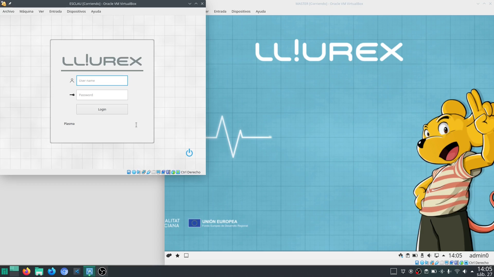
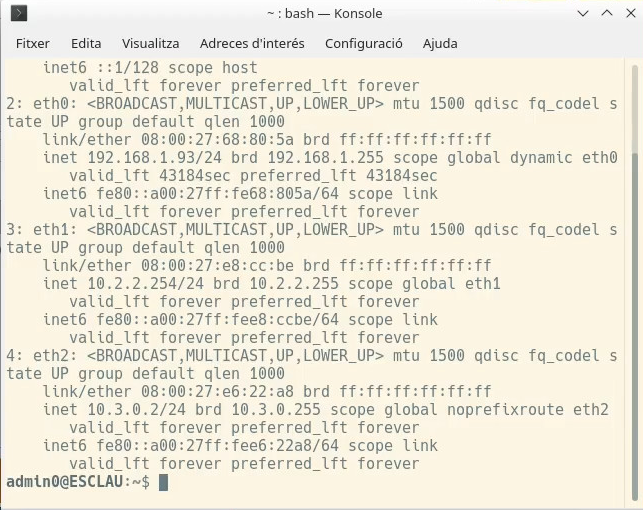

---
# Front matter
# Metainformació del document
title: "Model de centre amb Virtualbox"
author: [Alfredo Rafael Vicente Boix i Javier Estellés Dasi]
date: "05-05-2024"
subject: "Proxmox"
keywords: [Xarxa, Instal·lació]
subtitle: "ACTIVITAT"

lang: ca
page-background: img/bg.png
titlepage: true
# portada
titlepage-rule-height: 2
titlepage-rule-color: AA0000
titlepage-text-color: AA0000
titlepage-background: ../../portades/U2.png

# configuració de l'índex
toc-own-page: true
toc-title: Continguts
toc-depth: 2

# capçalera i peu
header-left: \thetitle
header-right: Curs 2023-2024
footer-left: CEFIRE València
footer-right: \thepage/\pageref{LastPage}

# Les figures que apareguen on les definim i centrades
float-placement-figure: H
caption-justification: centering 

# No volem numerar les linies de codi
listings-disable-line-numbers: true

# Configuracions dels paquets de latex
header-includes:

  #  imatges i subfigures
  - \usepackage{graphicx}
  - \usepackage{subfigure}
  - \usepackage{lastpage}


  #  - \usepackage{adjustbox}
  # marca d'aigua
  #- \usepackage{draftwatermark}
 # - \SetWatermarkText{\includegraphics{./img/Markdown.png}}
  #- \SetWatermarkText{Per revisar}
  #- \SetWatermarkScale{.5}
  #- \SetWatermarkAngle{20}
   
  # caixes d'avisos 
  - \usepackage{awesomebox}

  # text en columnes
  - \usepackage{multicol}
  - \setlength{\columnseprule}{1pt}
  - \setlength{\columnsep}{1em}

  # pàgines apaïsades
  - \usepackage{pdflscape}
  
  # per a permetre pandoc dins de blocs Latex
  - \newcommand{\hideFromPandoc}[1]{#1}
  - \hideFromPandoc {
      \let\Begin\begin
      \let\End\end
    }
 
# definició de les caixes d'avis
pandoc-latex-environment:
  noteblock: [note]
  tipblock: [tip]
  warningblock: [warning]
  cautionblock: [caution]
  importantblock: [important]
...

\vspace*{\fill}

{ height=50px }

Aquest document està subjecte a una llicència creative commons que permet la seua difusió i ús comercial reconeixent sempre l'autoria del seu creador. Aquest document es troba per a ser modificat al següent repositori de github:
<!-- CANVIAR L'ENLLAÇ -->
[https://github.com/arvicenteboix/lliurexproxmox](https://github.com/arvicenteboix/lliurexproxmox)
\newpage


# Valencià

## Activitat

L’activitat que vos proposem és crear un model de centre des de 0. Vos hem deixat un vídeo amb tot el procés (amb alguna errada que ens ha passat i com ho hem solventat). Compte!!! El vídeo no té audio, és només el procediment que s’ha de seguir.

## Característiques de l’ordinador

L’ordinador que s’ha utilitzat té les següents característiques:

* Sistema Operatiu: arch linux, distro Manjaro
* Ryzen 5
* 8GB de RAM
* 256 GB disc dur ssd m2

Heu d’anar amb compte amb les característiques que poseu a cada màquina, per a fer la instal·lació de cadascuna he posat molts recursos per a fer-ho més despresa, però després he baixat els recursos a 1,5 GB de RAM i 1 processador cada màquina.

## Procediment de l’activitat


### OPCIÓ 1 (SENSE USAR L'ARXIU .*OVA DELS RECURSOS DEL TEMA)


1.	Crear dos **VM** per als servidors, un MESTRE i un altre ESCLAU amb les tres targetes de xarxa (externa, interna i de replicació)
2.	Crear una **VM** per al client amb la seua targeta de xarxa en la xarxa interna d'un dels servidors.
3.	Inicialitzar amb **Zero-Server-Wizar** els dos servidors.
4.	Crear un usuari de prova amb **Llum**.
5.	Entrar en l'ordenador client amb l'usuari creat en **Llum**.


## Aconseguir Apte en l'activitat 

L'activitat es considerarà APTA entregant un document en format pdf amb les següents captures de pantalla

* Característiques de cada màquina des de *VirtualBox*
* Els dos servidors i el client funcionant.
* Captura d'inicialització correctament finalitzada amb **zero-server-wizard** d'un dels servidors.
* Captura d'un terminal amb les **IP** d'un dels servidors.
 ```bash
ip add
```
* Captura de **Llum** amb la creació de l'usuari de prova correctament realitzat.
* Captura de l'ordenador client amb l'usuari de prova amb la sessió iniciada.


### OPCIÓ 2 (USANT L'ARXIU .*OVA DELS RECURSOS DEL TEMA)


:::warning
Les màquines estan inicializades amb *zero-server-wizard* i funcionen. Heu de canviar el nom de cada màquina a CODI_DE_CETRE+{MAS,CEN,AU1 o AU2} en VirtualBox per a que comprovar que heu fet el canvi.
:::

1. Descarregar l'arxiu **.ova** dels recursos del tema i importar les màquines ja configurades i inicialitzades amb **Zero-server-wizard**. 
2. Canviar les característiques de les **VM** importades perquè s'adapten a les prestacions de cada equip si és necessari (nombre de processadors, RAM, etc) i canviar el nom de cada màquina a **CODI_DE_CETRE+{MAS,CEN,AU1 o AU2}**
3. Arrancar servidor mestre i esclau. 
4. Crear un usuari amb **Llum** (prova) des d'algun dels servidors.
5. Arrancar client i iniciar sessió amb l'usuari prova.

## Aconseguir Apte en l'activitat 

L'activitat es considerarà APTA entregant un document en format pdf amb les següents captures de pantalla

<<<<<<< HEAD
* Característiques de cada màquina des de *VirtualBox* amb el nom canviat (ej: cod_centre_mestre)
* Els dos servidors i el client funcionant.
* Captura de **Llum** amb la creació de l'usuari de prova correctament realitzat.
* Captura d'un terminal de les **IP** d'un dels servidors.
 ```bash
ip add
=======
```bash
$ ip addr
>>>>>>> e96af707e679676a9575e5e088b136d2c0d6f786
```
* Captura de l'ordenador client amb l'usuari de prova amb la sessió iniciada.

## Exemple de captures de pantalla





{ width=50% }


# Castellano

## Actividad

La actividad que os proponemos es crear un modelo de centro desde cero. Os hemos dejado un vídeo con todo el proceso (con algún error que nos ha ocurrido y cómo lo hemos solucionado). ¡Cuidado! El vídeo no tiene audio, es solo el procedimiento que se debe seguir.

## Características del ordenador

El ordenador que se ha utilizado tiene las siguientes características:

* Sistema Operativo: arch linux, distro Manjaro
* Ryzen 5
* 8GB de RAM
* 256 GB disco duro ssd m2

Deben tener cuidado con las características que ponen en cada máquina, para hacer la instalación de cada una he puesto muchos recursos para hacerlo más rápido, pero luego he bajado los recursos a 1,5 GB de RAM y 1 procesador cada máquina.

## Procedimiento de la actividad

### OPCIÓN 1 (SIN USAR EL ARCHIVO .OVA DE LOS RECURSOS DEL TEMA)

1.	Crear dos **VM** para los servidores, uno MAESTRO y otro ESCALVO con las tres tarjetas de red (externa, interna y de replicación)
2.	Crear una **VM** para el cliente con su tarjeta de red en la red interna de uno de los servidores.
3.	Inicializar con **Zero-Server-Wizar** los dos servidores.
4.	Crear un usuario de prueba con **Llum**.
5.	Entrar en el ordenador cliente con el usuario creado en Llum.


## Conseguir Apto en la actividad

La actividad se considerará APTA entregando un documento en formato pdf con las siguientes capturas de pantalla

*	Características de cada máquina desde *VirtualBox*
*	Los dos servidores y el cliente funcionando.
*	Captura de inicialización correctamente finalizada con **zero-server-wizard** de uno de los servidores. 
*	Captura de un terminal con las **IP**  de uno de los servidores.
```bash
ip add
```
*	Captura de **Llum** con la creación del usuario de prueba correctamente realizado.
*	Captura del ordenador cliente con el usuario de prueba con la sesión iniciada.


## OPCIÓN 2 (USANDO EL ARCHIVO .OVA DE LOS RECURSOS DEL TEMA)

:::warning
Las máquinas están inicializadas y funcionan. Deben cambiar el nombre de cada máquina a CODI_DE_CETRE+{MAS,CEN,AU1 o AU2} para comprobar que han hecho el cambio.
:::

1. Descargar el archivo **.ova** de los recursos del tema e importar las máquinas ya configuradas e inicializadas con Zero-server-wizard. 
2. Cambiar las características de las **VM** importadas para que se adapten a las prestaciones de cada equipo si es necesario (número de procesadores, RAM, etc) y cambiar el nombre de cada máquina a **CODI_DE_CETRE+{MAS,CEN,AU1 o AU2}**
3. Arrancar servidor maestro y esclavo.
4. Crear usuario con **Llum** (prueba) desde alguno de los servidores.
5. Arrancar cliente e iniciar sesión con el usuario prueba.


## Conseguir Apto en la actividad 

La actividad se considerará APTA entregando un documento en formato pdf con las siguientes capturas de pantalla

*	Características de cada máquina desde *VirtualBox* con el nombre cambiado (ej: cod_centro_maestro)
*	Los dos servidores y el cliente funcionando.
*	Captura de **Llum** con la creación del usuario de prueba correctamente realizado.
*	Captura de un terminal de las IPs  de uno de los servidores.
	```bash
	ip add
	```
* Captura del ordenador cliente con el usuario de prueba con la sesión iniciada.

<<<<<<< HEAD
=======
```bash
$ ip addr
```
>>>>>>> e96af707e679676a9575e5e088b136d2c0d6f786
## Ejemplo de capturas de pantalla


{ width=50% }
