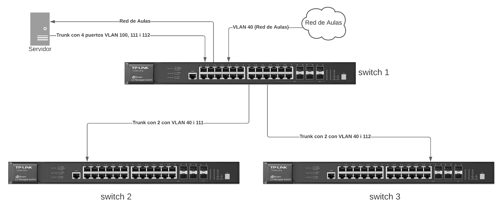
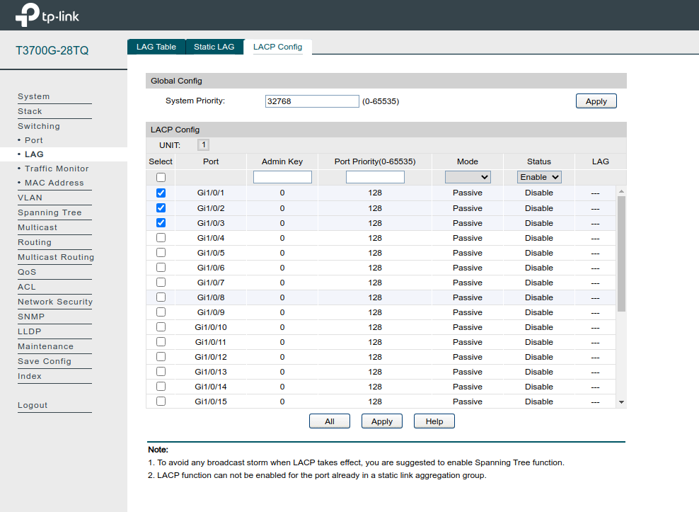
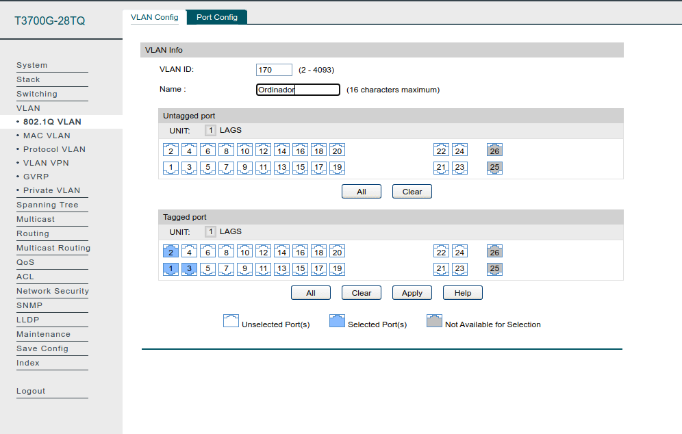
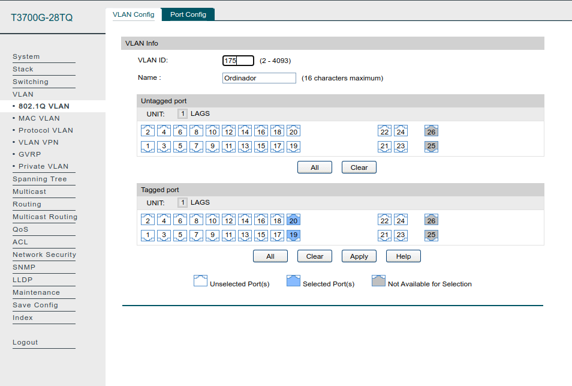
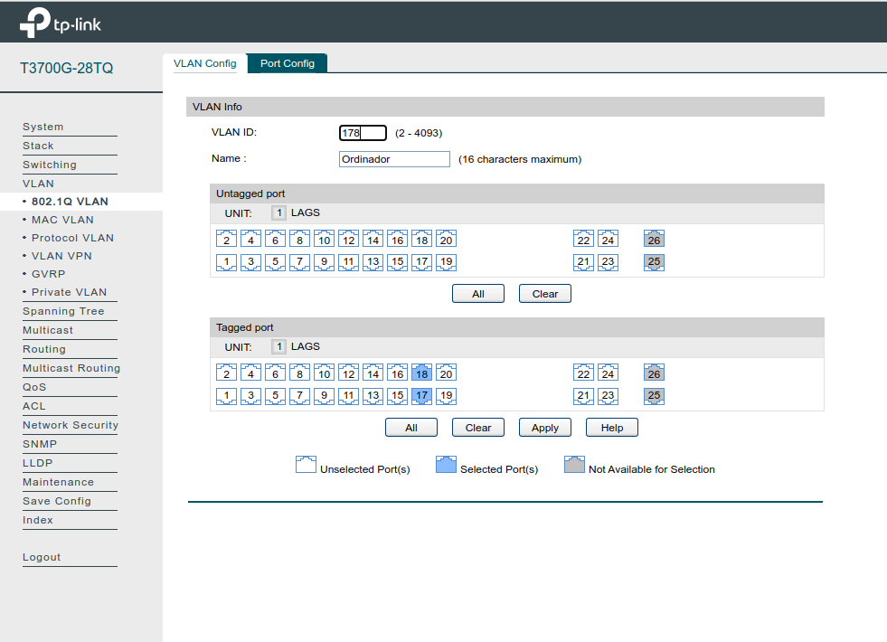
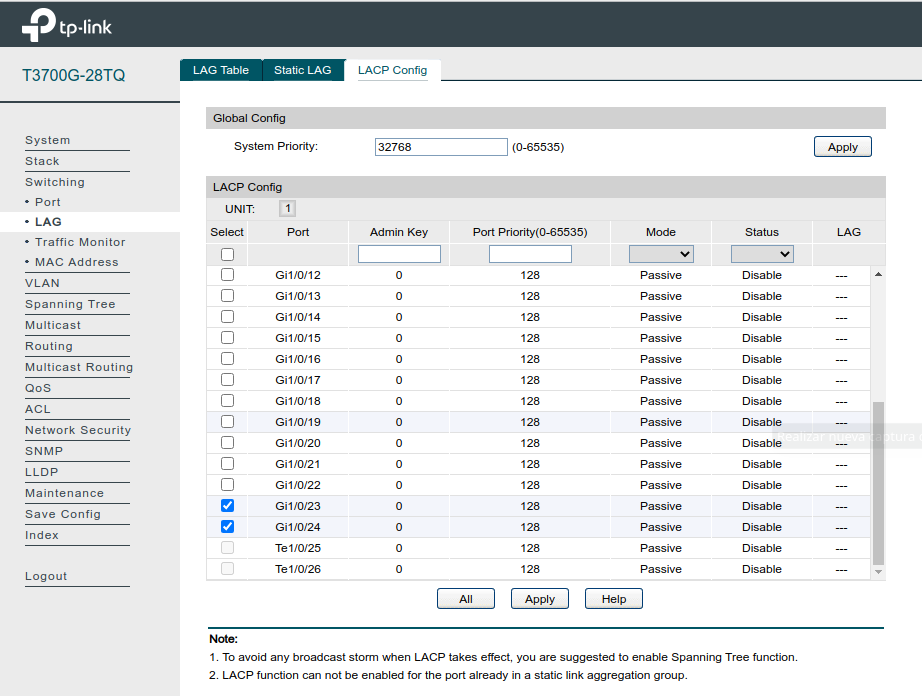
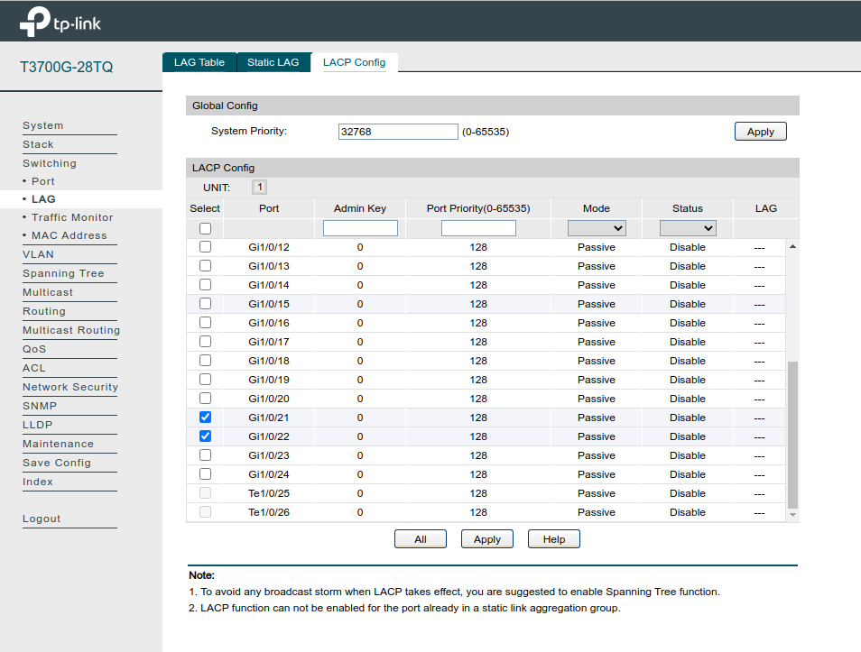

---
# Front matter
# Metainformació del document
title: "Configuració de xarxa"
author: [Alfredo Rafael Vicente Boix i Javier Estellés Dasi]
date: "05-05-2024"
subject: "Proxmox"
keywords: [Xarxa, Instal·lació]
subtitle: "Exemple d'esquema de xarxa en el model de centre"
lang: ca
page-background: img/bg.png
titlepage: true
# portada
titlepage-rule-height: 2
titlepage-rule-color: AA0000
titlepage-text-color: AA0000
titlepage-background: ../../portades/U3.png

# configuració de l'índex
toc-own-page: true
toc-title: Continguts
toc-depth: 2

# capçalera i peu
header-left: \thetitle
header-right: Curs 2023-2024
footer-left: CEFIRE València
footer-right: \thepage/\pageref{LastPage}

# Les figures que apareguen on les definim i centrades
float-placement-figure: H
caption-justification: centering 

# No volem numerar les linies de codi
listings-disable-line-numbers: true

# Configuracions dels paquets de latex
header-includes:

  #  imatges i subfigures
  - \usepackage{graphicx}
  - \usepackage{subfigure}
  - \usepackage{lastpage}

  #  - \usepackage{adjustbox}
  # marca d'aigua
  #- \usepackage{draftwatermark}
 # - \SetWatermarkText{\includegraphics{./img/Markdown.png}}
  #- \SetWatermarkText{Per revisar}
  #- \SetWatermarkScale{.5}
  #- \SetWatermarkAngle{20}
   
  # caixes d'avisos 
  - \usepackage{awesomebox}

  # text en columnes
  - \usepackage{multicol}
  - \setlength{\columnseprule}{1pt}
  - \setlength{\columnsep}{1em}

  # pàgines apaïsades
  - \usepackage{pdflscape}
  
  # per a permetre pandoc dins de blocs Latex
  - \newcommand{\hideFromPandoc}[1]{#1}
  - \hideFromPandoc {
      \let\Begin\begin
      \let\End\end
    }
 
# definició de les caixes d'avis
pandoc-latex-environment:
  noteblock: [note]
  tipblock: [tip]
  warningblock: [warning]
  cautionblock: [caution]
  importantblock: [important]
...

\vspace*{\fill}

{ height=50px }

Este documento está sujeto a una licencia creative commons que permite su difusión y uso comercial reconociendo siempre la autoría de su creador. Este documento se encuentra para ser modificado en el siguiente repositorio de github:
<!-- CAMBIAR EL ENLACE -->
[https://github.com/arvicenteboix/lliurexproxmox](https://github.com/arvicenteboix/lliurexproxmox)
\newpage

# Valencià

## Activitat

L’activitat que vos proposem és crear un esquema de la vostra xarxa, aquest esquema ha de ser semblant a aquest:

Si no disposeu de temps o la vostra xarxa del centre és massa complexa, podeu utilitzar l’esquema ací proposat. Podeu utilitzar el switch que vullgueu i la configuració de xarxa que desitgeu.

## Característiques de la xarxa

La xarxa ha de tenir al menys les següents característiques:

| Switch | Característiques |
| :---: | :-----: |
| Router | Servirá la VLAN 40 que es la xarxa de Aules |
| Switch 1 | Entrada de la red d’Aules, trunk amb 4 ports per a l’hipervisor, aquest servirà la VLAN 100, 111 i 112, trunk de 2 ports per als altres dos switchs |

| Switch | Característiques |
| :---: | :-----: |
| Switch 2 | Trunk amb 2 ports i donar servei en la resta de ports a ordinadors de la VLAN 40 i 111 |
| Switch 3 | Trunk amb 2 ports i donar servei en la resta de ports a ordinadors de la VLAN 40 i 112 |

:::tip
Els ports podeu escollir-los vosaltres, el criteri comú és utilitzar els últims ports per a fer el trunk. La resta de ports els heu de deixar configurats per a donar servei als ordinadors. La red d’aules es connecta sempre al port 1 del switch 1 (pista: com untagged 40)
:::

## Procediment de l’activitat

1. Organitzar el plantejament. És important que vos feu un esquema abans de començar amb paper i boli. L’activitat no és gens complexa, però cal tenir clar el que es fa.
2. Realitzar el esquema de la xarxa, es pot fer a mà o utilitzar algun programa com lucidchart
3. Configurar els 3 switchs. Es pot utilitzar el switch que vullgueu per a fer la configuració. Si no disposeu de switch podeu utilitzat un emulador de switch. Nosaltres vos proposem aquests:
  1. [tp-link 3700g](https://emulator.tp-link.com/t3700g-28tq-un-v3/Index.htm)
  2. [tp-link 2600g](https://emulator.tp-link.com/T2600G-28TS(UN)3.0/index.html)
4. Realitzar captures de pantalla de cada pas.

:::warning
Els emuladors no guarden la configuració quan li doneu a apply, per tant heu d’anar fent
captura de pantalla abans de sortir de la pàgina.
:::

## Aconseguir Apte en l’activitat

L’activitat es considerarà APTA si es fan tots els punts. S’ha d’entregar un full en format pdf amb les següents captures de pantalla:

* Configuració de cada VLAN amb cada switch
* Configuració del trunk

## Exemple de captures de pantalla

Es mostres exemples per a un dels switch (les pantalles no corresponen a la tasca correcta òbviament), i haureu de mostrar més pantalles per al switch 1:

# CASTELLANO

##  Actividad

La actividad que os proponemos es crear un esquema de vuestra red, este esquema debe ser similar a este:

Si no disponéis de tiempo o vuestra red del centro es demasiado compleja, podéis utilizar el esquema aquí propuesto. Podéis utilizar el switch que queráis y la configuración de red que deseéis.

## Características de la red

La red debe tener al menos las siguientes características:

| Switch | Características |
| :---: | :-----: |
| Router | Servirá la VLAN 40 que es la red de Aulas |
| Switch 1 | Entrada de la red de Aulas, trunk con 4 puertos para el hipervisor, este servirá la VLAN 100, 111 y 112, trunk de 2 puertos para los otros dos switches |

| Switch | Características |
| :---: | :-----: |
| Switch 2 | Trunk con 2 puertos y dar servicio en el resto de puertos a ordenadores de la VLAN 40 y 111 |
| Switch 3 | Trunk con 2 puertos y dar servicio en el resto de puertos a ordenadores de la VLAN 40 y 112 |

:::tip
Los puertos podéis elegirlos vosotros, el criterio común es utilizar los últimos puertos para hacer el trunk. El resto de puertos debéis dejarlos configurados para dar servicio a los ordenadores. La red de aulas se conecta siempre al puerto 1 del switch 1 (pista: como untagged 40)
:::

## Procedimiento de la actividad

1. Organizar el planteamiento. Es importante que os hagáis un esquema antes de comenzar con papel y bolígrafo. La actividad no es nada compleja, pero hay que tener claro lo que se hace.
2. Realizar el esquema de la red, se puede hacer a mano o utilizar algún programa como lucidchart.
3. Configurar los 3 switches. Se puede utilizar el switch que queráis para hacer la configuración. Si no disponéis de switch podéis utilizar un emulador de switch. Nosotros os proponemos estos:
  1. [tp-link 3700g](https://emulator.tp-link.com/t3700g-28tq-un-v3/Index.htm)
  2. [tp-link 2600g](https://emulator.tp-link.com/T2600G-28TS(UN)3.0/index.html)
4. Realizar capturas de pantalla de cada paso.

:::warning
Los emuladores no guardan la configuración cuando le dais a apply, por lo tanto debéis ir haciendo
captura de pantalla antes de salir de la página.
:::

## Conseguir Apto en la actividad

La actividad se considerará APTA si se hacen todos los puntos. Se debe entregar una hoja en formato pdf con las siguientes capturas de pantalla:

* Configuración de cada VLAN con cada switch
* Configuración del trunk

## Ejemplo de capturas de pantalla

Se muestran ejemplos para uno de los switches (las pantallas no corresponden a la tarea correcta obviamente), y deberéis mostrar más pantallas para el switch 1:

