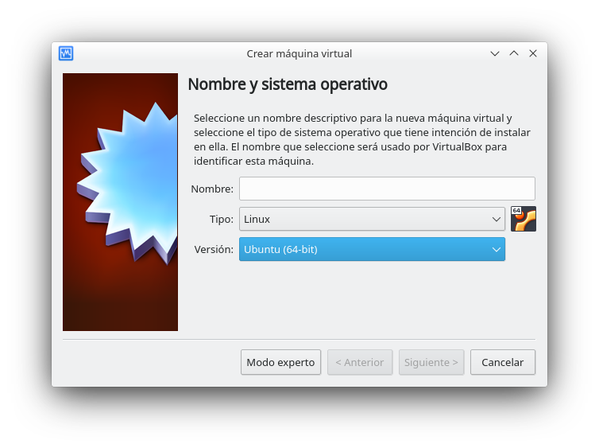
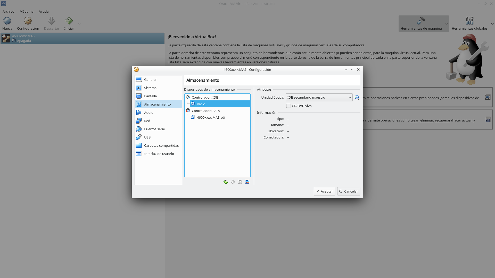
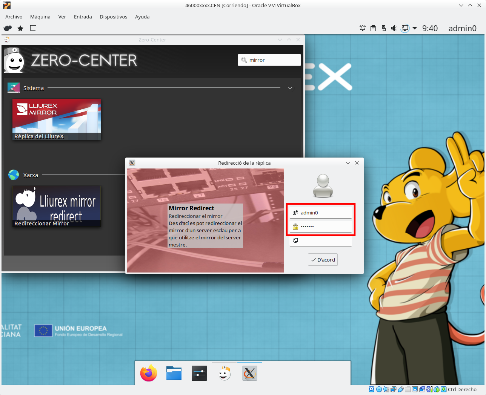
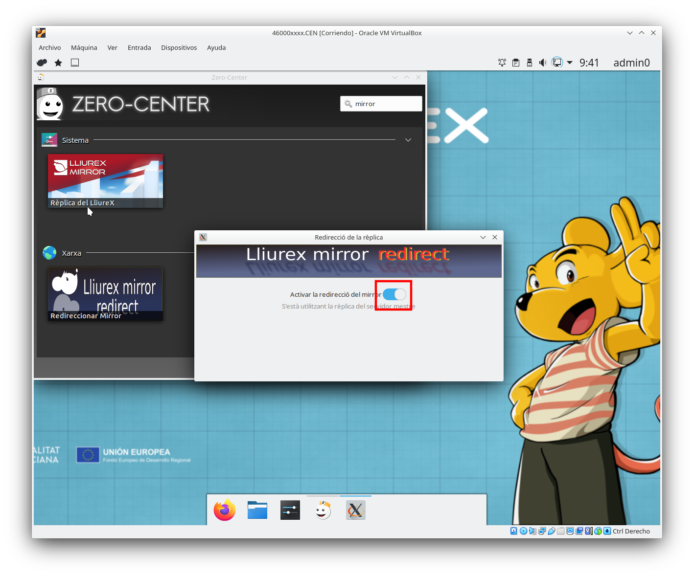
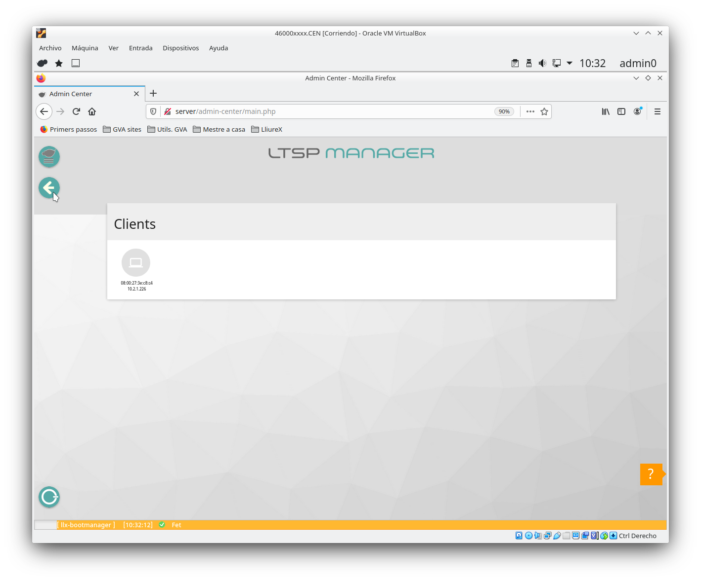
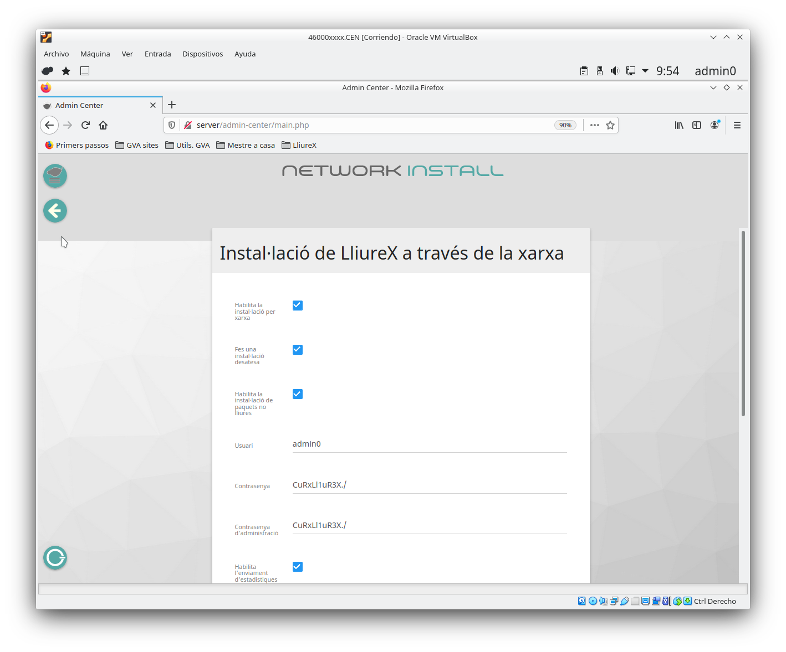

---
# Front matter
# Metainformació del document
title: "Model de centre amb Virtualbox"
author: [Alfredo Rafael Vicente Boix i Javier Estellés Dasi \newline Revisado por Sergio Balaguer]
date: "05-05-2024"
subject: "Proxmox"
keywords: [Xarxa, Instal·lació]
subtitle: "Exemple d'un centre amb Virtualbox sense Proxmox"

lang: ca
page-background: img/bg.png
titlepage: true
# portada
titlepage-rule-height: 2
titlepage-rule-color: AA0000
titlepage-text-color: AA0000
titlepage-background: ../portades/U2.png

# configuració de l'índex
toc-own-page: true
toc-title: Continguts
toc-depth: 2

# capçalera i peu
header-left: \thetitle
header-right: Curs 2023-2024
footer-left: CEFIRE València
footer-right: \thepage/\pageref{LastPage}

# Les figures que apareguen on les definim i centrades
float-placement-figure: H
caption-justification: centering 

# No volem numerar les linies de codi
listings-disable-line-numbers: true

# Configuracions dels paquets de latex
header-includes:

  #  imatges i subfigures
  - \usepackage{graphicx}
  - \usepackage{subfigure}
  - \usepackage{lastpage}


  #  - \usepackage{adjustbox}
  # marca d'aigua
  #- \usepackage{draftwatermark}
 # - \SetWatermarkText{\includegraphics{./img/Markdown.png}}
  #- \SetWatermarkText{Per revisar}
  #- \SetWatermarkScale{.5}
  #- \SetWatermarkAngle{20}
   
  # caixes d'avisos 
  - \usepackage{awesomebox}

  # text en columnes
  - \usepackage{multicol}
  - \setlength{\columnseprule}{1pt}
  - \setlength{\columnsep}{1em}

  # pàgines apaïsades
  - \usepackage{pdflscape}
  
  # per a permetre pandoc dins de blocs Latex
  - \newcommand{\hideFromPandoc}[1]{#1}
  - \hideFromPandoc {
      \let\Begin\begin
      \let\End\end
    }
 
# definició de les caixes d'avis
pandoc-latex-environment:
  noteblock: [note]
  tipblock: [tip]
  warningblock: [warning]
  cautionblock: [caution]
  importantblock: [important]
...

\vspace*{\fill}

{ height=50px }

Aquest document està subjecte a una llicència creative commons que permet la seua difusió i ús comercial reconeixent sempre l'autoria del seu creador. Aquest document es troba per a ser modificat al següent repositori de github:
<!-- CANVIAR L'ENLLAÇ -->
[https://github.com/arvicenteboix/lliurexproxmox](https://github.com/arvicenteboix/lliurexproxmox)
\newpage

<!-- \awesomebox[violet]{2pt}{\faRocket}{violet}{Lorem ipsum…} -->

# Introducció

En aquesta unitat veurem com muntar el model de centre virtualitzat. Això ens servirà per a entendre com funciona el model de centre de LliureX, què és un servidor mestre.

# Model de centre

El model de centre es un configuració que combina xarxa i servidors per a donar uns serveis a tots els ordinadors dins del centre. Entre altres coses el model de centre pot donar els següents serveis de xarxa:

- Pàgines web internet del centres.
- Jitsi per a reunions a la intranet.
- Moodle per a sessions internes.
- Videoconferències.
- LDAP per a autentificar-se els usuaris a qualsevol ordinador del centre.
- Carpetes compartides a tot el centre.
- Mirror compartit per tots els servidors.
- Servidor d'imatges per a clients lleugers.
- Nextcloud per a compartir fitxers a la intranet.
- DHCP per a cada aula.

A banda de totes aquestes característiques, LliureX presenta nombroses ferramentes que faciliten la instal·lació i configuració del programari.

Però el principal avantatge de tot és que LliureX permet configurar-ho tot sense tocar la terminal i sense tenir coneixements avançats d'informàtica. La posada a punt del model de centre és ràpida i senzilla.
Per entendre millor el model de centre parlarem de cada element per separat.

# Sabors de LliureX

LliureX es presenta en varios sabors i cadascú té les seues característiques diferenciades. Dins del model de centre tenim dos sabors principals:

| Sabor | Característiques |
| -- | -- |
| Servidor | Porta tot els paquets per a muntar el model de centre |
| Client | És la versió que hem d'instal·lar al centre |
| Escriptori | Pot funcionar de manera independent |

Els sabors música, infantil, fp, etc... són una versió d'escriptori amb paquets característics de cadascuna de les especialitats.

# Servidor

El servidor de LliureX pot treballar de 3 maneres.

| Servidor | Característiques |
| -- | -- |
| Independent | El servidor treballa de manera independent |
| Mestre | Dona serveis als esclaus |
| Esclau | Pot treballar de manera independent, es sincronitza amb el mestre |

El servidor té com a mínim 2 targetes de xarxa:

- La xarxa interna: a aquesta targeta es connectarà un switch on es connectaran els clients.
- La xarxa externa: es connectarà directament a la xarxa de Aules del router (antiga macrolan).

Per a que el servidor funcione dins del model de centre cal configurar-lo i inicialitzar-lo amb el **zero-server-wizard** que vorem més avant.


## Esquema de xarxa

Un esquema bastant habitual que ens trobem als centres és el següent:


:::warning
A l'esquema es mostra un servidor NFS d'arxius. A l'últim donarem unes recomanacions de  com es munta un servidor NFS, però has de tenir en compte que aquest tipus de servidors donen molts problemes per a muntar el /net, donat un problema amn les ACLs i el NFS v3, per tant, es recomana deixar el /net al MASTER. Es pot muntar al servidor NFS com un disc del PROXMOX (qcow per exemple), les ACLs no donaran problemes en eixe cas.
:::

En aquest esquema ens trobem 3 servidors, on el servidor mestre guarda la base de dades per a autentificar-se tots els usuaris (LDAP), i pot donar servei a la xarxa de professorat.

Un esquema més adient seria aquest:


Hem de tenir en compte els següents elements. Cadascun dels servidor ha de tenir com a mínim 3 targetes de xarxa:

 | Targeta | Característiques |
 | -- | -- |
 | eth0 | Targeta interna que dona DHCP a l'aula |
 | eth1 | Targeta externa que es connecta a la xarxa d'Aules |
 | eth2 | Targeta de replicació de serveis comuns |

# Instal·lació del model de centre

Anem a realitzar el muntatge d'un model de centre pas a pas amb totes les seues funcionalitats, per a tenir clar els seus conceptes. En aquesta unitat utilitzarem el programari de Virtualbox per a muntar el model de centre.

:::warning
Heu de tenir en compte que ací no parlarem de tot el programari que ve amb LliureX, com el harvester, libreoffice, programes de disseny, etc... En aquest curs ens centrarem exclusivament en el muntatge i configuració del model de centre
::: 

## Instal·lació de Lliurex

::: important

Podeu trobar l'última ISO per a descarregar [ací](https://releaseslliurexnet.gva.es/isos/23/LliureX-server_64bits_23_latest.iso).

:::

Podeu instal·lar virtualbox amb:

```
sudo apt install virtualbox-dkms virtualbox virtualbox-ext-pack virtualbox-guest-additions-iso
```

Una vegada teniu instal·lat el virtualbox, l'executeu i vos apareixerà la següent pantalla:


Clickem sobre **Nueva** i seguim el següent exemple:




:::caution
Si és un servidor MASTER que va a allotjar el mirror, has de donar bastant espai per a que càpiga el mirror (mínim 70GB, a les proves s'han utilitzat 90GB).
:::


Ara clickem sobre configuració i name a la secció d'emmagatzemament (almacenamiento), clickem sobre "Vacío" i seleccionem la iso de LliureX 19 descarregada (des de el requadre roig)





Després anem a la secció de xarxa i seleccionem 3 adaptadors:


Després anem a pantalla i seleccionem 128Mb de memòria de vídeo.


I li donem a Iniciar:


Després fem click sobre **Instal·la versió de LliureX**


Emplenem els següents paràmetres:

| Paràmetre | Opció |
| -- | -- |
| Nom | admin0 |
| Contrasenya | Una segura, no lliurex |
| Nom de l'ordinador | 4600xxxx.MAS |


I es procedix a la instal·lació:


Podem fer click en Reinicia o apagar l'ordinador amb el menú aturar:


Una vegada tenim l'ordinador apagat podem clonar la màquina:


Li donem el nom a la màquina: 46000xxxx.CEN:


I seleccionem clonació completa:


:::warning
És important fer la clonació completa abans d'inicialitzar el servidor i reiniciar la direcció MAC de totes les targetes de xarxa. Si es fera després requeriria unes tasques de manteniment en la carpeta /etc/netplan per a assegurar-se que no es dupliquen IPs. Si ja s'ha inicialitzat el servidor és millor fer una instal·lació nova per al servidor esclau.
:::

L'adaptador 2 el canviem a centre en lloc de mestre:


Ara que ja tenim les dues màquines creades i configurades amb tres targetes de xarxa connectarem l'adaptador 1 a la nostra xarxa local. D'aquesta manera l'adaptador 1 rebrà una adreça IP del DHCP de l'encaminador de la nostra xarxa. 

Per a això canviarem l'adaptador 1 a **Adaptador pont** en totes dues màquines:


# Inicialització del servidor

Per a poder tindre el model de centre és important inicialitzar el servidor. El servidor es pot inicialitzar de tres maneres diferents.

* Si només volem un servidor d'aula, el servidor s'inicia com a **independent**. 

* Si volem tindre un servidor on es fa l'autenticació (LDAP), emmagatzeme el *mirror*, les carpetes d'usuari i tots els serveis que vulguem donar, cal configurar un **mestre**

* Si volem un servidor per a una aula d'informàtica però que tinga els serveis de *LDAP, accés al *mirror, les carpetes d'usuaris, etc, cal configurar un **esclau**.

Amb tot això, inicialitzarem primer la màquina 4600xxxx.MES com a **mestre** i després la màquina 4600xxxx.CEN com a **esclau**.

Per a poder inicialitzar el servidor farem ús del programa **zero-server-wizard**. Podem iniciar-lo des de la terminal amb:

```
zero-server-wizard
```
També podem accedir des de **Menú d'aplicacions** > **Administració LliureX** > **Zero-Center, centre de control de LliureX**

:::info
El zero-center és un apartat exclusiu de lliurex on es pot trobar tot aquell programari específic de la distribució o instal·ladors de programari que bé perquè requereixen configuracions especials o bé perquè són complicats d'instal·lar, faciliten la tasca enormement.
:::

Anem al **zero-center** i busquem el zero-server-wizard:


Iniciem el zero-server-wizard


En el nostre cas, iniciarem aquest servidor com a mestre. Hem de tindre especial cura i no oblidar marcar en **exportar /net**, per a tindre només un mirror i carpetes d'usuaris en tots els servidors sincronitzades.

També cal tindre molta cura a identificar la targeta externa (la que ha agafat una IP del Router), la targeta interna (la que es comunica amb els ordenadors clients de l'aula/centre) i la targeta de replicació (la que es comunica amb altres servidors per a compartir **/net**).

:::*info
Des d'un terminal amb ***ifconfig** o **ip address** podem identificar els noms de les targetes de xarxa i veure qual ha agafat una IP del DHCP del Router per a identificar l'externa.
:::


En el nostre cas, anem a iniciar aquest servidor com a mestre. Hem de tenir especial cura en incloure **exporta el /net**, per  tenir només un mirror. La **IP interna** ens interessa tenir-la controlada per a saber quin és cada servidor. I la interfície de replicació que és per on es muntarà el /net entre els servidors.


En la primera imatge el servidor agafarà una IP per DHCP del router i en la segona s'ha posat fixa. Per a aquestes proves podem fer-ho per DHCP però si coneixem les direccions lliures de la nostra xarxa podem posar-la (recomanat).


En les dues imatges anteriors veiem com la targeta **eth0** és l'externa, **eth1** és la interna i **eth2** la de replicació.


:::caution
Cal assegurar-se que es col·loca correctament l'ordre de les targetes i estar segurs qual és l'externa.
:::

:::caution
Si estàs fent les proves a la teua casa has de tindre en compte que els DNS que hi ha per defecte no funcionaran ja que són per a la xarxa d'Aules. Com a exemple es poden usar 1.1.1.1, 1.0.0.1 (Cloudflare) i 8.8.8.8, 8.8.4.4 (Google).
:::

Una vegada s'ha inicialitzat el servidor mestre i reiniciat el deixarem en marxa per a continuar amb els servidors esclaus.

## Inicialització del servidor esclau

Una vegada inicialitzat el servidor mestre, els esclaus els inicialitzem de la mateixa manera, però tenint en compte que la ip serà diferent i muntarem el **/net** del servidor mestre.


:::caution
Cal assegurar-se que es col·loca correctament l'ordre de les targetes i estar segurs qual és l'externa.
:::

:::*info
Hi ha un altre camp anomenat **ID d'aula**. Aqueix número identifica a cada servidor esclau. Si inicialitzem un altre servidor esclau en el centre canviarem aqueix número amb el següent disponible. És important portar el compte que *IDs hem utilitzat en el centre.
:::

Després de reiniciar tornem al zero-center (recorda que sempre al servidor esclau) i executem el **lliurex-mirror-redirect**.


Escrivim el nostre usuari i contrasenya. La última entrada la deixem en blanc.



I activem l'opció del **lliurex-mirror-redirect**. Pots anar després a la carpeta **/net/mirror** o escriure a la terminal **mount | grep mirror** per a assegurar-te que està muntat.



# Instal·lació de clients

De fa un temps Conselleria ha decidit prescindir dels clients lleuger, i ja no es realitzen compres dels mateixos. Encara que als centres hi han molts i LliureX continuarà donant suport.

## Clients lleugers

Per a utilitzar clients lleugers utilitzarem **l'admin-center** que podem trobar tan en el zero-center com en la pàgina d'inici del Firefox. Al entrar a l'admin-center ens trobarem aquest menú.


Farem click sobre LliureX LTSP i veurem el menú de Gestió de Clients LTSP, farem click sobre Gestió d'Imatges de client.


 Una vegada ahí crearem una nova imatge.

:::*important
Cal recordar que abans de crear imatges de clients lleugers s'ha de descarregar el mirror complet de Lliurex en el servidor mestre la grandària del qual supera els 18GB. Com hem activat el **lliurex-mirror-redirect** en els servidors esclaus només es descarrega una vegada en el servidor mestre.
:::


:::info
Pots tenir tantes imatges com vullgues. Si tens diferents models de clients lleugers, tal vegada t'interese tenir-ne varies. A més, si tens una pissarra digital, és convenient tenir una imatge per a l'ordinador en pissarra i altra per a la resta d'ordinadors.
:::


Escollim l'opció de client ja que aquesta és la que ens permet logar-nos amb LDAP del servidor del servidor mestre.


### Associar client a imatge

Podem associar la imatge d'un client per a que s'inicie sempre amb eixa imatge. Aquesta situació ens interesarà principalment a l'ordinador del professor si té una pissarra digital. Anem a Gestió de client de l'aula:


Per a poder vore els clients és necessari que s'hagen engegat al menys una vegada i siga el mateix servidor qui els haja donat una IP (Les IPs s'agafan de la taula del dnsmasq).



Fas doble click sobre un ordinador (aquestos venen identificats amb la IP i la MAC). I ens apareixerà el següent menú:


A l'últim apartat podem veure un menú desplegable per a escollir la imatge amb la qual volem arrancar.

:::info
Cal actualitzat la pàgina de l'admin-center una vegada s'han detectat els clients per a que funcione la finestra de paràmetres.
:::

## Clients pesats

Per a instal·lar clients pesats la millor opció és habilitar la instal·lació per xarxa. Per tant, anem  a LliureX Netinstall i configurem els paràmetres per a fer una instal·lació desatesa. 


Exemple d'intal·lació.




## Boot Manager

Per a escollir la imatge que s'executa per defecte podem anar al menú principal a **Boot Manager** i canviar quines opcions per defecte volem per a iniciar el servidor.


# Creació d'usuaris amb Llum

Llum és al ferramenta que ens va a permetre gestionar els usuaris del nostre centre. Podem accedir al **Llum** des del zero-center. Podem crear tots els usuaris del centre important els usuaris de Ítaca, per a fer això cal anar a la pestanya de "Centre" i escollir la entrada "Importació/Exportación" on seleccionarem l'opció Aula LliureX.


I després iniciem Llum:


Una vegada hem iniciat Llum anem a l'opció d'importar/exportar d'Ítaca i importem els usuaris.

:::warning
Es podria tenir un model de centre funcionant amb servidors virtualitzats sobre una mateixa LliureX? 
Sí, enlloc de PROXMOX, podríem tenir com a sistema base un LliureX i enllaçar la targeta externa de cada servidor a la targeta física on està connectat el switch per a l'Aula d'informàtica, per als ordinadors del centre, etc... Però no tindríem gestió remota (o seria més complicat). I LliureX no es un sistema pensat per a tal fi. PROXMOX sí.
:::


