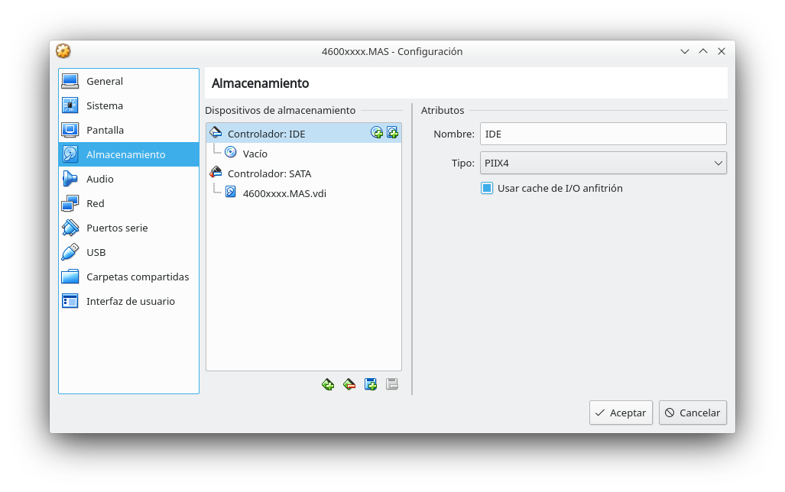
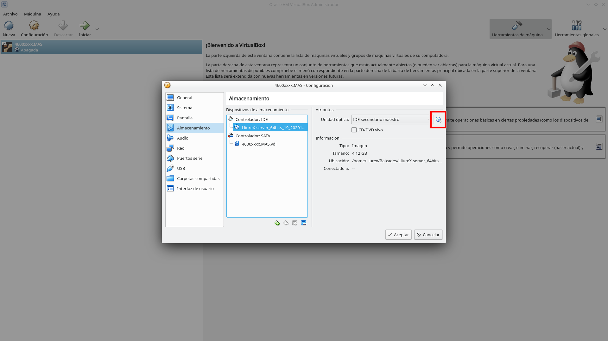
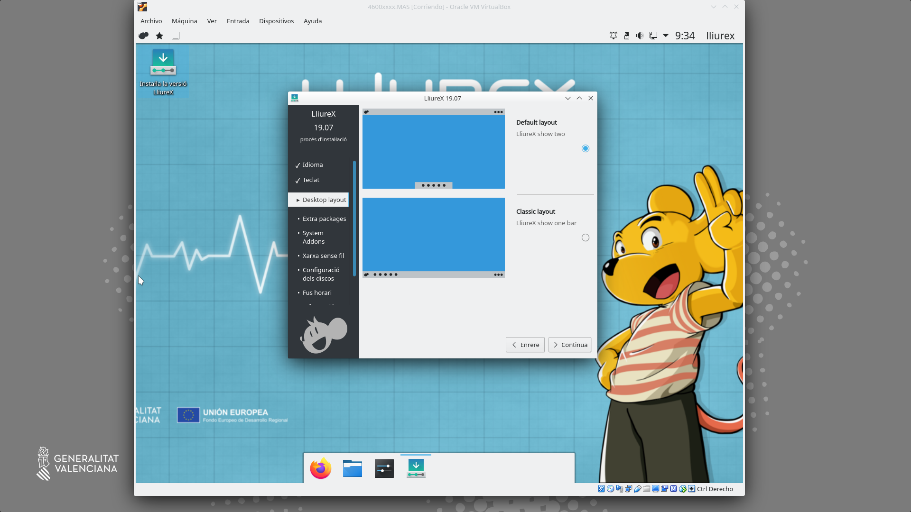
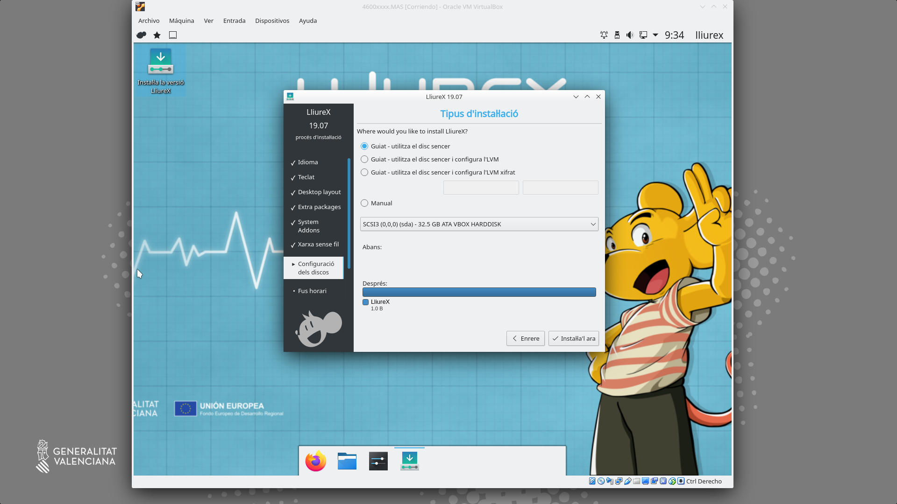
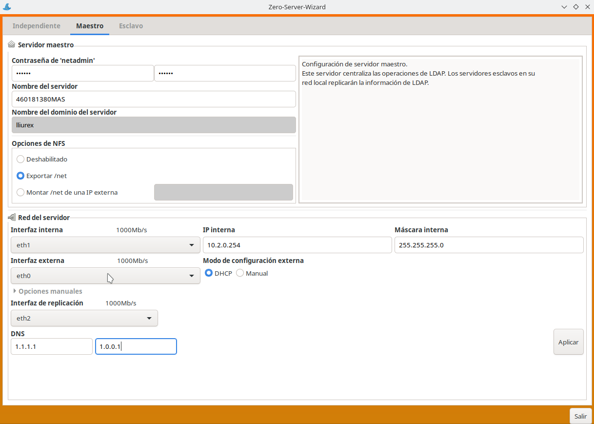

---
# Front matter
# Metainformació del document
title: "Modelo de centro con Virtualbox"
author: [Alfredo Rafael Vicente Boix y Javier Estellés Dasi \newline Revisado por Sergio Balaguer ]
dato: "05-05-2024"
subject: "Proxmox"
keywords: [Red, Instalación]
subtitle: "Ejemplo de un centro con Virtualbox sin Proxmox"


lang: es
page-background: img/bg.png
titlepage: true
# portada
titlepage-rule-height: 2
titlepage-rule-color: AA0000
titlepage-text-color: AA0000
titlepage-background: ../portades/U2.png

# configuració de  l'índex
toc-own-page: true
toc-title: Contenidos
toc-depth: 2

# ccapçalera i pe
header-left: \thetitle
header-right: Curs 2023-2024
footer-left: CEFIRE València
footer-right: \thepage/\pageref{LastPage}

# Les figures que apareguen on legu definim i centraes
float-placement-figure: H
caption-justification: centering 

# No volem numerar les linies de inie
listings-disable-line-numbers: true

# Configuracions dels paquets de atex
header-includes:

  #  imatges i subfigurgs
  - \usepackage{graphicx}
  - \usepackage{subfigure}
  - \usepackage{lastpage}


  #  - \usepackage{adjustbox}
  # marca d'aigua
  #- \usepackage{draftwatermark}
 # - \SetWatermarkText{\includegraphics{./img/Markdown.png}}
  #- \SetWatermarkText{Per revisar}
  #- \SetWatermarkScale{.5}
  #- \SetWatermarkAngle{20}
   
  # caixes d'avisos 
  - \usepackage{awesomebox}

  # text en columnes
  - \usepackage{multicol}
  - \setlength{\columnseprule}{1pt}
  - \setlength{\columnsep}{1em}

  # pàgines apaïsades
  - \usepackage{pdflscape}
  
  # per a permetre pandoc dins de blocdinsx
  - \newcommand{\hideFromPandoc}[1]{#1}
  - \hideFromPandoc {
      \let\Begin\begin
      \let\End\end
    }
 
# definició de les caixes davis
pandoc-latex-environment:
  noteblock: [note]
  tipblock: [tip]
  warningblock: [warning]
  cautionblock: [caution]
  importantblock: [important]
...

\vspace*{\fill}

{ height=50px }

Este documento está sujeto a una licencia creative commons que permite su difusión y uso comercial reconociendo siempre la autoría de su creador. Este documento se encuentra para ser modificado en el siguiente repositorio de github:
<!-- CAMBIAR EL ENLACE -->
[https://github.com/arvicenteboix/lliurexproxmox](https://github.com/arvicenteboix/lliurexproxmox)
\newpage
<!-- \awesomebox[violet]{2pt}{\faRocket}{violet}{Lorem ipsum…} -->

# Introducción

En esta unidad veremos cómo montar el modelo de centro virtualizado. Esto nos servirá para entender cómo funciona el modelo de centro de LliureX y qué es un servidor maestro.

# Modelo de centro

El modelo de centro es un modo de configuración que combina red y servidores para dar unos servicios a todos los ordenadores dentro del centro. Entre otras cosas el modelo de centro puede dar los siguientes servicios de red:

- Páginas web internet de los centros.
- Jitsi para reuniones a la intranet.
- Moodle para sesiones internas.
- Videoconferencias.
- LDAP para logar los usuarios a cualquier ordenador del centro.
- Carpetas compartidas en todo el centro.
- Mirror compartido por todos los servidores.
- Servidor de imágenes para clientes ligeros.
- Nextcloud para compartir ficheros a la intranet.
- DHCP para cada aula.

Además de todas estas características, LliureX presenta numerosas herramientas que facilitan la instalación y configuración del software.

Pero la principal ventaja de todo es que LliureX permite configurar todo sin tocar la terminal y sin tener conocimientos avanzados de informática. La puesta a punto del modelo de centro es rápida y sencilla.
Para entender mejor el modelo de centro hablaremos de cada elemento por separado.

# Sabores de LliureX

LliureX se presenta con varios sabores y cada cual tiene sus características diferenciadas. Dentro del modelo de centro tenemos tres sabores principales:

| Sabor | Características |
| -- | -- |
| Servidor | Trae todos los paquetes para montar el modelo de centro |
| Cliente | Es la versión que tenemos que instalar en el centro |
| Escritorio | Puede funcionar de manera independiente |

Los sabores música, infantil, fp, etc... son una versión de escritorio con paquetes característicos de cada una de las especialidades.

# Servidor

El servidor de LliureX puede trabajar de 3 maneras.

| Servidor | Características |
| -- | -- |
| Independiente | El servidor trabaja de manera independiente |
| Maestro | Proporciona servicios a los esclavos |
| Esclavo | Puede trabajar de manera independiente, sincroniza con MASTER (Maestro) |

El servidor tiene como mínimo 2 tarjetas de red:

- La red interna: a esta tarjeta se conectará uno switch donde se conectarán los clientes.
- La red externa: se conectará directamente en la red de Aulas del router (antigua macrolan).

Para que el servidor funcione dentro del modelo de centro hay que configurarlo e inicializarlo con el **zero-server-wizard** que veremos más adelante.

## Esquema de red

Un esquema bastante habitual que nos encontramos en los centros es el siguiente:


:::warning
En el esquema se muestra un servidor NFS de archivos. Al final del curso daremos unas recomendaciones de cómo se monta un servidor NFS, pero tienes que tener en cuenta que este tipo de servidores dan muchos problemas para montar el /net, debido a un problema con las ACLs y el NFS v3, por lo tanto, se recomienda dejar el /net en el MASTER. Se puede montar en el servidor NFS como un disco del PROXMOX (qcow por ejemplo), las ACLs no darán problemas en ese caso.
:::

En este esquema nos encontramos 3 servidores, donde el servidor maestro guarda la base de datos para logar todos los usuarios (LDAP), y puede dar servicio a la red de centro.

Un esquema más adecuado sería este:


Hemos de tener en cuenta los siguiente elementos. Cada uno de los servidores debe tener como mínimo 3 tarjetas de red:

 | Tarjeta | Características |
 | -- | -- |
 | eth0 | Tarjeta interna que da DHCP en el aula |
 | eth1 | Tarjeta externa que se conecta en la red de Aulas |
 | eth2 | Tarjeta de replicación de servicios comunes |

# Instalación del modelo de centro

Vamos a realizar el montaje de un modelo de centro paso a paso con todas sus funcionalidades, para tener claro sus conceptos. En esta unidad utilizaremos el software de Virtualbox para montar el modelo de centro.

:::warning
Debéis tener en cuenta que aquí no hablaremos de todo el software que viene con LliureX, como el Harvester, Libreoffice, programas de diseño, etc... En este curso nos centraremos exclusivamente en el montaje y configuración del modelo de centro
::: 

## Instalación de Lliurex

:::info
Podéis encontrar la última ISO para descargar [aquí](https://releaseslliurexnet.gva.es/isos/23/LliureX-server_64bits_23_latest.iso).
:::

Podéis instalar virtualbox con:

```
sudo apt install virtualbox-dkms virtualbox virtualbox-ext-pack virtualbox-guest-additions-iso
```

Una vez tenéis instalado el Virtualbox, lo ejecutáis y os aparecerá la siguiente pantalla:


Hacemos click sobre **Nueva** y seguimos el siguiente ejemplo:


:::caution
Si es un servidor MASTER que va a alojar el mirror, debes dejar bastante espacio para que quepa todo el mirror (mínimo 70GB, en las pruebas se han utilizado 90GB).
:::


Ahora hacemos click sobre configuración y vamos a la sección de almacenamiento (almacenamiento), hacemos click sobre “Vacío” y seleccionamos la iso de LliureX descargada (desde el recuadro rojo)







Después vamos a la sección de red y seleccionamos 3 adaptadores:


Después vamos a pantalla y seleccionamos 128Mb de memoria de video.


Y le damos a Iniciar:


Después hacemos click sobre **Instala versión de LliureX**








Rellenamos los siguientes parámetros:

| Parámetro | Opción |
| -- | -- |
| Nombre | admin0 |
| Contraseña | Una segura, no lliurex |
| Nombre del ordenador | 4600xxxx.MAS |


Y se procede a la instalación:


Podemos hacer click en Reinicia o apagar el ordenador con el menú parar:


Una vez tenemos el ordenador apagado podemos clonar la máquina:


Le damos el nombre a la máquina: 46000xxxx.CEN:


Y seleccionamos clonación completa:


:::warning
Es importante hacer la clonación completa antes de inicializar el servidor y reiniciar la dirección MAC de todas las tarjetas de red. Si se hiciera después requeriría unas tareas de mantenimiento en la carpeta /etc/netplan para asegurarse que no se duplican IPs. Si ya se ha inicializado el servidor es mejor hacer una instalación nueva para el servidor esclavo.
:::

El adaptador 2 lo cambiamos a centro en lugar de maestro:


Ahora que ya tenemos las dos máquinas creadas y configuradas con tres tarjetas de red vamos a conectar el adaptador 1 a nuestra red local. De esta manera el adaptador 1 recibirá una dirección IP del DHCP del router de nuestra red. 

Para ello cambiaremos el adaptador 1 a **Adaptador puente** en ambas máquinas:


# Inicialización del servidor

Para poder tener el modelo de centro es importante inicializar el servidor. El servidor se puede inicializar de tres maneras diferentes.

* Si solo queremos un servidor de aula, el servidor se inicia como **independiente**. 

* Si queremos tener un servidor donde se hace la autenticación (LDAP), almacene el *mirror*, las carpetas de usuario y todos los servicios que queramos dar, hay que configurar un **maestro**

* Si queremos un servidor para un aula de informática pero que tenga los servicios de LDAP, acceso al mirror, las carpetas de usuarios, etc, hay que configurar un **esclavo**.

Con todo esto, vamos a inicializar primero la máquina 4600xxxx.MAS como **maestro** y después la máquina 4600xxxx.CEN como esclavo.

Para poder inicializar el servidor haremos uso del programa **zero-server-wizard**. Podemos iniciarlo desde la terminal con:

```
zero-server-wizard
```
También podemos acceder desde **Menú de aplicaciones** > **Administración LliureX** > **Zero-Center, centro de control de LliureX**

:::info
El zero-center es un apartado exclusivo de lliurex donde se puede encontrar todo aquel software específico de la distribución o instaladores de software que bien porque requieren configuraciones especiales o bien porque son complicados de instalar, facilitan la tarea enormemente.
:::

Vamos al zero-center y buscamos el zero-server-wizard:


Iniciamos el zero-server-wizard


En nuestro caso, vamos a iniciar este servidor como maestro. Debemos tener especial cuidado y no olvidar marcar al **exportar /net**, para tener solo uno mirror y carpetas de usuarios en todos los servidores sincronizadas.

También hay que tener mucho cuidado en identificar la tarjeta externa (la que ha cogido una IP del Router), la tarjeta interna (la que se comunica con los ordenadores clientes del aula/centro) y la tarjeta de replicación (la que se comunica con otros servidores para compartir **/net**).

:::info
Desde un terminal con **ifconfig** o **ip address** podemos identificar los nombres de las tarjetas de red y ver cual ha cogido una IP del DHCP del router para saber cual es la externa.
:::




En la primera imagen el servidor cogerá una IP por DHCP del router y en la segunda se ha puesto fija. Para estas pruebas podemos hacerlo por DHCP pero si conocemos las direcciones libres de nuestra red pondremos esa (recomendado).

En las dos imágenes anteriores vemos como la tarjeta **eth0** es la externa, **eth1** es la interna y **eth2** la de replicación.

:::caution
Hay que asegurarse que se coloca correctamente el orden de las tarjetas y estar seguros cual es la externa.
:::

:::caution
Si estás haciendo las pruebas en tu casa has de tener en cuenta que los DNS que hay por defecto no funcionarán ya que son para la red de Aulas. Como ejemplo se pueden usar 1.1.1.1, 1.0.0.1 (Cloudflare) o 8.8.8.8, 8.8.4.4 (Google).
:::

Una vez se ha inicializado el servidor maestro y reiniciado lo dejaremos en marcha para continuar con los servidores esclavos.

## Inicialización del servidor esclavo

Una vez inicializado el servidor maestro, los esclavos los inicializamos del mismo modo, pero teniendo en cuenta que tendrán una dirección IP diferente y montaremos **/net** del servidor maestro.


:::caution
Hay que asegurarse que se coloca correctamente el orden de las tarjetas y estar seguros cual es la externa.
:::

:::info
Hay otro campo llamado **ID del aula**. Ese número identifica a cada servidor esclavo. Si inicializamos otro servidor esclavo en el centro cambiaremos ese número con el siguiente disponible. Es importante llevar la cuenta de que IDs hemos utilizado en el centro.
:::

Después de reiniciar el servidor esclavo volvemos al zero-center (recuerda que siempre en el servidor esclavo) y ejecutamos **lliurex-mirror-redirect**.


Escribimos nuestro usuario y contraseña. La última entrada la dejamos en blanco.


Y activamos la opción del **lliurex-mirror-redirect**. Puedes ir después a la carpeta **/net/mirror** o escribir a la terminal **mount | grep mirror** para asegurarte que está montado.


# Instalación de clientes

Desde hace un tiempo Consellería ha decidido prescindir de los clientes ligeros, y ya no se realizan compras de los mismos. Aunque en los centros todavía hay muchos y LliureX continuará dando soporte.

## Clientes ligeros

Para utilizar clientes ligeros utilizaremos **admin-center** que podemos encontrar tan en el zero-center como en la página de inicio del Firefox. Al entrar en admin-center nos encontraremos este menú.


Haremos click sobre LliureX LTSP y veremos el menú de Gestión de Clientes LTSP, haremos click sobre Gestión de Imágenes de cliente.


 Una vez ahí crearemos una nueva imagen.

:::important
Hay que recordar que antes de crear imágenes de clientes ligeros se ha de descargar el mirror completo de Lliurex en el servidor maestro cuyo tamaño supera los 18GB. Como hemos activado el **lliurex-mirror-redirect** en los servidores esclavos solo se descarga una vez en el servidor maestro.
:::
 
:::info
Puedes tener tantas imágenes como quieras. Si tienes diferentes modelos de clientes ligeros, tal vez te interese tener varías. Además, si tienes una pizarra digital, es conveniente tener una imagen para el ordenador en pizarra y otra para el resto de ordenadores.
:::


Escogemos la opción de cliente puesto que esta es la que nos permite logarnos con LDAP al servidor maestro.


### Asociar cliente a imagen

Podemos asociar la imagen de un cliente para que se inicie siempre con esa imagen. Esta situación nos interesará principalmente en el ordenador del profesor si tiene una pizarra digital. Vamos a Gestión de cliente del aula:


Para poder ver los clientes es necesario que se hayan puesto en marcha al menos una vez y sea el mismo servidor quién les haya dado una IP (Las IPs se cogen de la tabla del dnsmasq).


Haces doble click sobre un ordenador (estos vienen identificados con la IP y la MAC). Y nos aparecerá el siguiente menú:


En el último apartado podemos ver un menú desplegable para escoger la imagen con la cual queremos arrancar.

:::info
Hace falta actualizar la página del admin-center una vez se han detectado los clientes para que funcione la ventana de parámetros.
:::

## Clientes pesados

Para instalar clientes pesados la mejor opción es habilitar la instalación por red. Por lo tanto, vamos  a LliureX Netinstall y configuramos los parámetros para hacer una instalación desatendida. 


Ejemplo de instalación.


## Boot Manager

Para escoger la imagen que se ejecuta por defecto podemos ir al menú principal a **Boot Manager** y cambiar qué opciones por defecto volamos para iniciar el servidor.


# Creación de usuarios con Llum

Llum es la herramienta que nos va a permitir gestionar los usuarios de nuestro centro. Podemos acceder a **Llum** desde el zero-center. Podemos crear todos los usuarios del centro importando los usuarios de Itaca, para hacer esto hay que ir a la pestaña de "Centro" y escoger la entrada "Importación/Exportación" donde seleccionaremos la opción Aula LliureX.


Y después iniciamos Llum:


Una vez hemos iniciado Llum vamos a la opción de importar/exportar de Itaca e importamos los usuarios.

:::warning
¿Se podría tener un modelo de centro funcionando con servidores virtualizados sobre una misma LliureX? 
Sí, sin usar PROXMOX, podríamos tener como sistema base un LliureX y enlazar la tarjeta externa de cada servidor a la tarjeta física donde está conectado el switch para el aula de informática, para los ordenadores del centro, etc... Pero no tendríamos gestión remota (o sería más complicada). Además, LliureX no es un sistema pensado para tal fin. PROXMOX sí.
:::