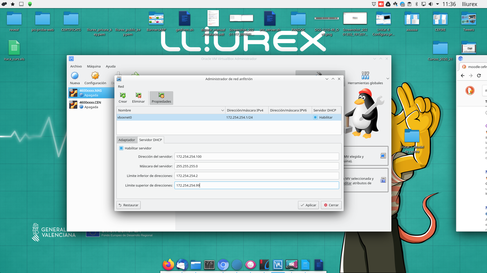
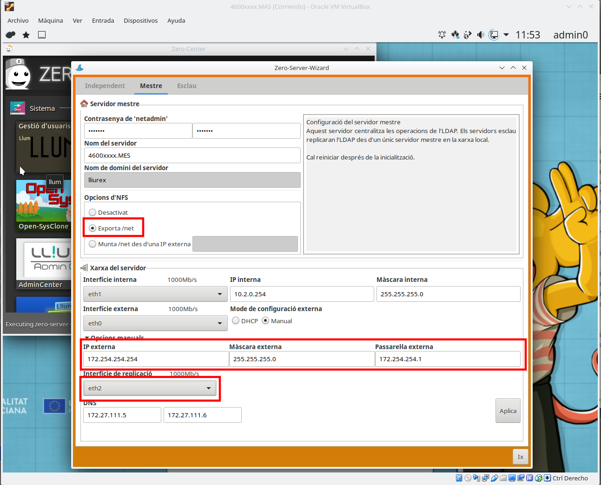

---
title: "MODELO DE CENTRO CON VIRTUALBOX"
author: [Alfredo Rafael Vicente Boix y Javier Estellés Dasi \newline Revisado por Sergio Balaguer ]
dato: "2021-02-24"
subject: "Proxmox"
keywords: [Red, Instalación]
subtitle: "Ejemplo de un centro con Virtualbox sin Proxmox"
lang: "es"
page-background: "background10.pdf"
titlepage: true,
titlepage-rule-color: "360049"
titlepage-background: "background10.pdf"
colorlinks: true
toc-own-page: true
header-includes:
- |
  ```{=latex}
  \usepackage{awesomebox}
  \usepackage{caption}
  \usepackage{array}
  \usepackage{tabularx}
  \usepackage{ragged2e}
  \usepackage{multirow}


  ```
pandoc-latex-environment:
  noteblock: [noto]
  tipblock: [tip]
  warningblock: [warning]
  cautionblock: [caution]
  importantblock: [importando]
...

<!-- \awesomebox[violet]{2pt}{\faRocket}{violet}{Lorem ipsum…} -->

# Introducción

En esta unidad veremos como montar el modelo de centro virtualitzado. Esto nos servirá para entender como funciona el modelo de centro de LliureX y qué es un servidor maestro.

# Modelo de centro

El modelo de centro es un modo de configuración que combina red y servidores para dar unos servicios a todos los ordenadores dentro del centro. Entre otras cosas el modelo de centro puede dar los siguientes servicios de red:

- Páginas web internet del centros
- Jitsi para reuniones a la intranet
- Moodle para sesiones internas
- Videoconferencias
- LDAP para logar los usuarios a cualquier ordenador del centro
- Carpetas compartidas en todo el centro
- Mirror compartido por todos los servidores
- Servidor de imágenes para clientes ligeros
- Nextcloud para compartir ficheros a la intranet
- DHCP para cada aula

Además de todas estas características, LliureX presenta numerosas herramientas que facilitan la instalación y configuración del software.

Pero la principal ventaja de todo es que LliureX permite configurarlo todo sin tocar la terminal y sin tener conocimientos avanzados de informática. La puesta a punto del modelo de centro es rápida y sencilla.
Para entender mejor el modelo de centro hablaremos de cada elemento por separado.

# Sabores de LliureX

LliureX se presenta con varios sabores y cada cual tiene sus características diferenciadas. Dentro del modelo de centro tenemos tres sabores principales:

| Sabor | Características |
| -- | -- |
| Servidor | Puerta todo los paquetes para montar el modelo de centro |
| Cliente | Es la versión que tenemos que instalar en el centro |
| Escritorio | Puede funcionar de manera independiente |

Los sabores música, infantil, fp, etc... son una versión de escritorio con paquetes característicos de cada una de las especialidades.

# Servidor

El servidor de LliureX puede trabajar de 3 maneras.

| Servidor | Características |
| -- | -- |
| Independiente | El servidor trabaja de manera independiente |
| Maestro | Proporciona servicios a los esclavos |
| Esclavo | Puede trabajar de manera independiente, sincroniza con MASTER (Maestro) |

El servidor tiene como mínimo 2 tarjetas de red:

- La red interna: a esta tarjeta se conectará uno switch donde se conectarán los clientes.
- La red externa: se conectará directamente en la red de Aulas del router (antigua macrolan).

Para que el servidor funcione dentro del modelo de centro hay que configurarlo e inicializarlo con el **zero-server-wizard** que veremos más adelante.

## Esquema de red

Un esquema bastante habitual que nos encontramos en los centros es el siguiente:


:::warning
En el esquema se muestra un servidor NFS de archivos. Al final del curso daremos unas recomendaciones de cómo se monta un servidor NFS, pero tienes que tener en cuenta que este tipo de servidores dan muchos problemas para montar el /net, debido a un problema con las ACLs y el NFS v3, por lo tanto se recomienda dejar el /net al MASTER. Se puede montar en el servidor NFS como un disco del PROXMOX (qcow por ejemplo), las ACLs no darán problemas en ese caso.
:::

En este esquema nos encontramos 3 servidores, donde el servidor maestro guarda la base de de datos para logar todos los usuarios (LDAP), y puede dar servicio en la red de profesorado.

Un esquema más adecuado sería este:


Hemos que tener en cuenta los siguiente elementos. Cada uno de los servidores tiene que tener como mínimo 3 tarjetas de red:

 | Tarjeta | Características |
 | -- | -- |
 | eth0 | Tarjeta interna que da DHCP en el aula |
 | eth1 | Tarjeta externa que se conecta en la red de Aulas |
 | eth2 | Tarjeta de replicación de servicios comunes |

# Instalación del modelo de centro

Vamos a realizar el montaje de un modelo de centro paso a paso con todas sus funcionalidades, para tener claro sus conceptos. En esta unidad utilizaremos el software de Virtualbox para montar el modelo de centro.

:::warning
Tenéis que tener en cuenta que aquí no hablaremos de todo el software que viene con LliureX, como lo harvester, libreoffice, programas de diseño, etc... En este curso nos centraremos exclusivamente en el montaje y configuración del modelo de centro
::: 

## Instalación de Lliurex

:::note
Podéis encontrar la última ISO para descargar [aquí](http://releases.lliurex.net/isos/19.07_64bits/lliurex-servidor_64bits_19_latest.iso).
:::

Podéis instalar virtualbox con:

```
sudo apt install virtualbox-dkms virtualbox virtualbox-ext-pack virtualbox-guest-additions-iso
```

Una vez tenéis instalado lo virtualbox, lo ejecutáis y os aparecerá la siguiente pantalla:


Hacemos click sobre **Nueva** y seguimos el siguiente ejemplo:


:::caution
Si es un servidor MASTER que va a alojar el mirror, tienes que dejar bastante espacio para que quepa todo el mirror (mínimo 70GB, en las pruebas se han utilizado 90GB).
:::


Ahora hacemos click sobre configuración y vamos a la sección de almacenamiento (almacenamiento), hacemos click sobre “Vacío” y seleccionamos la iso de LliureX 19 descargada (desde el recuadro rojo)


Después vamos a la sección de red y seleccionamos 3 adaptadores:


Después vamos a pantalla y seleccionamos 128Mb de memoria de video.


Y le damos a Iniciar:


Después hacemos click sobre **Instala versión de LliureX**


Rellenamos los siguientes parámetros:

| Parámetro | Opción |
| -- | -- |
| Nombre | admin0 |
| Contraseña | Una segura, no lliurex |
| Nombre del ordenador | 4600xxxx.MAS |


Y se procede a la instalación:


Podemos hacer click en Reinicia o apagar el ordenador con el menú parar:


Una vez tenemos el ordenador apagado podemos clonar la máquina:


Le damos el nombre a la máquina: 46000xxxx.CEN:


Y seleccionamos clonación completa:


:::warning
A pesar de que aquí se explica la clonación completa. NO es recomendable hacerla, puesto que después va a requerir unas tareas de mantenimiento en la carpeta /etc/netplan para asegurarte que no se duplican ips. Si se hace la clonación completa se tiene que tratar de hacer siempre antes de inicializar el servidor y reiniciar las macs. Es mejor realizar otra instalación.
:::

El adaptador 2 lo cambiamos a centro en lugar de maestro:


:::warning
¡ATENCIÓN! Este paso es voluntario y os puede resultar lioso si no estáis muy acostumbrados a trabajar con redes. Podéis omitirlo y trabajar directament con las direcciones que os da por DHCP vuestro router, para ello debéis configurar la tarjeta de la máquina virtual como modo *bridge* (puente).
:::

Para simular la red del centro en virtualbox vamos a hacer uso del administrador de red de virtualbox. Vamos a Archivo  Administrador de red anfitrión y llenamos los parámetros como en la figura


Emularemos también lo DHCP del router a pesar de que no es necesario:



:::warning
El router de Telefónica que tenemos en los centros nos proporcionan DHCP y la salida a, si queremos emular el centro como es debido, podríamos instalar dnsmasq en nuestro ordenador (el host de virtualbox). Pero como se trata solo de probar cosas, dejamos que virtualbox de DHCP a través de la 172.254.254.100 (aunque no es necesario puesto que vamos a dar direcciones estáticas). Y utilizamos la dirección 172.254.254.1 para nuestro ordenador (host), para poder conectarnos remotamente si fuera necesario.
:::

Si queréis tener acceso a internet desde los servidores de virtualbox tenéis que hacer el siguiente:

```
sysctl net.ipv4.ip_forward
// Si es 0 entonces hay que aplicar la siguiente línea
sudo sysctl -w net.ipv4.ip_forward=1

sudo iptables -t nat -A POSTROUTING -o eth0 -j MASQUERADE

sudo iptables -A FORWARD -i vboxnet0 -j ACCEPT
```

# Inicialización del servidor

Para poder tener el modelo de centro es importante inicializar el servidor, dependiendo de la configuración que queremos tener tenemos que hacerlo de una manera u otra.

* Si solo volamos un servidor de aula, el servidor se inicia como **independiente**. 
* Si queremos tener un servidor *maestro* donde se hace la autenticación (LDAP), está el mirror, las carpetas de usuario y todos los servicios que queramos dar, hay que configurar un maestro y los servidores que se conectan a él como *esclavos*.

Esta última es la configuración que más nos interesa. Para poder iniciar el servidor haremos uso del programa **zero-server-wizard**. Podemos iniciarlo desde la terminal con:

```
zero-server-wizard
```
:::note
El zero-center es un apartado exclusivo de lliurex donde se puede encontrar todo aquel software específico de la distribución o instaladores de software que bien porque requieren configuraciones especiales o bien porque son complicados de instalar, facilitan la tarea enormemente.
:::

Vamos al zero-center y buscamos el zero-server-wizard:


Iniciamos el zero-server-wizard


En nuestro caso, vamos a iniciar este servidor como maestro. Tenemos que tener especial cuidado al incluir **exporta /net**, para tener solo uno mirror. La IP interna nos interesa tenerla controlada para saber cuál es cada servidor. Y la interfaz de replicación que es por donde se montará el **/net** entre los servidores.



:::caution
Si estás haciendo pruebas al virtualbox en tu casa has de tener en cuenta que no estás conectado en la red de Aulas, por lo tanto tienes que posar unos DNS diferentes. Se podan utilizado a modo de ejemplo 1.1.1.1 (Cloudflare) y 8.8.8.8 (Google).
:::

## Inicialización del servidor esclavo

Una vez iniciamos el servidor maestro, los esclavos los iniciamos del mismo modo, pero teniendo en cuenta que la ip será diferente y montaremos lo mirror del servidor maestro.


Después de reiniciar volvemos al zero-center (recuerda que siempre al servidor esclavo) y ejecutamos **lliurex-mirror-redirect**.


Escribimos nuestro usuario y contraseña. La última entrada la dejamos en blanco.


Y activamos la opción del **lliurex-mirror-redirect**. Puedes ir después a la carpeta **/net/mirror** o escribir a la terminal **mount | grep mirror** para asegurarte que está montado.


# Instalación de clientes

Desde hace un tiempo Consellería ha decidido prescindir de los clientes ligeros, y ya no se realizan compras de los mismos. Aunque en los centros todavía hay muchos y LliureX continuará dando soporte.

## Clientes ligeros

Para utilizar clientes ligeros utilizaremos **admin-center** que podemos encontrar tan en el zero-center como en la página de inicio del firefox. Al entrar en admin-center nos encontraremos este menú.


Haremos click sobre LliureX LTSP y veremos el menú de Gestión de Clientes LTSP, haremos click sobre Gestión de Imágenes de cliente.


 Una vez ahí crearemos una nueva imagen.

:::important
Hay que recordar que antes de crear imágenes de clientes ligeros se ha de descargar el mirror completo de Lliurex en el servidor Maestro cuyo tamaño es aproximadamente 20GB
:::
 
:::note
Puedes tener tantas imágenes como quieras. Si tienes diferentes modelos de clientes ligeros, tal vez te interese tener varías. Además, si tienes una pizarra digital, es conveniente tener una imagen para el ordenador en pizarra y otra para el resto de ordenadores.
:::


Escogemos la opción de cliente puesto que esta es la que nos permite logarnos con LDAP al servidor maestro.


### Asociar cliente a imagen

Podemos asociar la imagen de un cliente para que se inicie siempre con esa imagen. Esta situación nos interesará principalmente en el ordenador del profesor si tiene una pizarra digital. Vamos a Gestión de cliente del aula:


Para poder ver los clientes es necesario que se hayan puesto en marcha al menos una vez y sea el mismo servidor quién les haya dado una ip (Las ips se cogen de la tabla del dnsmasq).


Haces doble click sobre un ordenador (estos vienen identificados con la ip y la MAC). Y nos aparecerá el siguiente menú:


En el último apartado podemos ver un menú desplegable para escoger la imagen con la cual queremos arrancar.

:::note
Hace falta actualizar la página del admin-center una vez se han detectado los clientes para que funcione la ventana de parámetros.
:::

## Instalar nuevo software en una imagen


## Clientes pesados

Para instalar clientes pesados la mejor opción es habilitar la instalación por red. Por lo tanto, vamos  a LliureX Netinstall y configuramos los parámetros para hacer una instalación desatendida. 


Ejemplo de instalación.


## Boot Manager

Para escoger la imagen que se ejecuta por defecto podemos ir al menú principal a **Boot Manager** y cambiar qué opciones por defecto volamos para iniciar el servidor.


# Creación de usuarios con Llum

Llum es la herramienta que nos va a permitir gestionar los usuarios de nuestro centro. Podemos acceder a **Llum** desde el zero-center. Podemos crear todos los usuarios del centro importando los usuarios de Itaca, para hacer esto hay que ir a la pestaña de "Centro" y escoger la entrada "Importación/Exportación" donde seleccionaremos la opción Aula LliureX.


Y después iniciamos llum:


Una vez hemos iniciado Llum vamos a la opción de importar/exportar de Itaca e importamos los usuarios.

:::warning
Se podría tener un modelo de centro funcionando con servidores virtualizados sobre una misma LliureX? Sí, sin usar PROXMOX, podríamos tener como sistema base una LliureX y enlazar la tarjeta externa de cada servidor a la tarjeta física donde está conectado el switch para el aula de informática, para los ordenadores del centro, etc... Pero no tendríamos gestión remota (o sería más complicada). Además, LliureX no es un sistema pensado para tal fin. PROXMOX sí.
:::