---
# Front matter
# Metainformació del document
title: "Configuració de xarxa"
author: [Alfredo Rafael Vicente Boix i Javier Estellés Dasi \newline Revisado por Sergio Balaguer]
date: "05-05-2024"
subject: "Proxmox"
keywords: [Xarxa, Instal·lació]
subtitle: "Exemple d'esquema de xarxa en el model de centre"
lang: ca
page-background: img/bg.png
titlepage: true
# portada
titlepage-rule-height: 2
titlepage-rule-color: AA0000
titlepage-text-color: AA0000
titlepage-background: ../portades/U3.png

# configuració de l'índex
toc-own-page: true
toc-title: Continguts
toc-depth: 2

# capçalera i peu
header-left: \thetitle
header-right: Curs 2023-2024
footer-left: CEFIRE València
footer-right: \thepage/\pageref{LastPage}

# Les figures que apareguen on les definim i centrades
float-placement-figure: H
caption-justification: centering 

# No volem numerar les linies de codi
listings-disable-line-numbers: true

# Configuracions dels paquets de latex
header-includes:

  #  imatges i subfigures
  - \usepackage{graphicx}
  - \usepackage{subfigure}
  - \usepackage{lastpage}


  #  - \usepackage{adjustbox}
  # marca d'aigua
  #- \usepackage{draftwatermark}
 # - \SetWatermarkText{\includegraphics{./img/Markdown.png}}
  #- \SetWatermarkText{Per revisar}
  #- \SetWatermarkScale{.5}
  #- \SetWatermarkAngle{20}
   
  # caixes d'avisos 
  - \usepackage{awesomebox}

  # text en columnes
  - \usepackage{multicol}
  - \setlength{\columnseprule}{1pt}
  - \setlength{\columnsep}{1em}

  # pàgines apaïsades
  - \usepackage{pdflscape}
  
  # per a permetre pandoc dins de blocs Latex
  - \newcommand{\hideFromPandoc}[1]{#1}
  - \hideFromPandoc {
      \let\Begin\begin
      \let\End\end
    }
 
# definició de les caixes d'avis
pandoc-latex-environment:
  noteblock: [note]
  tipblock: [tip]
  warningblock: [warning]
  cautionblock: [caution]
  importantblock: [important]
...

\vspace*{\fill}

{ height=50px }

Este documento está sujeto a una licencia creative commons que permite su difusión y uso comercial reconociendo siempre la autoría de su creador. Este documento se encuentra para ser modificado en el siguiente repositorio de github:
<!-- CAMBIAR EL ENLACE -->
[https://github.com/arvicenteboix/lliurexproxmox](https://github.com/arvicenteboix/lliurexproxmox)
\newpage


<!-- \awesomebox[violet]{2pt}{\faRocket}{violet}{Lorem ipsum…} -->

# Introducció

Fins ara hem vist que en el model clàssic de centre existia un servidor en cadascuna de les aules d'informàtica. Per tant, per a gestionar-lo calia anar a l'aula d'informàtica, o connectar-se bé via ssh o per vnc. 
Amb un model de centre virtualitzat canviem el paradigma i tindrem tots els servidors virtualitzats en un hipervisor o en un cluster d'hipervisors.
A mode d'exemple tenim el següent esquema de model clàssic.

 

I hem de passar al següent al nou esquema.


Per tant, és necessari que cada ordinador bé siga del centre, de l'Aula d'informàtica o la wifi sàpiga quina és la seua xarxa i/o el seu servidor. Per a aconseguir-ho utilitzarem Xarxes virtuals (VLAN).

:::note
La VLAN que utilitzarem en el nostre cas és una VLAN de nivell 1 o per port, existeixen altres tipus de VLAN, per mac, subxarxa, protocol... Que poden tindre interès en un entorn empresarial on siga necessària la mobilitat del lloc de treball.
:::

De tota manera, aquesta unitat és la més complexa de totes i no cal que faces tu la configuració. Des de la DGTIC s'estan renovant el switchs dels centres en un projecte que se n'anomena FÈNIX on s'aplica conjuntament amb el COURSE. Una vegada impantats, aquestos projectes normalitzen la vostra xarxa. L'últim punt del d'aquesta Unitat tracta del projecte COURSE, FÈNIX. Podeu anar directament a eixe punt si teniu constància que van a muntar-vos aquest projecte al vostre centre. Encara que es recomana llegir tota la unitat per tenir una idea de quin és el funcinament de les VLANs.

:::warning
El projecte no es sol·licita en el SAI, a aquestes alçades pràcticament el 90% dels centres ja tenen actualitzada la xarxa de centre. Tots els canvis que es vulguin sol·licitar s'haurien de fer expressament en [gvasai](https://gvasai.edu.gva.es/) *Nou tiquet sobre xarxa de Dades > Petició > Xarxa de dades > Canvi configuració router*, no atendran peticions del tipus vull que em prepares un switch per a Proxmox, s'haurà d'especificar vull un bond en les boces 21-24 amb les VLAN configurades en *tagged* 10, 40, 100, 111, 112 i 198. Per a això cal conèixer molt bé com està muntada la xarxa del teu centre.
:::

# Conceptes de xarxa

En aquesta unitat configurarem un esquema de xarxa model amb dos *switches* a mena d’exemple. Coneixent com es configuren dos *switches*, configurar-ne'n més es fa de manera similar. Però abans anem a veure un poc de terminologia i tecnologia que anem a utilitzar.

:::warning
Es pressuposa certa expertesa en tema de xarxes com saber què és una IP, un switch o un router, com es connecten els ordinadors en xarxa o configurar una estació de treball en una xarxa.
:::

## VLAN i LAG

Tractarem de fer una breu explicació per entendre les VLANS sense entrar en detalls tècnics que no corresponen a aquest curs. A les xarxes virtuals per port, tal i com diu el nom, hem de configurar cadascun dels ports segons la xarxa virtual que nosaltres volem tindre. Es poden configurar tantes VLANS com el switch ho permeta. En el nostre cas, la quantitat màxima és de 256, més que suficient per al que anem a fer. A mode d'exemple podríem tenir el següent switch on cada port pertany a una o més VLANS.

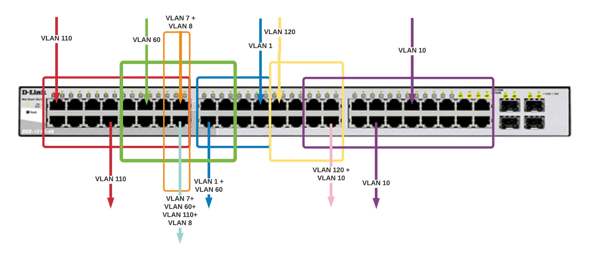

Hem de tenir en compte que:

* Hem de configurar cadascun dels ports del switch amb la VLAN corresponent. És per això que es necessari tenir ***switches* gestionables** per a poder configurar la xarxa.
* Si ens fixem en la VLAN 110 en roig, podem veure que la VLAN que entra és la 110 i la que ix és la mateixa.
* En canvi, al port 12 podem veure com la VLAN que ix és la 60 i la 110, ja que el port està configurat per a pertànyer a 2 VLANS.
* Al port 16 passa el mateix però amb 4 VLANS, els port de la zona taronja estan configurats per a tenir 4 VLANS.
* Si a un port arriba una connexió sense cap VLAN i el port està configurat amb la VLAN 10, la connexió que surt és de la VLAN 10.

Per a fer-vos una idea senzilla simplement heu de tenir en compte cadascun dels quadrats. Quan penseu en la VLAN 110, penseu en els ports que pertanyen a eixa VLAN. Però ara se'ns planteja la següent qüestió.

### Com sap un ordinador amb diferents VLANS quina xarxa ha d'escollir?

Si l’ordinador suporta VLANS que no és el més habitual, es deurà de configurar a l’arxiu corresponent amb les VLAN de la xarxa. Però com normalment es tracta d’una màquina de treball (només treballa amb una VLAN), li direm al port del switch on va a connectar-se l’ordinador que eixa màquina no entén de **VLANS**. A aquesta opció l’anomenem **UNTAGGED**. Si en lloc d’un ordinador connectem un switch (que sí entén de VLANS). Entendrà que la VLAN untagged és per a ell (per exemple, un DHCP que li oferix una ip, o la xarxa per a poder accedir per a gestionar-lo) i les **TAGGED** serán aquelles que passaran als ports configurats amb les respectives VLANS. A mode d’exemple podem veure.

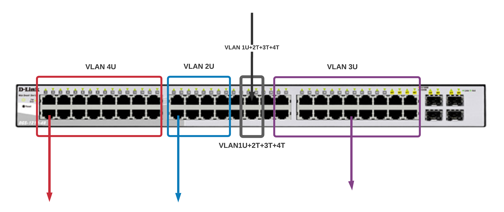

Aquesta és la situació que ens trobarem normalment als centres. En aquest cas podem veure que, arriben 4 VLANS, la 1 arriba untagged, el que significa que el switch haurà de tindre una ip de la VLAN 1. La VLAN 2+3+4 com estan tagged, estaran connectades a la xarxa 2,3 i 4 respectivament. Com que anem a connectar un ordinador a eixe port les hem posades unttagged.
Podem veure com seria la connexió entre dos ordinadors connectats a la mateixa VLAN:


:::caution
Aquesta explicació no pretén ser tècnica ja aquest curs no va adreçat únicament a gent amb una formació tècnica, sinó de generar una idea sobre com funcionen les VLANs sense entrar en com es marquen les VLANS a nivell de connexió. Hi ha molta informació al respecte a la web. Això sí, és important tindre una idea de com funciona. A mesura que practiqueu amb algun switch anireu agafant soltesa.
:::

## Bonding/Link Aggregation

El bonding és una manera de poder ampliar la velocitat de connexió entre dos màquines, poden ser bé dos ordinadors, dos *switches*, o un ordinador i un switch, etc...


Els avantatges i consideracions que té fer un bonding entre dos màquines són:

* Augmentes la velocitat.
* Si un cable deixa de funcionar, la connexió es manté.
* Utilitzant el protocol **LACP** augmenta la compatibilitat entre diferents màquines.
* Simplifica les connexions. 


:::caution
De la mateixa manera que l'apartat anterior aquesta explicació no pretén ser tècnica sinó donar una idea. Cal incidir que per al cas que estem tractant i en funció de marques, moltes vegades s'utilitzen indistintament els termes, **bonding**, **trunking**, **LAG**, **bundling** o **channeling**. I segur que s'utilitzen altres terminologies que no coneguem.
:::

# Model d'exemple

Partirem de l'exemple del següent model. Per a poder fer-lo hem utilitzat:

| Dispositiu | Característiques |
| -- | -- |
| Dlink DGS-12-10-48 | Switch de 48 ports a 1Gb |
| Netgear GS724T | Switch de 24 ports a 1 Gb |
| Servidor SEH1 | Ordinador de 32 Gb i processador i7 | 

L’esquema es quedaria de la següent manera. Una vegada tinguem dissenyat el esquema del nostre centre podem passar a configurar cadascun del *switches*.

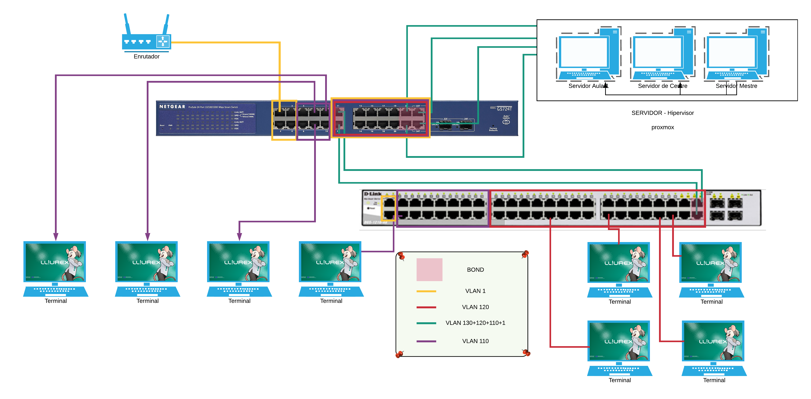

## Configuració dels *switches*

Abans de començar cal que ens creem una taula per a definir, les adreces ip dels switches i quins ports van a tenir cadascuna de les VLANs. El rang del centre fictici que tenim creat al nostre exemple és el 172.254.254.X

Les adreces IP dels *switches* seran:

| Switch | Adreça |
| -- | -- |
| Dlink DGS-12-10-48 | 172.254.254.11 |
| Netgear GS724T | 172.254.254.10 |


### Configuració del Switch principal amb el Netgear GS724T

Basant-nos en l'exemple que este seguint l'esquema del switch quedaria de la següent manera:

| Ports | VLAN | Bond |
| -- | -- | -- |
| P1 a P4 | 1 | No |
| P5 a P10 | 110 | No |
| P11 a P12 | 1,110,120,130 | Si LAG1 |
| P13 a P16 | 1,110,120,130 | Si LAG4 |
| P17 a P20 | 1,110,120,130 | Si LAG3 |
| P21 a P24 | 1,110,120,130 | Si LAG2 |

\* LAG = Link Aggregation group. És el que nosaltres estem anomenant **bond**. 

Encara que per a configurar el switch és millor traure't un esquema de la següent manera:

| VLANs | Ports | 
| -- | -- | 
| 1 | U-P1, U-P2, U-P3, U-P4, U-LAG1, T-LAG2, T-LAG3, T-LAG4| 
| 110 | U-P5, U-P6, U-P7, U-P8, U-P9, U-P10 T-LAG1, T-LAG2, T-LAG3, T-LAG4 | 
| 120 | T-LAG1, T-LAG2, T-LAG3, T-LAG4 | 
| 130 | T-LAG1, T-LAG2, T-LAG3, T-LAG4 | 
| 200 | T-LAG2, T-LAG3, T-LAG4 |

La VLAN 200 l'utilitzem per a la **xarxa de replicació de LliureX**.  Concepte que tractarem en l'última unitat.

:::note
És possible que us pregunteu el perquè de T-LAG2 i T-LAG3. Hem deixat preparat el switch per si volem crear un clúster en Proxmox amb altres hipervisores. 
És a dir que si tinguérem tres servidors amb 4 targetes de xarxa podem fer tres LAG amb quatre ports cadascun. Els tres servidors es comunicarien entre ells per aquests LAG.
:::


Abans de res per a accedir al switch hem de tindre'l dins de la mateixa xarxa. Si el switch ja està configurat i coneguem l'adreça ip i la contrasenya ens podem votar el següent pas.

#### Reinicialitzar switch

Per a reinicialitzar el switch hem d'utilitzar un clip i pressionar 10 segons el clip al botó de la imatge. L'adreça per defecte per a accedir és la 192.168.0.239 (depèn sempre de marques i models)


:::warning
**Tinc en compte** que si el switch ja està connectat a una xarxa aquest agafarà una adreça per DHCP.
:::

Si el switch ha agafat una adreça per DHCP pots tractar d'esbrinar la seua ip amb el comandament:

```sh
sudo nmap -sP 172.254.254.*
``` 

Utilitzem **sudo** ja que ens un poc més d'informació.

#### Accedir a switch

Per a poder accedir al switch has de tenir configurada la xarxa de l'ordinador dins del mateix rang que el switch. Podem configurar la xarxa de la següent manera:
Anem al panell de ferramentes i clickem sobre la icona del pc.

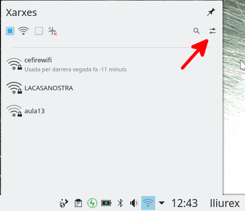

Allí canviem la configuració. Podem crear-ne una nova fent click sobre el més. En aquest cas hem configurat l'adreça 10.90.90.100, però per al switch Netgear seria la 192.168.0.100, o qualsevol que no siga la 192.168.0.239.

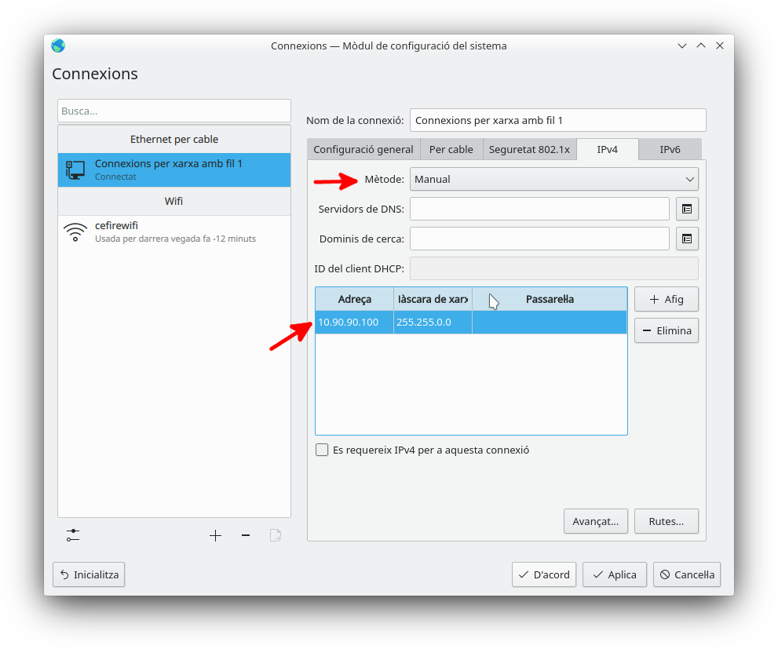

:::caution
Una vegada canviada la configuració heu de desconnectar-vos i tornar-vos a connectar sinó no vos canviarà la ip.
:::

#### Configuració del Switch

Una vegada ja teniu la ip al mateix rang, ja podeu accedir al switch a través del navegador:


El primer que caldria fer es accedir al switch per a canviar la seua ip i posar-la dins del rang de la nostra xarxa de Aules.


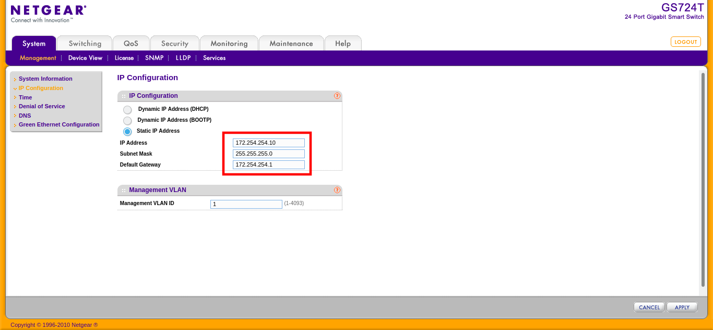

Una vegada actualitzada la IP del switch recorda canviar la IP del teu ordinador per a poder tornar a accedir. Després anem a la secció de LAG, per a configurar cadascun dels LAG segons la imatge.


Quan tenim definits tots els LAGs, anem a LAG membership i afegim els ports als quals pertanyen cadascun dels switchs.

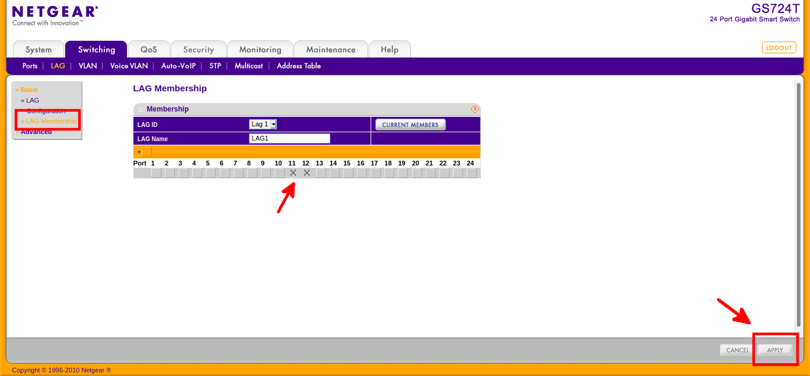

Ens ha de quedar una cosa així:


Després hem de definir les VLANS, anem a la pestanya de VLAN i configurem les nostres VLAN.


Ens ha de quedar una cosa així:


I afegim els ports untagged de cadascuna de els VLAN en l'apartat VLAN membership.


Després canviem del menú VLAN ID cadascuna de les VLAN i anem configurant-les una a una. 

:::warning
Recorda donar-li al botó Apply cadascuna de les vegades que acabes la configuració d'una VLAN.
:::


El mateix amb la VLAN 120.


La 130.


I la de replicació.


:::warning
Finalment, i és molt important, als *switches* Netgear (no amb els d'altres marques) és necessari canviar el paràmetre PVID, pel que cal anar a l'apartat PVID configuration i canviar-lo en aquells ports untagged al valor que hem donat untagged. Altres marques aquest pas es fan automàticament.
:::

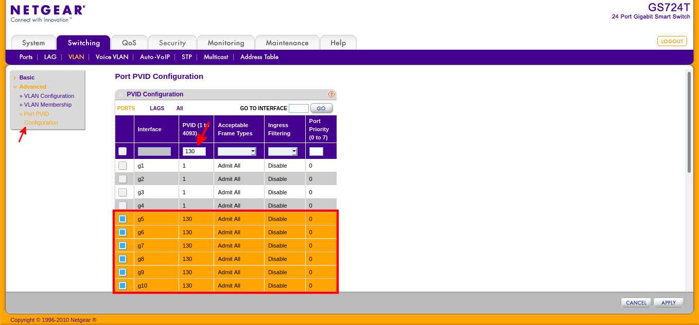


### Configuració de Switch de Aula D-LINK DGS1210-48

Cal dir que, tot i que anomenem aquest switch, switch de Aula, podria ser perfectament un switch que dona servei a les aules del voltant i a l'aula d'informàtica. La configuració d'aquest switch quedaria de la següent manera:

| VLANs | Ports | 
| -- | -- | 
| 1 | U-P1, U-P2, U-P3, U-P4, U-LAG1 (U-P47,U-P48) | 
| 110 | U-P5 a U-P16, T-LAG1 (T-P47,T-P48) | 
| 120 | U-P17 a U-P46, T-LAG1 (T-P47,T-P48) | 
| 130 | T-LAG1 (T-P47,T-P48) | 

Hem indicat els ports entre parèntesis, ja que, al contrari en el Netgear, en este switch sí que has de configurar els ports pertanyents al LAG.

#### Reinicialitzar switch

Per a reinicialitzar el switch D-link hi ha que procedir de manera similar al Netgear, cal polsar el botó *reset* durant 10s aproximadament.


:::warning
**Tinc en compte** que, al igual que el Netgear si el switch ja està connectat a una xarxa aquest agafarà una adreça per DHCP. Per a fer el reset és recomanable no tenir cap cable connectat al switch.
:::

Si el switch ha agafat una adreça per DHCP pots tractar d'esbrinar la seua ip amb el comandament:

```sh
sudo nmap -sP 172.254.254.*
``` 
#### Configuració del Switch

Una vegada tingues la ip al mateix rang, ja pots accedir a ell, la ip per defecte del switch D-link és 10.90.90.90, per tant, canviarem la ip del nostre ordinador i accedirem a ell. Igualment podem utilitzar la terminal per a crear un alias. Depenent de si tens instal·lat el ifconfig o no pots utilitzar qualsevol dels següents comandaments

```sh
sudo ip addr addr add 10.90.90.100/24 dev eth0 label eth0:1
```

```sh
sudo ifconfig eth0:1 10.90.90.100 netmask 255.255.255.0 up
```
Després ja podem entrar al switch, la contrasenya per a poder entrar és *admin*. 

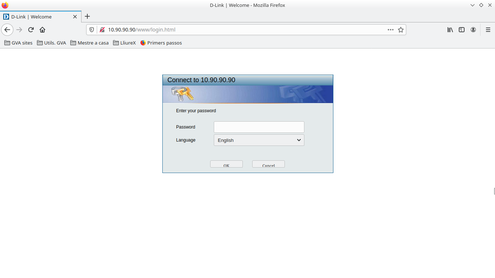

Posteriorment configurem la IP del switch.


I canviem la contrasenya genèrica


Si anem a gestionar el switch a través de SNMP[^1] caldrà habilitar aquesta opció.

[^1]: Es tracta d'un agent que permet recopilar informació d'administració del dispositiu localment i la posa a disposició de l'administrador SNMP, d'aquesta manera es pot monitoritzar l'estat de la xarxa.


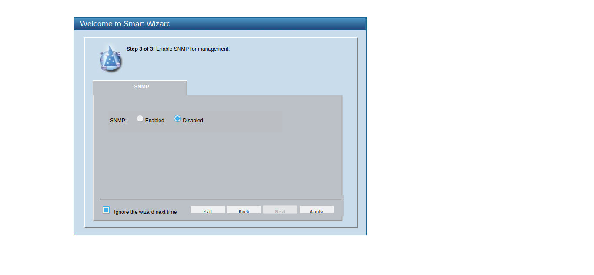

També es pot canviar la configuració de la ip desde les opcions de configuració.


Per a configurar el LAG fem el següent procediment.


Cal configurar el switch per a la VLAN de gestió. En el nostre cas es la 1.

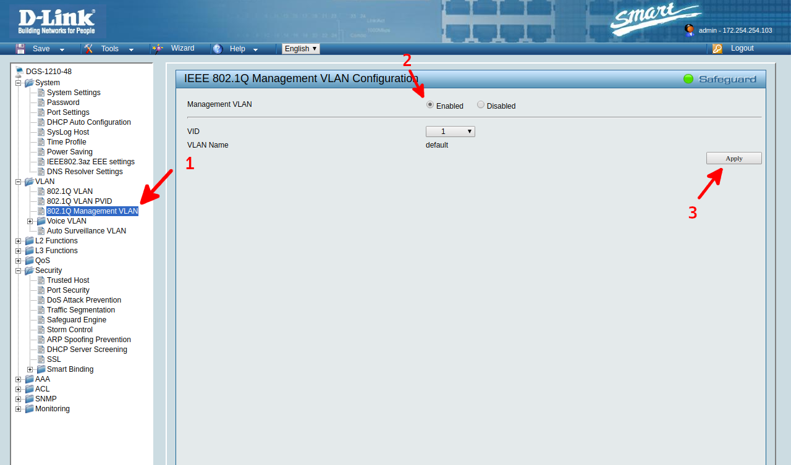

Habilitem el Spanning tree.

:::note
El spanning tree es un protocol que detecta bucles en la xarxa i pot desactivar ports si en detecta algun.
:::


Ara es quan hem de configurar les VLAN, a la imatge podem veure ja totes les VLAN configurades. En un principi només ens apareixerà la VLAN 1, a la qual és necessari entrar ja que tots els ports están configurats en eixa VLAN. Es procedirà a passar-los a *Not member* ja que no et permetrà assignar-los a altra VLAN si ja estan configurats.
Per a afegir noves VLAN hem de donar-li al botó Add.

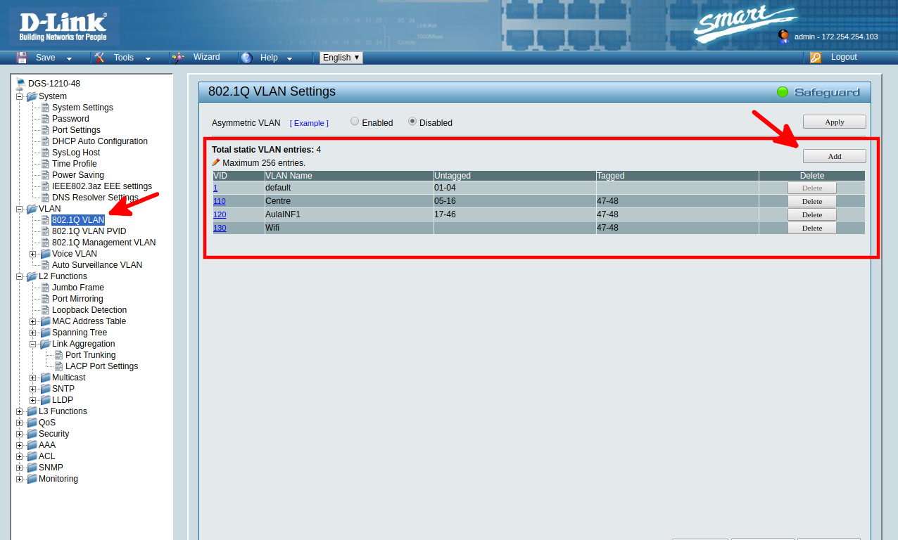


Una vegada hem donat al botó Add, configurem la VID i la VLAN Name, seleccionem els ports que pertanyen a eixa VLAN i li donem a Apply.


:::caution
Finalment, i en alguns *switches* és de vital importància, cal salvar la configuració ja que, si hi ha un tall de subministrament elèctric el switch torna a la configuració d'abans. En aquest cas, donat que tenim un switch amb un LAG, probablement provocaríem un bucle en la xarxa i deixaria de funcionar tot el centre. Per tant, hi ha que anar molt amb compte en aquests detalls.
:::

Procedim a salvar la configuració:

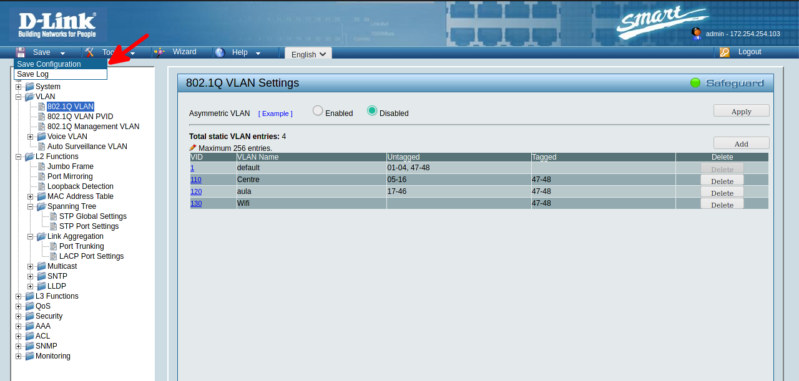

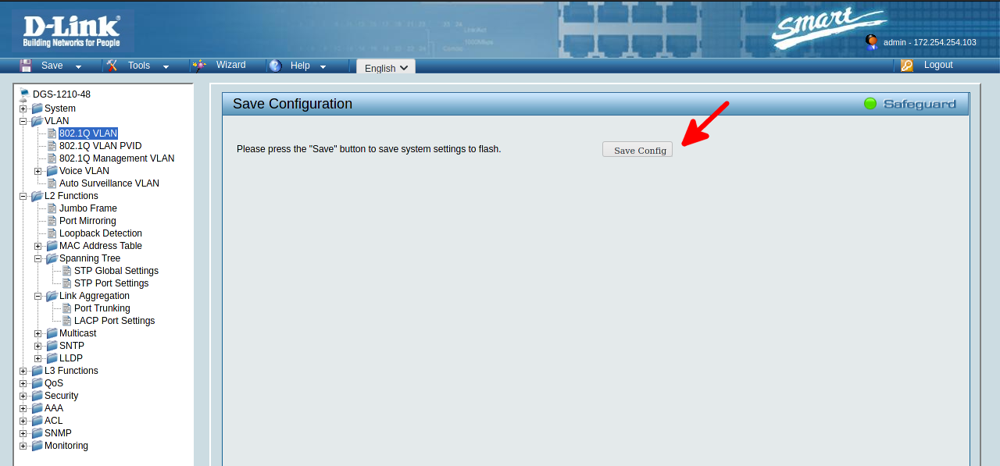

Ara en aquests moments ja tenim tots els switches preparats per a posar en funcionament el nostre centre. Al proper tema instal·larem el Proxmox de les diferents maneres possibles i configurarem els paràmetres del servidor.

# COURSE - FÈNIX

Existeix un projecte des de la DGTIC que tracta de normalitzar el funcionament de les VLANS al centre. En aquest projecte s'actualitza l'electrònica de xarxa del centre, en principi de secreataria i **si el centre reunix els requisits** la electrónica de tot el centre.

En principi els requisits principals és que siga viable canviar la electrònica del tots els racks sense que afecte al funcionament del centre en general. Els switches que en principi es munten són els següents:


En aquest cas quan vos monten els *switches*, si ho demaneu, ja vos deixen tota la infraestructura preparada per a muntar el model de centre amb Proxmox. Les últimes boques sempre son reservades per a fer connexions entre *switches*. Les VLANS normalitzades al projecte curs són les següents:

| VLAN | Descripció |
| -- | --------- |
| 100 | Xarxa de centre |
| 111 a 120 | Xarxa d'Aules (111 Aula 1 ... 120 Aula 10) |
| 198 | Xarxa de replicació - per a replicació de servidors LliureX, o Proxmox |
| 200 | Xarxa Wifi |
| 90-91 | Reservades per a VoIP |
| 40-41 | Reservades per a Xarxa d'Aules (Antiga MacroLAN) |
| 10-11 | Reservades per a Xarxa de secretaria |

La xarxa de 198 s'utilitza en principi per a fer la replicació entre servidors LliureX, però si s'utilitza per a fer replicació entre diferents servidors amb Proxmox es podria utilitzar alguna de les altres reservades per a les Aules d'Informàtica (tenen 10 VLANs reservades). En principi, hi ha pocs centres que tenen 10 Aules d'informàtica, per tant, es podria utlitzar una de les altres si et feren falta.

La manera de configurar els *switches* d'aquesta manera és posant un ticket al SAI exposant la boca, el número de VLAN i el switch on ho vols configurar. A mena d'exemple imaginem que tenim un switch al rack principal, les característiques principals són:

* Les últimes 4 boques del switch están reservades
* Tenim configurat el switch del rack per a model de centre
* Les connexions marcades com hipervisors tenen marcades totes les VLANS (100, 111-120, 198 i 200) per tant no cal tocar res d'este switch

I volem que el switch de l'Aula 1 tinga les 24 primeres boques per als ordinadors de l'Aula d'informàtica i les altres 12 les volem per a ordinadors de les Aules que es troben a eixa planta. Per tant, escriuriem un ticket al SAI indicant el següent:

> Canviar les boques de 1 a 24 a la VLAN 110 y de la 37-44 a la VLAN 100 del switch d'Aula 1.

I des de la DGTIC ens farien el canvi. D'aquesta manera no ens hauriem de preocupar per la configuració de cap switch.


<!-- 


És important tenir clar els següents conceptes abans de començar la instal·lació.

* **AMT** funciona com un sistema independent, per tant tindrà la seua pròpia ip.
* Els suports físics cada vegada s'utilitzen menys. Recorda quan va ser última vegada que utilitzares un CD-ROM.
* Anem a fer una instal·lació de proxmox. No és necessari tenir accés a la consola de Proxmox en cap moment, per tant si ja tens l'hipervisor muntat al rack, no el desmuntes.
* Les IPs utilitzades no corresponen amb les indicades al que recomana el SAI. És la tasca que se vos manarà!


\newpage

# Posada a punt del servidor

Per a posar a punt el servidor, és recomanable, encara que no imprescindible habilitar el AMT, per a posteriorment utilitzar la ferramenta meshcomander per a fer una instal·lació remota.

## Habilitar AMT de Intel

Els servidors distribuïts als centres disposen de la ferramenta AMT de Intel per a poder connectar-se remotament, no sols ens permetrà arrancar l'hipervisor sinó que també ens permetrà configurar certes funcionalitats bàsiques. Però abans que res, caldrà entrar a la BIOS.
Per a accedir a la BIOS (Model SEH1) polsem F2 en el setup de l'ordinador.


\newpage

Una vegada dins anem a la pestanya *Advanced*.


\newpage

I seleccionem *AMT Configuration*.


\newpage

Canviem *MEBx Mode* i seleccionem l'opció Enter MEBx Setup


\newpage

Finalment salvem els paràmetres i reiniciem.


## Configuració del AMT

Una vegada hem habilitat el AMT, entrem en la configuració del mateix i configurem els següents paràmetres.

::: tip
**Info**: Per obvis motius de seguretat no es permet entrar a la configuració del AMT per VNC, pel que algunes de les següents imatges están fotografiades de la pantalla.
:::

Quan entren a la ferramenta de configuració del AMT, hem de logar-nos. La contrasenya d'administrador és **admin**. Posteriorment ens demanarà que canviem la contrasenya per una nova.

::: warning
**Contrasenya**: Hem de respectar la política de contrasenyes, amb majúscula, minúscula i caràcter especial.
:::


Hem d'accedir a les següents opcions per a fer una configuració bàsica.

| Opció | Funcionalitat |
| -- | -- |
| **User Consent** | Ens permetrà poder connectar-nos al servidor per VNC sense donar permís |
| **Network Setup** | Per a configurar les opcions de xarxa |
| **Activate Network Access** | Hem de fer click sobre aquesta opció per a poder accedir a l'hipervisor |


Dins de la opció de **User Content** hem de canviar l'opció assenyalada a *NONE*.


Per a configurar la xarxa anem a l'opció de Network Setup. 


Després anem a **TCP/IP Settings**


I configurem la AMT segons els següents paràmetres

::: caution
**Vés amb compte**: L'adreça de l'AMT és diferent a l'adreça de l'hipervisor. A més has de tenir en compte que el AMT no té el ICMP activitat, pel que si fas un *ping* no et donarà resposta.
:::

Els paràmetres que mostrem són uns paràmetres d'exemple que anem a utilitzar dins del nostre banc de proves.

| Opció | IP |
| -- | -- |
| IP | 172.x.y.2 – 172.x.y.254 |
| Máscara | 255.255.255.0 |
| Puerta de Enlace | 172.x.y.1 |
| DNS | 172.27.111.5 y 172.27.111.6 |


::: important
**Accés**: Una vegada ja tingues funcionant el AMT, podràs accedir a través del navegador amb l'adreça http://172.x.y.238:16992 ó https://172.x.y.238:16993. Hauràs de canviar l'adreça segons la que hages escollit.
:::

# Meshcomander

> En aquest punt hem de tenir en compte que hem d'utilitzar Windows. Si algú coneix algun programari que permeta servir una imatge .iso a través de IDE-R en LliureX seria molt interessant que ho comentara als fòrums.

El AMT ens permetrà tenir el servidor muntat dins del rack principal sense necessitat de tenir ni un monitor ni un teclat connectat. Tot i que es una ferramenta tremendament útil. Aquesta no està disponible per a cap distribució de linux, o al menys, no una versió que disposa de totes les funcionalitats que ens oferix AMT de Intel com el IDE-R.

::: note
**Info**: IDE Redirect (IDE-R) permet muntar una imatge ISO remotament des d'un client. Aquesta opció és molt interessant ja que evita que necessàriament estiguem físicament presents a d'instal·lar o reinstal·lar el Proxmox. Podeu trobar més informació [ací](https://software.intel.com/content/www/us/en/develop/blogs/meshcommander-javascript-ider.html).
:::

Hem de descarregar el programari de la seua [pàgina web](https://www.meshcommander.com/meshcommander) i fer la instal·lació.


::: caution
**Vés amb compte**: Recorda que has d'estar a la mateixa xarxa que l'hipervisor (la xarxa d'Aules en el nostre cas). L'hipervisor no té el perquè d'estar encés per a poder accedir.
:::

Una vegada instal·lat i funcionant el mesh comander veurem una cosa com la següent.


Farem click sobre *Add computer...* I configurarem el servidor amb els paràmetres del AMT que hem configurat prèviament. Podem accedir de dues maneres:

* Amb TLS, pel que utilitzarem el port **16993**
* Sense seguretat, utilitzarem el port **16992**


Una vegada configurat el servidor veurem la pantalla de la següent manera. Ja només en cal, donar a **connect** i podrem accedir a la configuració del nostre servidor de manera remota.


Si has escollit la connexió amb TLS, probablement t'apareixerà una advertència.


Una vegada connectat veurem la següent pantalla. No anem a parar a explicar totes les funcionalitats que disposes, sinó que ens centrarem en la instal·lació remota. Per a això cal anar a Serial-over-LAN.


En aquest punt hem de descarregar la ISO de Proxmox desde la seua [pàgina web](https://proxmox.com/en/downloads).


Aquí farem click sobre l'opció **IDER** i seleccionarem la imatge descarregada.


Una vegada seleccionada l'opció de Proxmox anirem  **Remote Desktop** i seleccionarem l'opció de **Power Actions**. Allí, hem d'escollir l'opció de *Power on to IDE-R CDROM*. Veurem que l'hipervisor es reinicia i començarà la instal·lació.


Finalment veurem com comença la instal·lació de Proxmox.


:::important
És altament recomanable tenir una connexió al menys de 1Gb, ja que sinó la instal·lació es pot fer molt pesada i poden aparèixer errades de *timeout*.
:::

# Instal·lació de Proxmox

Per a instal·lar Proxmox podem utilitzar l'opció explicada. És la més recomanable si ja tens el servidor muntat al rack. De tota manera, també es pot instal·lar amb una memòria usb.


## Creació de usb d'arrancada de proxmox

Per a fer la instal·lació de la iso de proxmox, la millor opció és utilitzar **dd**. Per a detectar on està muntat el usb podem executar abans i després lsblk i podem veure on s'ha muntat la partició.

```sh
lsblk
```

En el nostre exemple (ja que tenim un disc dur m2 no sata, s'ha muntat en sda). Per tant el nostre comandament seria:

```sh
dd if=./proxmox-ve_6.2-1.iso of=/dev/sda status=progress
```

\awesomebox[violet]{2pt}{\faUsb}{violet}{Es recomana fugir de d'aquelles opcions que creen un usb de manera gràfica. Ja que no solen crear bé les particions. Utilitzeu sempre dd.}

## Instal·lació de proxmox

Una vegada tenim creat el disc usb d'arrancada i iniciem amb l'usb, o a través de IDER. Veurem la següent imatge. Polsem *enter* i continuem. 


Tots sabem que és important llegir-se la llicència :smirk:.


Aquesta és una de les parts més delicades i depèn del que vullgueu tenir muntat al vostre centre, també depèn de la quantitat de discs durs que tingueu instal·lats i de si voleu invertir diners en una cabina de discs durs.


Si voleu deixar-ho en ext4. I utilitzar un únic disc per a utilitzar Proxmox i les màquines virtuals no va a donar mals resultats. L'altre disc dur el podeu utilitzar per a fer còpies de seguretat.

:::note
Proxmox utilitza ZFS que és una combinació d'administrador de volums i sistema de fitxers.
:::


Les opcions que tenim són les següents:

| Sistema | Característiques  |
| -- | -- |
| RAID0 | La capacitat de tal volum és la suma de les capacitats dels discos. La fallada d'una unitat fa el volum inservible. |
| RAID1 | La dada és escrita idènticament a tots els discos. Aquest mode requereix com a mínim 2 discos amb la mateixa mida. |
| RAID10 | Una combinació de RAID0 i RAID1. Requereix com a mínim 4 discos. |
| RAIDZ-1 | Una variació de RAID-5, paritat sola. Requereix com a mínim 3 discos. |
| RAIDZ-2 | Una variació de RAID-5, paritat doble. Requereix com a mínim 4 discos. |
| RAIDZ-3 | Una variació damunt RAID-5, paritat triple. Requereix com a mínim 5 discos |

:::warning
Si heu optat per adquirir una targeta controladora per a muntar el RAID, aquesta opció no l'heu de fer servir. Sempre i quan la targeta siga reconeguda per Proxmox, es veurà com un únic disc. Les opcions que estem configurant és RAID per via software.
:::

L'opció més anivellada entre tots els paràmetres a tenir en compte seria l'opció de RAID1.


Configurem la zona geogràfica.


Configurem el password i la contrasenya.

:::caution
Si estàs fent la instal·lació per IDER utilitza la arroba del camp de text ja que és possible que no la pugues escriure amb Alt Gr+2.
:::


Configura la xarxa segons els paràmetres del teu centre. L'exemple donat no és el corresponent al que deuries utilitzar.


Comprovem que tots els paràmetres que hem configurat són els correctes i li donem a Install. De seguida començarà la instal·lació que sol ser bastant ràpida.


Una vegada finalitzada la instal·lació. Reiniciem el sistema i passarem a la següent unitat. Configuració del Proxmox.


 -->


# Bibliografia i referències

(@) https://es.wikipedia.org/wiki/VLAN


