---
# Front matter
# Metainformació del document
title: "CONFIGURACIÓN DE RED"
author: [Alfredo Rafael Vicente Boix i Javier Estellés Dasi \newline Revisado por Sergio Balaguer]
dato: "05-05-2024"
subject: "Proxmox"
keywords: [Red, Instalación]
subtitle: "Ejemplo de esquema de red en el modelo de centro"


lang: ca
page-background: img/bg.png
titlepage: true
# portada
titlepage-rule-height: 2
titlepage-rule-color: AA0000
titlepage-text-color: AA0000
titlepage-background: ../portades/U3.png

# configuració de l'índex
toc-own-page: true
toc-title: Contenidos
toc-depth: 2

# capçalera i peu
header-left: \thetitle
header-right: Curs 2023-2024
footer-left: CEFIRE València
footer-right: \thepage/\pageref{LastPage}

# Les figures que apareguen on les definim i centrades
float-placement-figure: H
caption-justification: centering 

# No volem numerar les linies de codi
listings-disable-line-numbers: true

# Configuracions dels paquets de latex
header-includes:

  #  imatges i subfigures
  - \usepackage{graphicx}
  - \usepackage{subfigure}
  - \usepackage{lastpage}


  #  - \usepackage{adjustbox}
  # marca d'aigua
  #- \usepackage{draftwatermark}
 # - \SetWatermarkText{\includegraphics{./img/Markdown.png}}
  #- \SetWatermarkText{Per revisar}
  #- \SetWatermarkScale{.5}
  #- \SetWatermarkAngle{20}
   
  # caixes d'avisos 
  - \usepackage{awesomebox}

  # text en columnes
  - \usepackage{multicol}
  - \setlength{\columnseprule}{1pt}
  - \setlength{\columnsep}{1em}

  # pàgines apaïsades
  - \usepackage{pdflscape}
  
  # per a permetre pandoc dins de blocs Latex
  - \newcommand{\hideFromPandoc}[1]{#1}
  - \hideFromPandoc {
      \let\Begin\begin
      \let\End\end
    }
 
# definició de les caixes d'avis
pandoc-latex-environment:
  noteblock: [note]
  tipblock: [tip]
  warningblock: [warning]
  cautionblock: [caution]
  importantblock: [important]
...

\vspace*{\fill}

{ height=50px }

Este documento está sujeto a una licencia creative commons que permite su difusión y uso comercial reconociendo siempre la autoría de su creador. Este documento se encuentra para ser modificado en el siguiente repositorio de github:
<!-- CAMBIAR EL ENLACE -->
[https://github.com/arvicenteboix/lliurexproxmox](https://github.com/arvicenteboix/lliurexproxmox)
\newpage
<!-- \awesomebox[violet]{2pt}{\faRocket}{violet}{Lorem ipsum…} -->

# Introducción

Hasta ahora hemos visto que en el modelo clásico de centro existía un servidor en cada una de las aulas de informática. Por lo tanto, para gestionarlo había que ir al aula de informática, o conectarse bien vía ssh o por vnc. Con el nuevo modelo de centro cambiamos el paradigma y tendremos todos los servidores virtualizados en un hipervisor o en un cluster de hipervisores. A modo de ejemplo tenemos el siguiente esquema de modelo clásico.

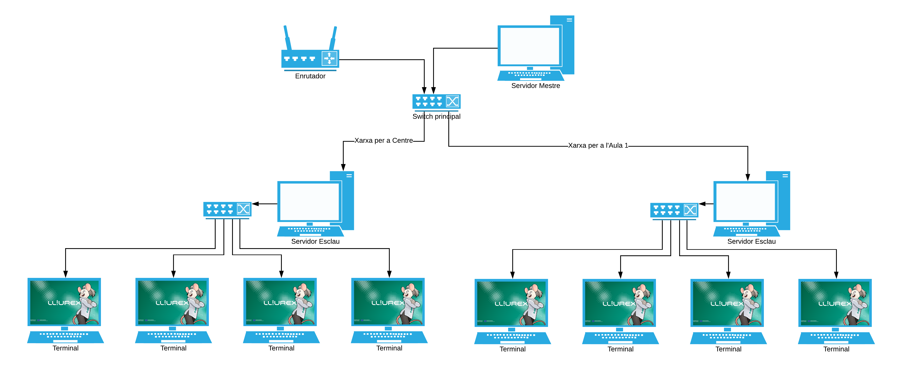 

Y tenemos que pasar al siguiente al nuevo esquema.


Por lo tanto, es necesario que cada ordenador bien sea del centro, del aula de informática o la wifi sepa cuál es su red y/o su servidor. Para conseguirlo utilizaremos Redes virtuales (VLAN).

:::note
La VLAN que utilizaremos en nuestro caso es una VLAN de nivel 1 o por puerto, existen otros tipos de VLAN, por mac, subred, protocolo... Que pueden tener interés en un entorno empresarial o donde sea necesaria la movilidad del puesto de trabajo.
:::

De todas maneras, esta unidad es la más compleja de todas y no hace falta que hagas tú toda la configuración. Desde la DGTIC se están renovando los switchs de los centros en un proyecto que se  denomina FÉNIX donde se aplica conjuntamente con el COURSE. Una vez implantados, estos proyectos normalizan vuestra red. El último punto del de esta Unidad trata del proyecto COURSE y FÈNIX. Podéis ir directamente a ese punto si tenéis constancia que van a montaros este proyecto en vuestro centro. De todas maneras, se recomienda leer toda la unidad para tener constancia sobre cómo funcionan las VLANs.

# Conceptos de red

En esta unidad configuraremos un esquema de red modelo con dos switchs a tipo de ejemplo. Conociendo como se configuran dos swiths, configurar más se hace de manera similar. Pero antes vamos a ver un poco de terminología i tecnología que vamos a utilizar.

:::warning
Se presupone cierta pericia en tema de redes como saber qué es una IP, un switch o un router, como se conectan los ordenadores en red o configurar una estación de trabajo en una red.
:::

## VLAN y LAG

Trataremos de hacer una breve explicación para entender las VLANS sin entrar en detalles técnicos que no corresponden a este curso. En las redes virtuales por puerto, tal y como dice el nombre, podemos configurar tantas VLANS como el switch permita. En nuestro caso, la cantidad máxima es de 256, más que suficiente para lo que vamos a hacer. A modo de ejemplo podríamos tener el siguiente switch donde cada puerto pertenece a una o más VLANS.


Tenemos que tener en cuenta que:

* Tenemos que configurar cada uno de los puertos del switch con la VLAN correspondiente. Es por eso que se hace necesario tener **switchs gestionables** para poder configurar la red.
* Si nos fijamos en la VLAN 110 en rojo, podemos ver que la VLAN que entra es la 110 y la que sale es la misma.
* En cambio, en el puerto 12 podemos ver como la VLAN que sale es la 60 y la 110, ya que que el puerto está configurado para pertenecer a 2 VLANS.
* Al puerto 16 pasa lo mismo pero con 4 VLANS, los puerto de la zona naranja están configurados para tener 4 VLANS.
* Si a un puerto llega una conexión sin ninguna VLAN y el puerto está configurado con la VLAN 10, la conexión que sale es de la VLAN 10.

Para haceros una idea sencilla simplemente tenéis que tener en cuenta cada uno de los cuadrados. Cuando pensáis en la VLAN 110, pensáis en los puerto que pertenecen a esa VLAN. Pero ahora se nos plantea la siguiente cuestión.

### ¿Cómo sabe un ordenador con diferentes VLANS qué red tiene que escoger?

Si el ordenador soporta VLANS o està configurado para ello, que no es lo más habitual, se deberá de configurar el archivo de red correspondiente con las VLAN de la red. Pero como normalmente se trata de una máquina de trabajo (solo trabaja con una VLAN), le diremos al puerto del switch donde va a conectarse el ordenador que esa máquina no entiende de VLANS. A esta opción lo denominamos **UNTAGGED**.
Si en lugar de un ordenador conectamos un switch (que sí entiende de VLANS). Entenderá que la VLAN untagged es para él (por ejemplo un DHCP que le ofrece una ip, o la red para de acceso para gestionarlo) y las **TAGGED** serán aquellas que pasarán a los puertos configurados con las respectivas VLANS.
A modo de ejemplo podemos ver.

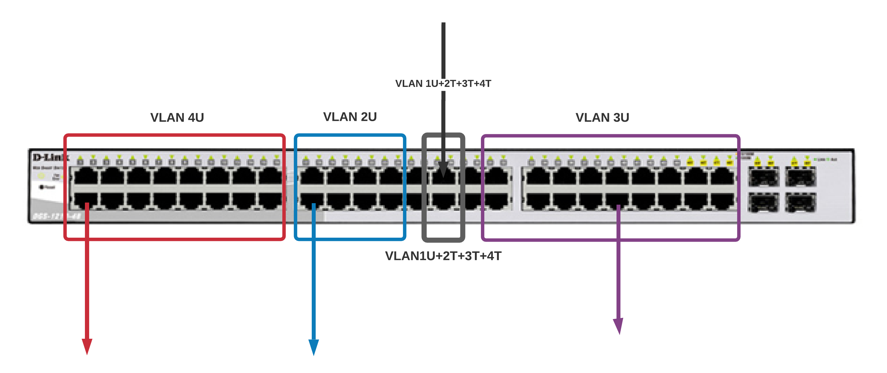

Esta es la situación que nos encontraremos normalmente en el centros. En este caso podemos ver que llegan 4 VLANS, la 1 llega untagged, lo que significa que el switch deberá tener una ip de la VLAN 1. La VLAN 2+3+4 como estan tagged, estarán conectadas en la red 2,3 y 4 respectivamente. Como vamos a conectar un ordenador a ese puerto las hemos puesto en unttagged.
Podemos ver cómo sería la conexión entre dos ordenador conectados a la misma VLAN:

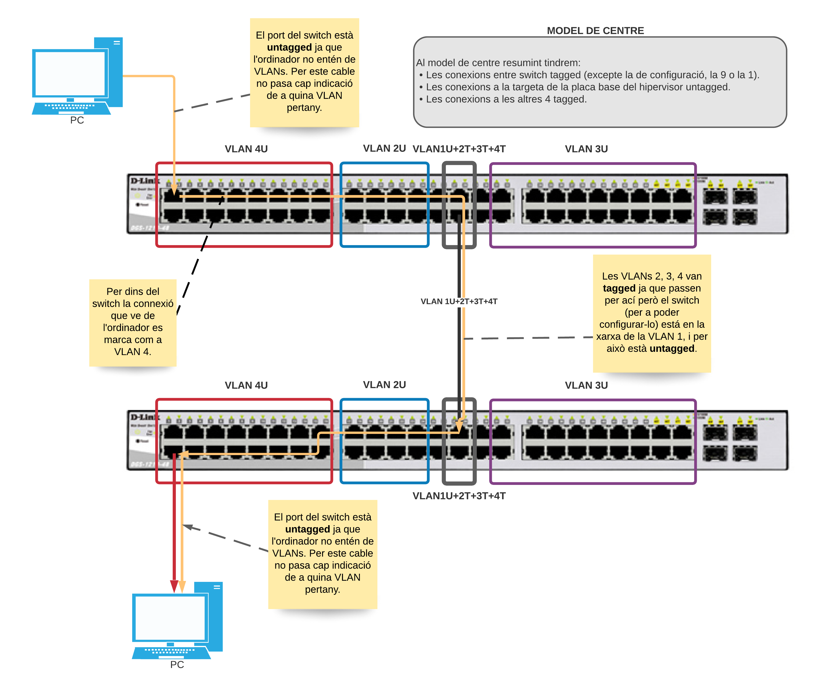

:::caution
Esta explicación no pretende ser técnica ya este curso no va dirigido únicamente a gente con una formación técnica, sino que trata de dar una idea sobre cómo funcionan las VLANs sin entrar en cómo se marcan las VLANS a nivel de conexión. Hay mucha información al respecto a la web. Eso sí, es importante tener una idea de cómo funciona. A medida que practiqueis con algún switch iréis cogiendo soltura.
:::

## Bonding/Link Aggregation

El bonding es una forma de poder ampliar la velocidad de conexión entre dos máquinas, pueden ser bien dos ordenadores, dos switchs, o un ordenador y un switch, entre otras cosas.

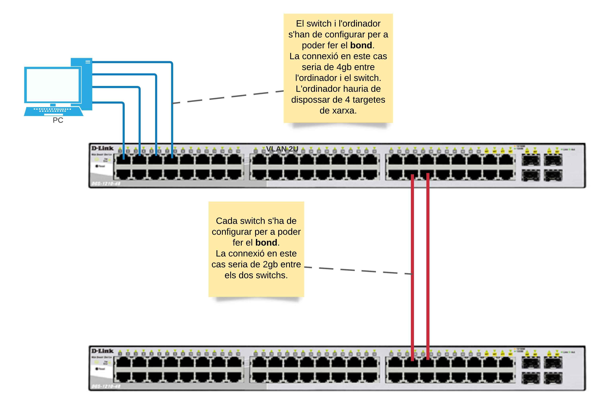

Las ventajas y consideraciones que tiene hacer un bonding entre dos máquinas son:

* Aumentas la velocidad.
* Si un cable deja de funcionar, la conexión se mantiene.
* Utilizando el protocolo **LACP** aumenta la compatibilidad entre diferentes máquinas.
* Simplifica las conexiones. 


:::caution
Del mismo modo que el apartado anterior esta explicación no pretende ser técnica sino dar una idea. Hay que incidir que para el caso que estamos tratando y en función de marcas, muchas veces se utilizan indistintamente los términos, **bonding**, **trunking**, **LAG**, **bundling** o **channeling**. Y seguro que se utilizan otras terminologías que no conocemos.
:::


# Modelo de ejemplo

Partiremos del ejemplo del siguiente modelo. Para poder hacerlo hemos utilizado:

| Dispositivo | Características |
| -- | -- |
| Dlink DGS-12-10-48 | Switch de 48 puertos a 1Gb |
| Netgear GS724T | Switch de 24 puertos a 1 Gb |
| Servidor SEH1 | Ordenador de 32 Gb y procesador i7 | 

El esquema se quedaría de la siguiente manera. Una vez tengamos diseñado el esquema de nuestro centro podemos pasar a configurar cada uno del switchs.

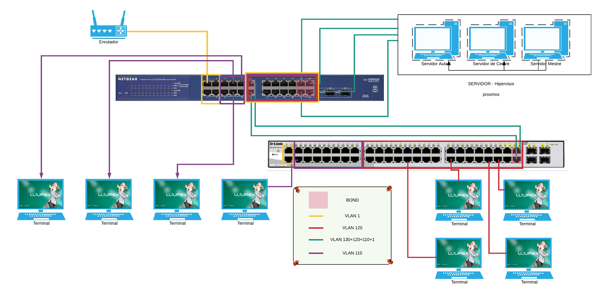

## Configuración de los switchs

Antes de empezar hace falta que nos creemos una tabla para definir, las direcciones ip de los switch y qué puertos van a tener cada una de las VLANs. El rango del centro ficticio que tenemos creado en nuestro ejemplo es el 172.254.254.X. Las direcciones IP de los switchs serán:

| Switch | Dirección |
| -- | -- |
| Dlink DGS-12-10-48 | 172.254.254.11 |
| Netgear GS724T | 172.254.254.10 |


### Configuración del Switch principal con el Netgear GS724T

Basándonos en el ejemplo que estamos siguiendo, el esquema del switch quedaría de la siguiente manera:

| Puertos | VLAN | Bond |
| -- | -- | -- |
| P1 a P4 | 1 | No |
| P5 a P10 | 110 | No |
| P11 a P12 | 1,110,120,130 | Si LAG1 |
| P13 a P16 | 1,110,120,130 | Si LAG4 |
| P17 a P20 | 1,110,120,130 | Si LAG3 |
| P21 a P24 | 1,110,120,130 | Si LAG2 |

\* LAG = Link Aggregation group. Es lo que nosotros estamos denominando **bond**. 

Aunque para configurar el switch es mejor sacarte un esquema de la siguiente manera:

| VLANs | Puertos | 
| -- | -- | 
| 1 | U-P1, U-P2, U-P3, U-P4, U-LAG1, T-LAG2, T-LAG3, T-LAG4| 
| 110 | U-P5, U-P6, U-P7, U-P8, U-P9, U-P10 T-LAG1, T-LAG2, T-LAG3, T-LAG4 | 
| 120 | T-LAG1, T-LAG2, T-LAG3, T-LAG4 | 
| 130 | T-LAG1, T-LAG2, T-LAG3, T-LAG4 | 
| 200 | T-LAG2, T-LAG3, T-LAG4 |

La VLAN 200 lo utilizamos para la **red de replicación de LliureX**.  Concepto que trataremos en la última unidad.

:::note
Es posible que os preguntéis el porqué de T-LAG2 y T-LAG3. Hemos dejado preparado el switch por sí queremos crear un cluster en Proxmox con otros hipervisores. 
Es decir que si tuvieramos tres servidores con 4 tarjetas de red  podemos hacer tres LAG con cuatro puertos cada uno. Los tres servidores se comunicarían entre ellos por estos LAG.
:::

Antes de nada, para acceder al switch tenemos que tenerlo dentro de la misma red. Si el switch ya está configurado y conocemos la dirección ip y la contraseña nos podemos saltar el siguiente paso.

#### Reinicializar switch

Para reinicializar el switch Netegear tenemos que utilizar un clip y presionar durante 10 segundos el clip en el botón como el de la imagen. La dirección por defecto para acceder es la 192.168.0.239 (depende siempre de marcas y modelos)


:::warning
**Hay que tener en cuenta** que si el switch ya está conectado en una red este cogerá una dirección por DHCP.
:::

Si el switch ha cogido una dirección por DHCP puedes tratar de averiguar su **ip** con el comando:

```tcsh
sudo nmap -sP 172.254.254.
``` 

Utilizamos **sudo** ya que nos da un poco más de información, como el fabricante.

#### Acceder a switch

Para poder acceder al switch has de tener configurada la red del ordenador dentro del mismo rango que el switch. Podemos configurar la red de la siguiente manera: Vamos al panel de herramientas y hacemos click sobre el icono del pc.

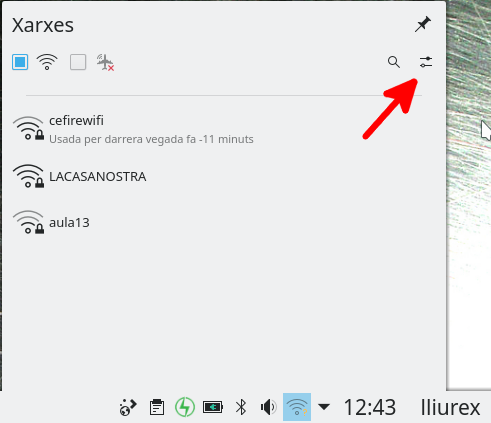

Allí cambiamos la configuración. Podemos crear una nueva haciendo click sobre el más. En este caso hemos configurado la dirección 10.90.90.100, pero para el switch Netgear sería la 192.168.0.100, o cualquier que no sea la 192.168.0.239.


:::caution
Una vez cambiada la configuración hemos de desconectaros y volver a conectarnos sino no os cambiará la ip.
:::

#### Configuración del Switch

Una vez ya tenéis la ip en el mismo rango, ya podéis acceder al switch a través del navegador:

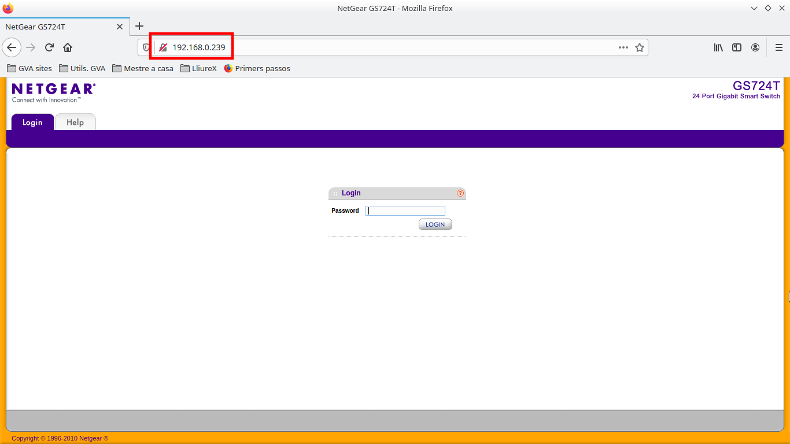

Lo primero que hay que hacer es acceder al switch para cambiar su **ip** y ponerla dentro del rango de nuestra red de Aulas.

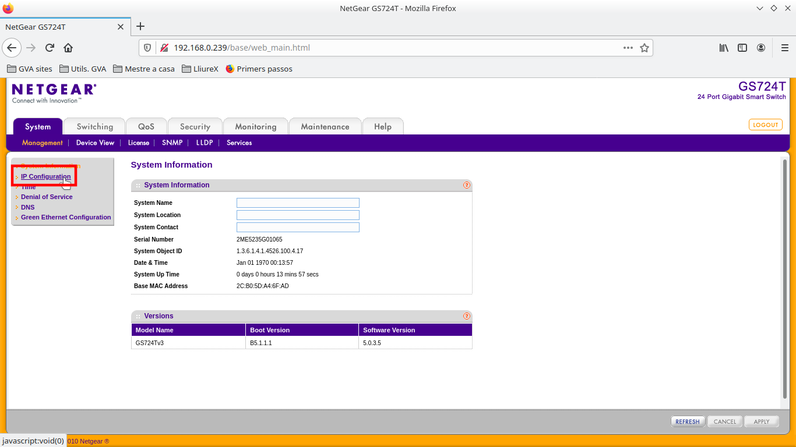

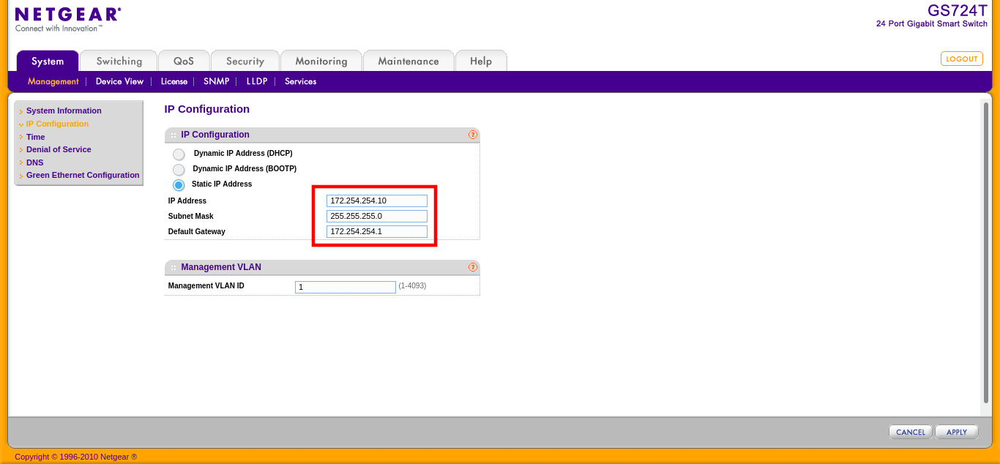

Una vez actualizada la IP del switch recuerda cambiar la IP de tu ordenador para poder volver a acceder. Después vamos a la sección de LAG, para configurar cada uno de los LAG según la imagen.


Cuando tenemos definidos todos los LAGs, vamos a LAG membership y añadimos los puertos a los cuales pertenecen cada uno de los switchs.

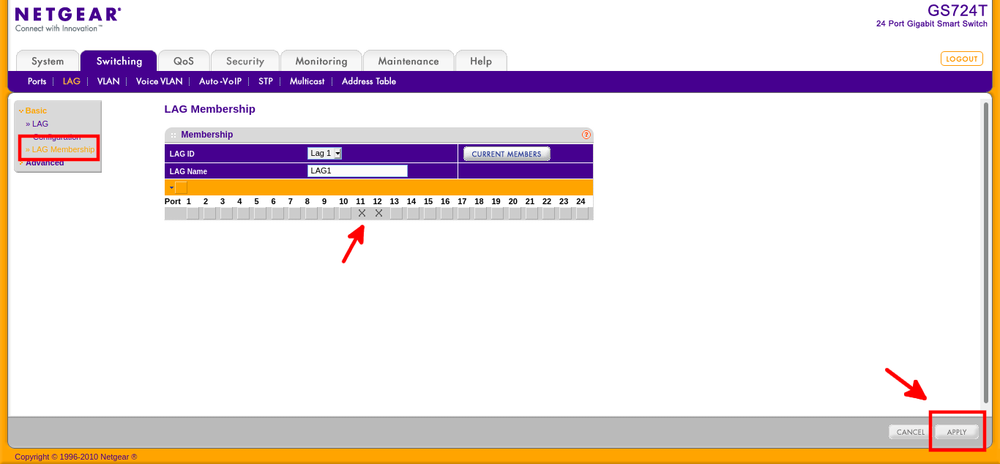

Nos tiene que quedar una cosa así:


Después tenemos que definir las VLANS, vamos a la pestaña de VLAN y configuramos nuestras VLAN.

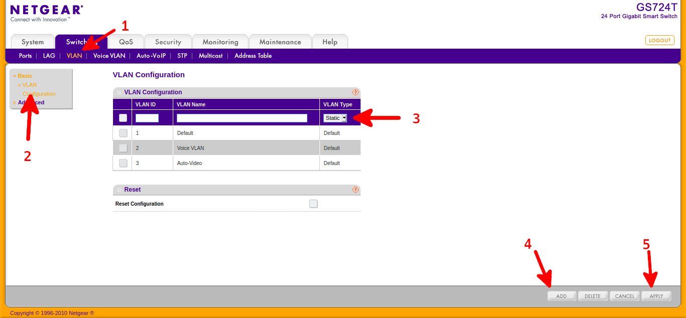

Nos tiene que quedar una cosa así:

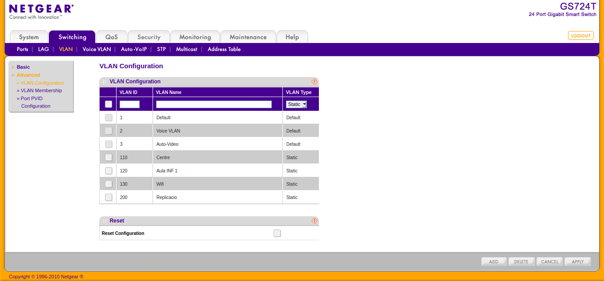

Y añadimos los puertos untagged de cada una de los VLAN en el apartado VLAN membership.

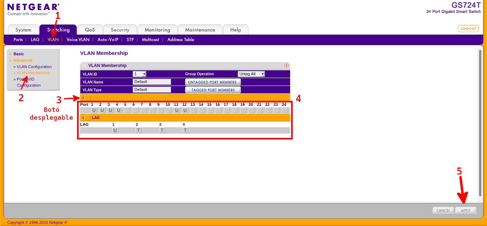

Después cambiamos del menú VLAN ID cada una de las VLAN y vamos configurándolas una a una. 

:::warning
Recuerda darle al botón Apply cada una de las veces que acabas la configuración de una VLAN.
:::


El mismo con la VLAN 120.

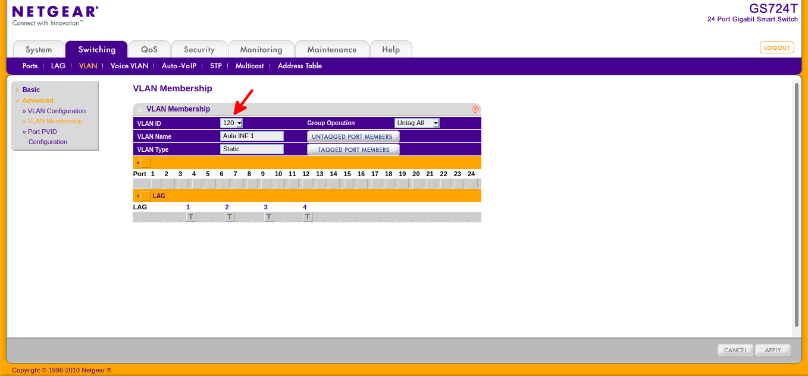

La 130.


Y la de replicación.

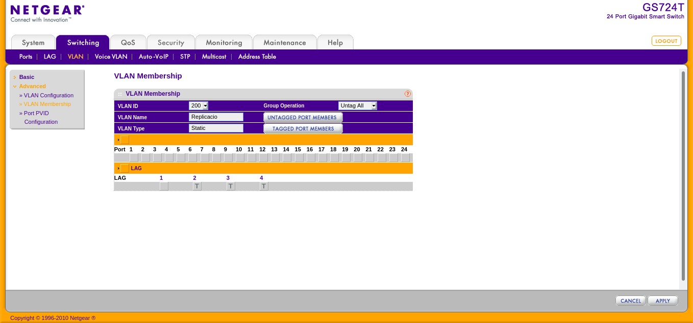

:::warning
Finalmente y es muy importante, a los switchs Netgear (no con los otros marcas) es necesario cambiar el parámetro PVID, por el que hay que ir al apartado PVID configuration y cambiarlo en aquellos puertos untagged al valor que hemos dado. Otras marcas este paso se hacen automáticamente.
:::

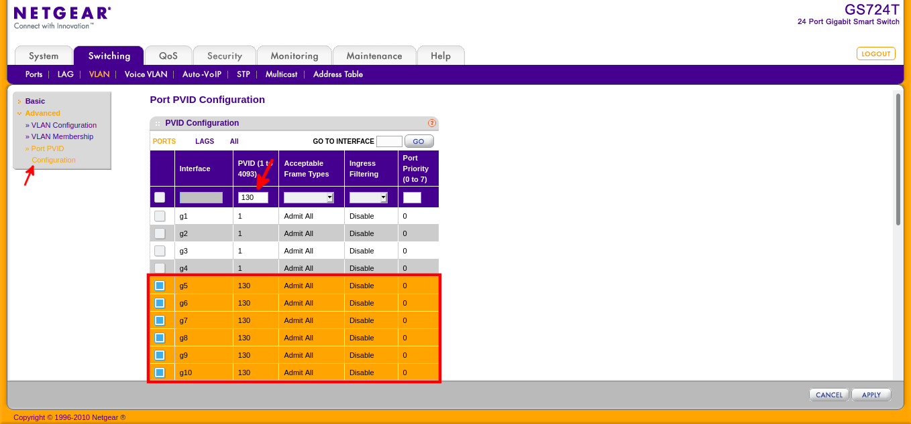


### Configuración de Switch de Aula D-LINK DGS1210-48

Hay que decir que, a pesar de que denominamos este switch como switch de Aula, podría ser perfectamente un switch que da servicio en las aulas de alrededor y al aula de informática. La configuración de este switch quedaría de la siguiente manera:

| VLANs | Puertos | 
| -- | -- | 
| 1 | U-P1, U-P2, U-P3, U-P4, U-LAG1 (U-P47,U-P48) | 
| 110 | U-P5 a U-P16, T-LAG1 (T-P47,T-P48) | 
| 120 | U-P17 a U-P46, T-LAG1 (T-P47,T-P48) | 
| 130 | T-LAG1 (T-P47,T-P48) | 

Hemos indicado los puertos entre paréntesis, puesto que, al contrario que en el Netgear, en este switch sí que tienes que configurar los puertos pertenecientes al LAG.

#### Reinicializar switch

Para reinicializar el switch D-link hay que proceder de manera similar al Netgear, hace falta pulsar el botón *reset* durando 10s aproximadamente.

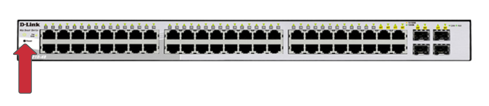

:::warning
**Hay que tener en cuenta** que, al igual que el Netgear si el switch ya está conectado en una red este cogerá una dirección por DHCP. Para hacer el reset es recomendable no tener ningún cable conectado al switch.
:::

Si el switch ha cogido una dirección por DHCP puedes tratar de averiguar su ip con el comando:

```tcsh
sudo nmap -sP 172.254.254.*
``` 
#### Configuración del Switch

Una vez tengas la ip en el mismo rango, ya puedes acceder a él, la **ip** por defecto del switch D-link es 10.90.90.90, por lo tanto cambiaremos la ip de nuestro ordenador accederemos a él. Igualmente podemos utilizar la terminal para crear un alias. Dependiendo de si tienes instalado el comando ifconfig o no puedes utilizar cualquier de los siguientes comandos:

```tcsh
sudo ip addr addr add 10.90.90.100/24 dev eth0 labelo eth0:1
```

```tcsh
sudo ifconfig eth0:1 10.90.90.100 netmask 255.255.255.0 up
```
Después ya podremos entrar al switch, la contraseña para poder entrar es *admin*. 

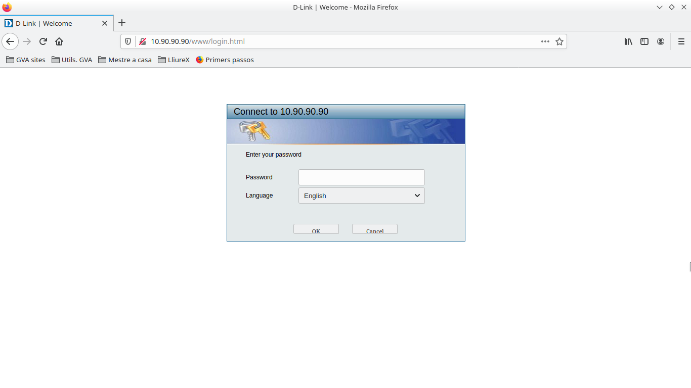

Posteriormente configuramos la IP del switch.

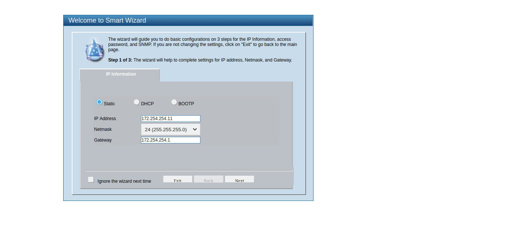

Y cambiamos la contraseña genérica


Si vamos a gestionar el switch a través de SNMP habrá que habilitar esta opción.

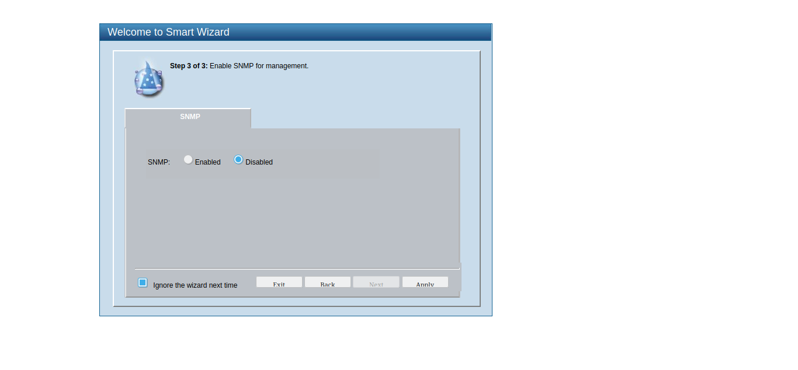

También se puede cambiar la configuración de la ip desde las opciones de configuración.

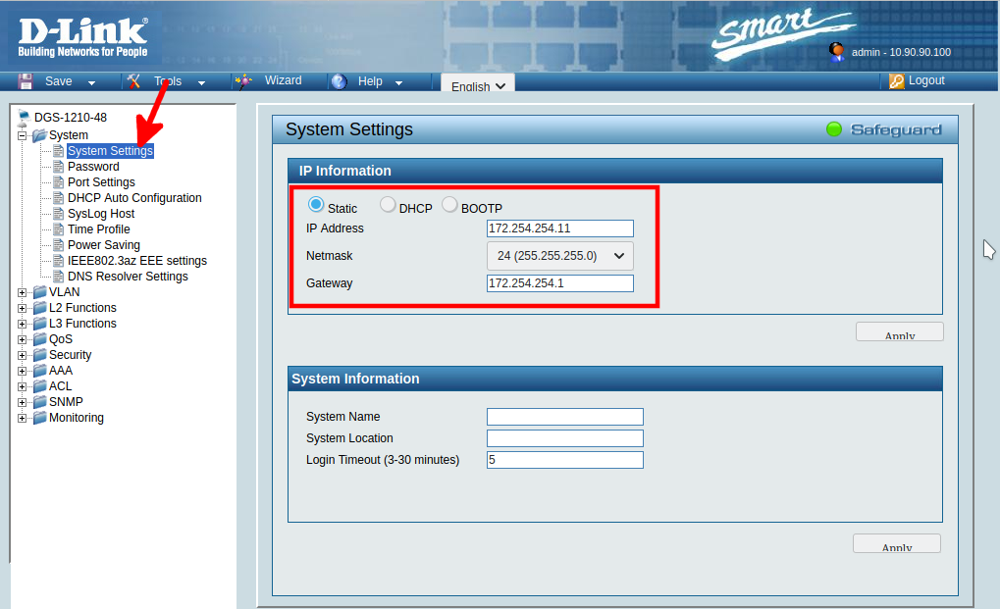

Para configurar el LAG haremos el siguiente procedimiento.

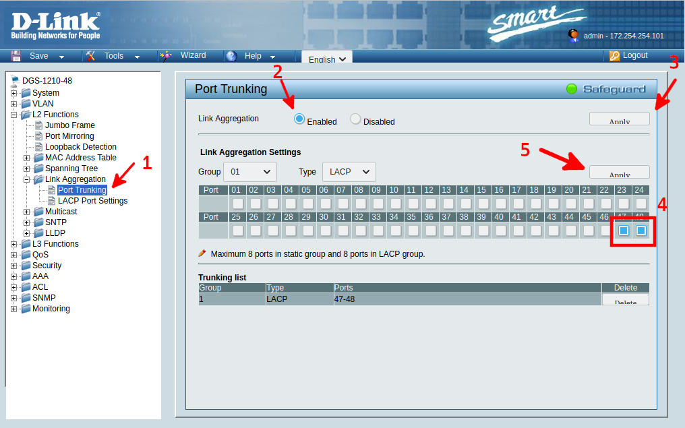

Hay que configurar el switch para la VLAN de gestión. En nuestro caso es la 1.

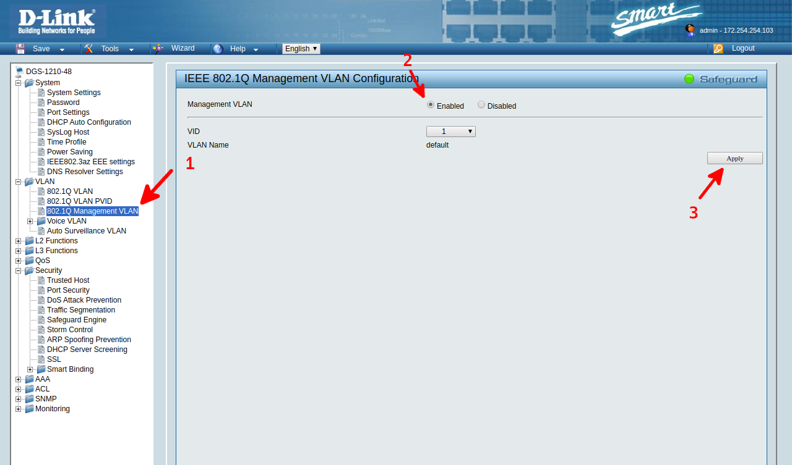

Habilitamos el Spanning tree.

:::note
El spanning tree es un protocolo que detecta bucles en la red y puede desactivar puertos si detecta alguno.
:::

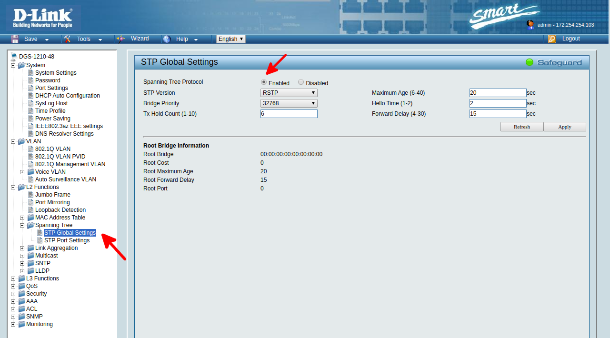

Ahora es cuando tenemos que configurar las VLAN, en la imagen podemos ver ya todas las VLAN configuradas. En un principio solo nos aparecerá la VLAN 1, en la cual es necesario entrar puesto que todos los puertos están configurados en esa VLAN. Se procederá a pasarlos a **Not member** puesto que no te permitirá asignarlos a otra VLAN si ya están configurados. Para añadir nuevas VLAN tenemos que darle al botón **Add**.

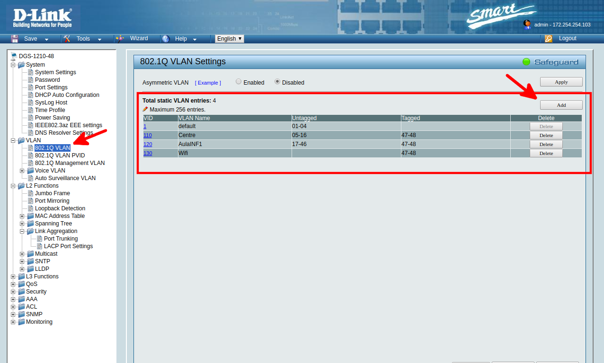


Una vez hemos dado al botón **Add**, configuramos el VID y la VLAN Name, seleccionamos los puertos que pertenecen a esa VLAN y le damos a **Apply**.

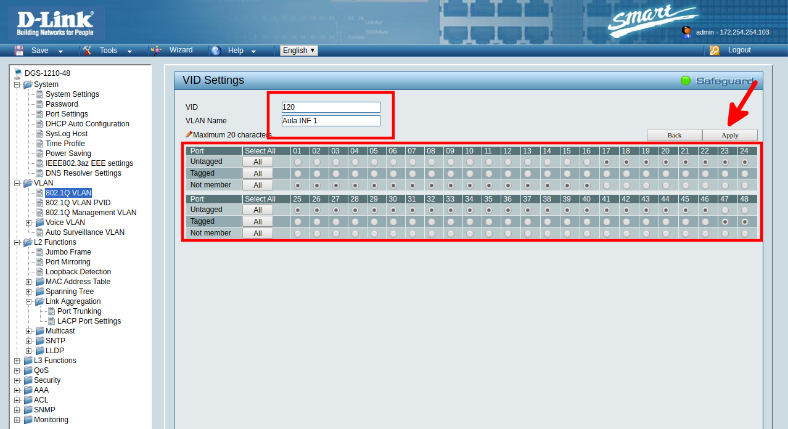

:::caution
Finalmente, y en algunos switchs es de vital importancia, hay que salvar la configuración puesto que, si hay un corte en el suministro eléctrico el switch vuelve a la configuración anterior. En este caso, dado que tenemos un switch con un LAG, probablemente provocaríamos un bucle en la red y dejaría de funcionar todo el centro. Por lo tanto hay que ir con mucho cuidado con estos detalles.
:::

Procedemos a salvar la configuración:

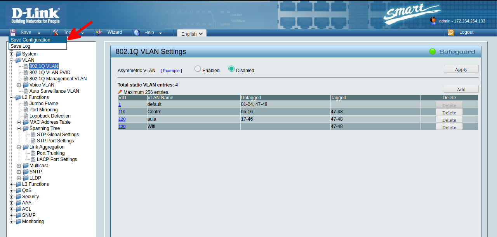


Ahora en estos momentos ya tenemos todos los switch preparados para poner en funcionamiento nuestro centro. En el próximo tema instalaremos el Proxmox de las diferentes maneras posibles y configuraremos los parámetros del servidor.

# COURSE - FÈNIX

Existe un proyecto desde la DGTIC que trata de normalizar el funcionamiento de las VLANS en el centro. En este proyecto se actualiza la electrónica de red del centro, en principio de secreataria y **si el centro reúne los requisitos** la electrónica de todo el centro.

En principio los requisitos principales es que sea viable cambiar la electrónica del todos los racks sin que afecte al funcionamiento del centro en general. Los switchs que en principio se montan son los siguientes:

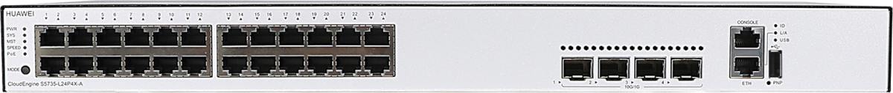

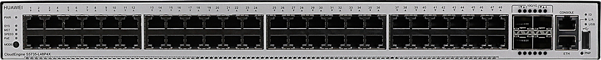

En este caso cuando os monten los switchs, si lo pedís, ya os dejan toda la infraestructura preparada para montar el modelo de centro con Proxmox. Las últimas bocas siempre se reservan para hacer conexiones entre switchs. Las VLANS normalizadas del proyecto curso son las siguientes:

| VLAN | Descripción |
| -- | --------- |
| 100 | Red de centro |
| 111 a 120 | Red de Aulas (111 Aula 1 ... 120 Aula 10) |
| 198 | Red de replicación - para replicación entre servidores LliureX, o Proxmox |
| 200 | Red Wifi |
| 90-91 | Reservadas para VoIP |
| 40-41 | Reservadas para Red de Aulas (Antigua MacroLAN) |
| 10-11 | Reservadas para Red de secretaría |

La red de 198 se utiliza en principio para hacer la replicación entre servidores LliureX, pero si se utiliza para hacer replicación entre diferentes servidores con Proxmox se podría utilizar alguna de las otras reservadas para las Aulas de Informática (tienen 10 VLANs reservadas). En principio, hay pocos centros que tienen 10 Aulas de informática, por lo tanto se podría utlitzar una de las otras si te hicieran falta.

La manera de configurar los switchs de este modo es poniendo un ticket al SAI exponiendo la boca, el número de VLAN y el switch donde lo quieres configurar. Como ejemplo imaginemos que tenemos un switch en el rack principal cuyas características principales son:

* Las últimas 4 bocas del switch están reservadas
* Tenemos configurado el switch del rack para modelo de centro
* Las conexiones marcadas cómo *hipervisors* tienen marcadas todas las VLANS (100, 111-120, 198 y 200) por lo tanto no hay que tocar nada de este switch

Y queremos que el switch del aula 1 tenga las 24 primeras bocas para los ordenadores del aula de informática y las otras 12 las queremos para ordenadores de las Aulas que se encuentren en esa planta. Por lo tanto pondríamos un ticket al SAI indicando lo siguiente:

> Cambiar las bocas de 1 a 24 a la VLAN 110 y de la 37-44 a la VLAN 100 del switch de Aula 1.

Y desde la DGTIC nos harían el cambio. De este modo no nos deberíamos de preocupar por la configuración de ningun switch.

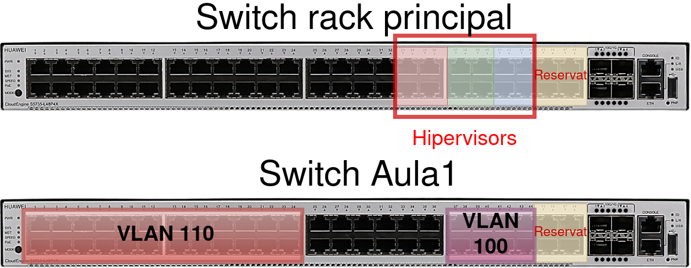

# Bibliografía y referencias

(@) https://se.wikipedia.org/wiki/VLAN
