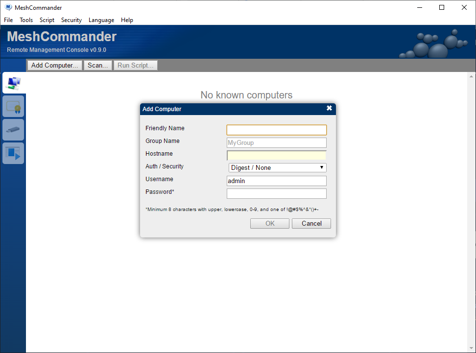
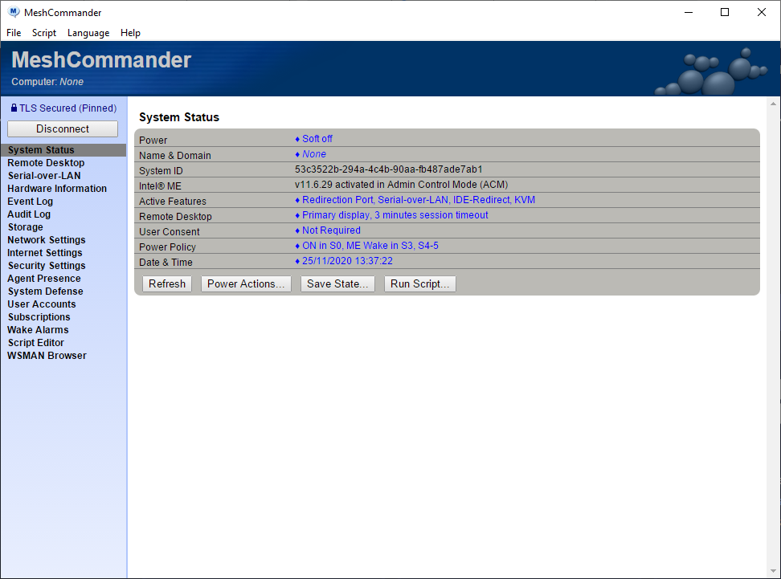
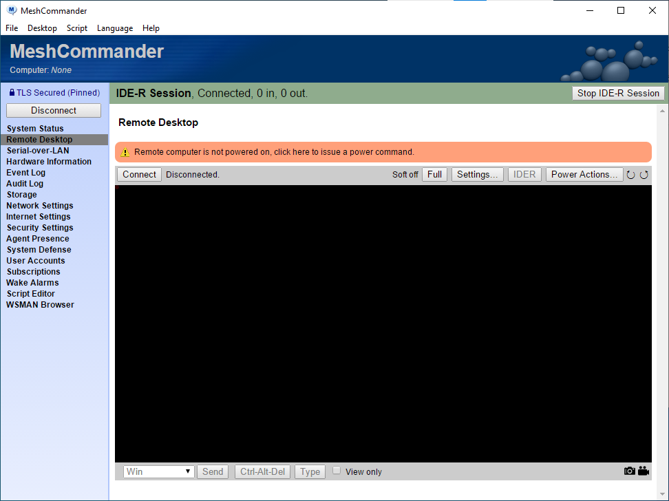
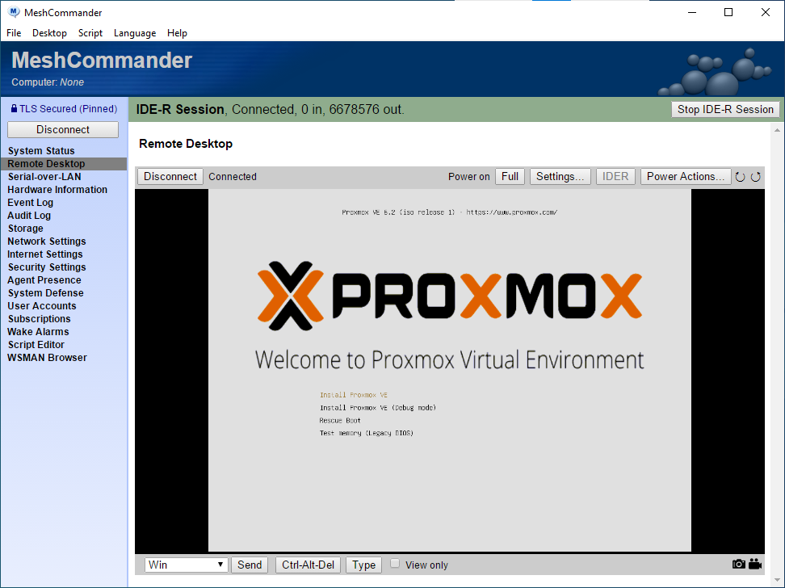
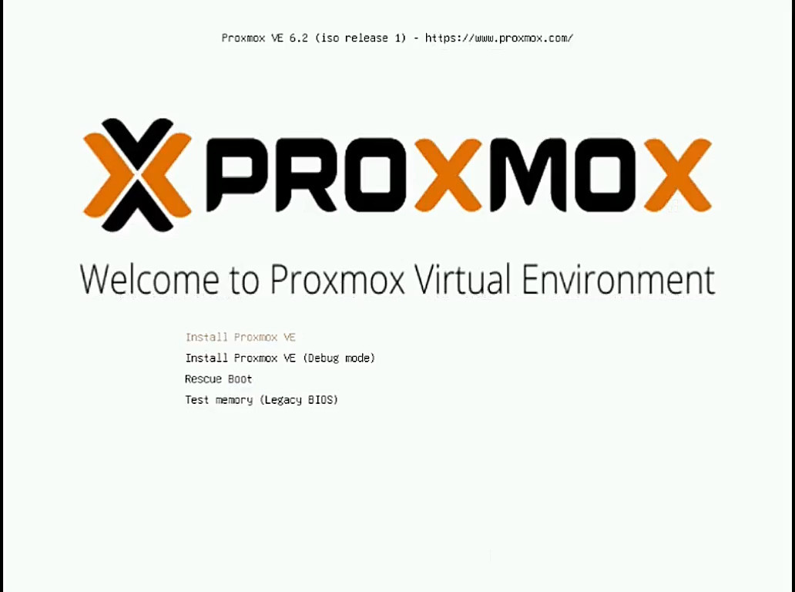
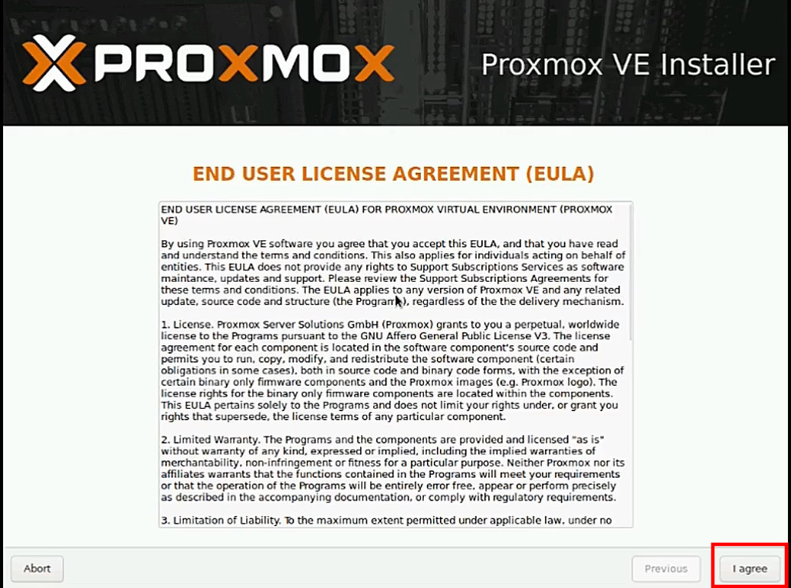
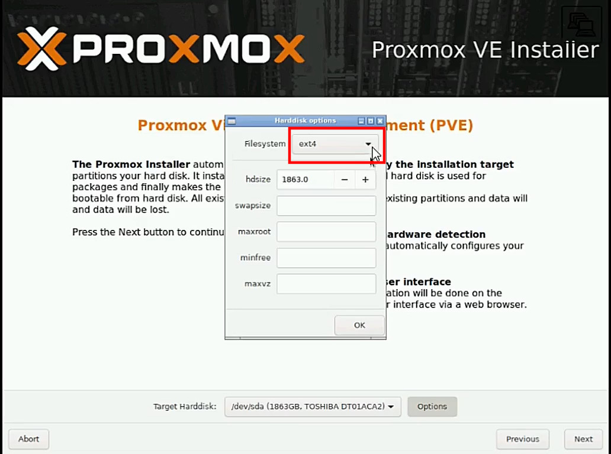

---
# Front matter
# Metainformació del document
title: "INSTALACIÓN DE PROXMOX"
author: [Alfredo Rafael Vicente Boix y Javier Estellés Dasi \newline Revisado por Sergio Balaguer]
dato: "05-05-2024"
subject: "Proxmox"
keywords: [Proxmox, Instalación]
subtitle: "Primer paso para instalar el modelo de aula LliureX"


lang: ca
page-background: img/bg.png
titlepage: true
# portada
titlepage-rule-height: 2
titlepage-rule-color: AA0000
titlepage-text-color: AA0000
titlepage-background: ../portades/U4.png

# configuració de l'índex
toc-own-page: true
toc-title: Contenidos
toc-depth: 2

# capçalera i peu
header-left: \thetitle
header-right: Curs 2025-2026
footer-left: CEFIRE FP
footer-right: \thepage/\pageref{LastPage}

# Les figures que apareguen on les definim i centrades
float-placement-figure: H
caption-justification: centering 

# No volem numerar les linies de codi
listings-disable-line-numbers: true

# Configuracions dels paquets de latex
header-includes:

  #  imatges i subfigures
  - \usepackage{graphicx}
  - \usepackage{subfigure}
  - \usepackage{lastpage}


  #  - \usepackage{adjustbox}
  # marca d'aigua
  #- \usepackage{draftwatermark}
 # - \SetWatermarkText{\includegraphics{./img/Markdown.png}}
  #- \SetWatermarkText{Per revisar}
  #- \SetWatermarkScale{.5}
  #- \SetWatermarkAngle{20}
   
  # caixes d'avisos 
  - \usepackage{awesomebox}

  # text en columnes
  - \usepackage{multicol}
  - \setlength{\columnseprule}{1pt}
  - \setlength{\columnsep}{1em}

  # pàgines apaïsades
  - \usepackage{pdflscape}
  
  # per a permetre pandoc dins de blocs Latex
  - \newcommand{\hideFromPandoc}[1]{#1}
  - \hideFromPandoc {
      \let\Begin\begin
      \let\End\end
    }
 
# definició de les caixes d'avis
pandoc-latex-environment:
  noteblock: [note]
  tipblock: [tip]
  warningblock: [warning]
  cautionblock: [caution]
  importantblock: [important]
...

\vspace*{\fill}

{ height=50px }

Este documento está sujeto a una licencia creative commons que permite su difusión y uso comercial reconociendo siempre la autoría de su creador. Este documento se encuentra para ser modificado en el siguiente repositorio de github:
<!-- CAMBIAR EL ENLACE -->
[https://github.com/arvicenteboix/lliurexproxmox](https://github.com/arvicenteboix/lliurexproxmox)
\newpage
<!-- \awesomebox[violet]{2pt}{\faRocket}{violet}{Lorem ipsum…} -->

# Introducción

En esta unidad vamos a ver la instalación de Proxmox. En el primer capítulo veremos cómo nos puede resultar útil la herramienta [meshcomander](https://www.meshcommander.com/meshcommander).


Es importante tener claro los siguientes conceptos antes de empezar la instalación.

* **AMT** funciona como un sistema independiente, por lo tanto, tendrá su propia ip.
* Los dispositivos físicos cada vez se utilizan menos. Recuerda cuando fue la última vez que utilizaste un CD-ROM.
* Vamos a hacer una instalación de Proxmox. No es necesario tener acceso a la consola de Proxmox en ningún momento, por lo tanto, si ya tienes un hipervisor montado en el rack, no lo desmontes.
* Las IP utilizadas no corresponden con las indicadas a las que recomienda el SAI. Es parte de la tarea que deberéis hacer!


\newpage

# Puesta a punto del servidor

Para poner a punto el servidor, es recomendable, aunque no imprescindible habilitar el AMT, así posteriormente utilizar la herramienta **meshcomander** para hacer una instalación remota.

## Habilitar AMT de Intel

Los servidores distribuidos en los centros disponen de la herramienta AMT de Intel para poder conectarse remotamente, no solo nos permitirá arrancar el hipervisor sino que también nos permitirá  configurar ciertas funcionalidades básicas. Pero, antes de nada, habrá que entrar en la BIOS. Para acceder (Modelo SEH1) pulsamos F2 en el setup del ordenador.


\newpage

Una vez dentro vamos a la pestaña *Advanced*.


\newpage

Y seleccionamos *AMT Configuration*.


\newpage

Cambiamos *MEBx Modo* y seleccionamos la opción Entero MEBx Setup


\newpage

Finalmente guardamos los parámetros y reiniciamos.


## Configuración del AMT

Una vez hemos habilitado el AMT, entramos en la configuración del mismo y configuramos los siguientes parámetros.

::: tip
**Info**: Por motivos obvios de seguridad no se permite entrar a la configuración del AMT por VNC, por lo que algunas de las siguientes imágenes están fotografiadas de la pantalla.
:::

Cuando entramos a la herramienta de configuración del AMT, tenemos que identificarnos (hacer *login*). La contraseña del administrador es **admin**. Posteriormente nos pedirá que cambiemos la contraseña por una nueva.

::: warning
**Contraseña**: Tenemos que respetar la política de contraseñas, con mayúscula, minúscula y carácter especial. El teclado está configurado por defecto en inglés.
:::


Tenemos que acceder a las siguientes opciones para hacer una configuración básica.

| Opción | Funcionalidad |
| -- | -- |
| **User Consent** | Conectarnos al servidor por VNC sin permiso |
| **Network Setup** | Para configurar las opciones de red |
| **Activate Network Access** | Para poder acceder a lo hipervisor |


Dentro de la opción de **User Content** tenemos que cambiar la opción señalada a *NONE*.


Para configurar la red vayamos a la opción de Network Setup. 


Después vamos a **TCP/IP Settings**


Y configuramos el AMT según los siguientes parámetros

::: caution
**Ten cuidado**: La dirección del AMT es diferente a la dirección del hipervisor. Además, debes de tener en cuenta que el AMT no tiene el ICMP activado, por lo que si haces un *ping* o *nmap* no te dará respuesta.
:::

Los parámetros que mostramos son unos parámetros de ejemplo que vamos a utilizar dentro de nuestro banco de pruebas.

| Opción | IP |
| -- | -- |
| IP | 172.x.y.2 – 172.x.y.254 |
| Máscara | 255.255.255.0 |
| Puerta de Enlace | 172.x.y.1 |
| DNS | 10.239.3.7 i 10.239.3.8 |


::: importante
**Acceso**: Una vez ya tengas funcionando el AMT, podrás acceder a través del navegador con la dirección http://172.x.y.238:16992 o https://172.x.y.238:16993. Tendrás que cambiar la dirección según la que hayas escogido.
:::

# Meshcomander

El *AMT* junto la aplicación *Meshcommander* nos permitirá tener los servidores montados dentro del rack principal sin necesidad de tener ni un monitor ni teclado conectado. 


> Desde febrero de 2021 existe una versión de *Meshcommander* para GNU/Linux, os dejamos un **vídeo** en recursos adicionales para hacer la instalación en GNU/Linux. En resumen, se instala con el comando:

```sh
npm install meshcommander
```
>Una vez instalado accedemos a la carpeta que se ha descargado 
```sh
cd node_modules/meshcommander
``` 
y ejecutamos:

```sh
node meshcommander
```
>Esto habilitará meshcommander en la dirección web http://127.0.0.1:3000 y el procedimiento será igual que con la aplicación Windows.


En esta sección se detalla la instalación en Windows. Pero es más que recomendable usar la versión para GNU/Linux. 

::: note
**Info**: IDE Redirect (IDE-R) permite montar una imagen ISO remotamente desde un cliente. Esta opción es muy interesante puesto que evita que necesariamente estemos físicamente presentes a la hora de instalar o reinstalar el Proxmox. Podéis encontrar más información [aquí](https://software.intel.com/content/www/us/en/develop/blogs/meshcommander-javascript-ider.html).
:::

Tenemos que descargar el software de su [página web](https://www.meshcommander.com/meshcommander) y hacer la instalación.


::: caution
**Ten cuidado**: Recuerda que tienes que estar en la misma red que el hipervisor (la red de Aulas en nuestro caso). No es necesario que el hipervisor esté encendido para poder acceder.
:::

Una vez instalado y funcionando el meshcomander veremos algo parecido a esto:


Haremos click sobre *Add computer...* Y configuraremos el servidor con los parámetros del AMT que hemos configurado previamente. Podemos acceder de dos maneras:

* Con TLS, por el que utilizaremos el puerto *16993*
* Sin seguridad, utilizaremos el puerto *16992*

:::warning
El puerto 16993 da problemas, si no tenéis el firmware del AMT actualizado es posible que no os deje utilizar el puerto 16993.
:::




Una vez configurado el servidor veremos la pantalla de la siguiente manera. Ya solo hace falta, dar a **connect** y podremos acceder a la configuración de nuestro servidor de manera remota.


Si has escogido la conexión con TLS, probablemente te aparecerá una advertencia.


Una vez conectado veremos la siguiente pantalla. No nos vamos a parar a explicar todas las funcionalidades disponibles, sino que nos centraremos en la instalación remota. Para lo cual hay que ir a **Serial-over-LAN**.



En este punto tenemos que descargar la ISO de Proxmox desde su [página web](https://proxmox.com/en/downloads).


Aquí haremos click sobre la opción **IDER** y seleccionaremos la imagen descargada.


Una vez seleccionada la opción de Proxmox iremos a **Remote Desktop** y seleccionaremos la opción de **Power Actions**. Allí, tenemos que escoger la opción de Power on to IDE-R CDROM. Veremos que el hipervisor se reinicia y empezará la instalación.




Finalmente veremos como empieza la instalación de Proxmox.



:::important
Es altamente recomendable tener una conexión al menos de 1Gb, puesto que sino la instalación se puede hacer muy pesada y pueden aparecer errores de *timeout*.
:::

# Instalación de Proxmox

Para instalar Proxmox podemos utilizar la opción explicada. Es la más recomendable si ya tienes el servidor montado en el rack. De todas maneras, también se puede instalar con una memoria USB.

## Creación de usb de arranque de proxmox

Para hacer la instalación de la ISO de Proxmox, la mejor opción es utilizar **dd**. Para detectar donde está montado el USB podemos ejecutar antes y después lsblk y podemos ver donde se ha montado la partición.

```sh
lsblk
```

En nuestro ejemplo (puesto que tenemos un disco duro m2 no sata, se ha montado sda). Por lo tanto, nuestro comando sería:

```sh
sudo dd if=./proxmox-viene_6.2-1.iso of=/dev/sda status=progress
```
<!-- \awesomebox[violet]{2pt}{\faUsb}{violet}{} -->

También disponemos de herremientas gráficas para grabar la ISO de Proxmox en un USB. Podemos utilizar [Etcher](https://balena.io/etcher/) que es multiplataforma y muy sencilla de utilizar.


## Instalación de proxmox

Una vez tenemos creado el disco USB de arranque e iniciamos con el USB, o a través de IDE-R. Veremos la siguiente imagen. Pulsamos enter y continuamos.



Todos sabemos que es importante leerse la licencia :smirk: .



Esta es una de las partes más delicadas y depende de lo que queréis tener montado en vuestro centro, también depende de la cantidad de discos duros que tengáis instalados y de si queréis invertir dinero en una cabina de discos duros o no.


Si queréis dejarlo en ext4. Y utilizar un único disco para utilizar Proxmox en las máquinas virtuales, no va a dar malos resultados. El otro disco duro lo podéis utilizar para hacer copias de seguridad.

:::info
Proxmox utiliza ZFS que es una combinación de administrador de volúmenes y sistema de ficheros.
:::



Las opciones que tenemos son las siguientes:

| Sistema | Características  |
| -- | -- |
| RAID0 | Suma capacidades de los discos. Si falla una unidad es inservible. |
| RAID1 | Dato escrito idénticamente. Mínimo 2 discos de la misma medida. |
| RAID10 | Una combinación de RAID0 y RAID1. Mínimo 4 discos. |
| RAIDZ-1 | Variación de RAID-5, paridad sola. Mínimo 3 discos. |
| RAIDZ-2 | Variación de RAID-5, paridad doble. Mínimo 4 discos. |
| RAIDZ-3 | Variación encima RAID-5, paridad triple. Mínimo 5 discos |

:::warning
Si habéis optado por adquirir una tarjeta controladora para montar un RAID, esta opción no la tenéis que usar. Siempre y cuando la tarjeta sea reconocida por Proxmox, se verá como un único disco. Las opciones que estamos configurando es RAID por vía software.
:::

La opción más nivelada entre todos los parámetros a tener en cuenta sería la opción de RAID1.


Configuramos la zona geográfica.


Configuramos el password y la contraseña.

:::caution
Si estás haciendo la instalación por IDE-R utiliza la arroba del campo de texto ya que es posible que no la puedas escribir con *Alt Gr+2*.
:::


Configura la red según los parámetros de tu centro. El ejemplo dado no es el correspondiente al que deberías de utilizar.


Comprobamos que todos los parámetros que hemos configurado son los correctos y le damos a Install. Enseguida empezará la instalación que suele ser bastante rápida.


Una vez finalizada la instalación. Reiniciamos el sistema y pasaremos a la siguiente unidad. Configuración del Proxmox.


# Bibliografía y referencias

(@) https://pve.proxmox.com/wiki/zfs_on_linux
(@) https://www.meshcommander.com/meshcommander
(@) https://wiki.edu.gva.es/lliurex/tiki-index.php
(@) https://proxmox.com/en/