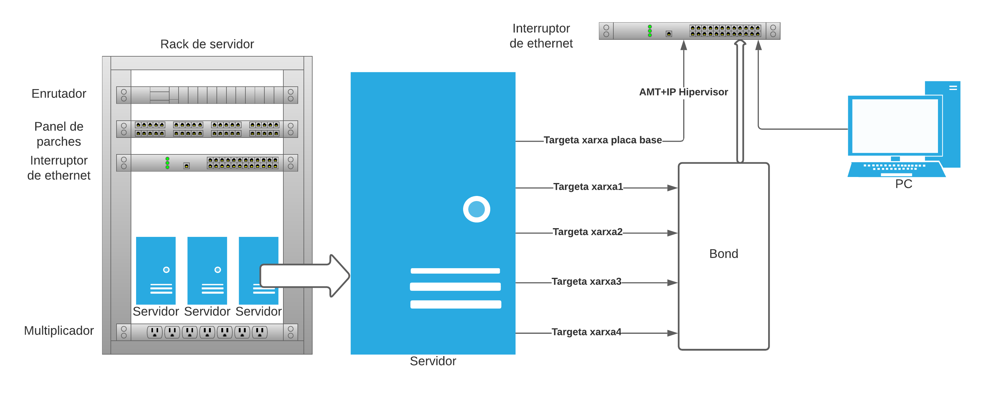
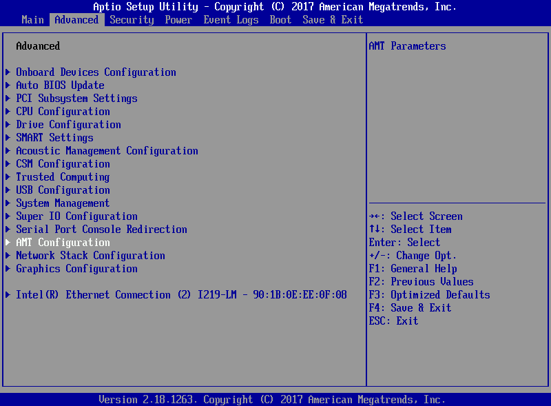
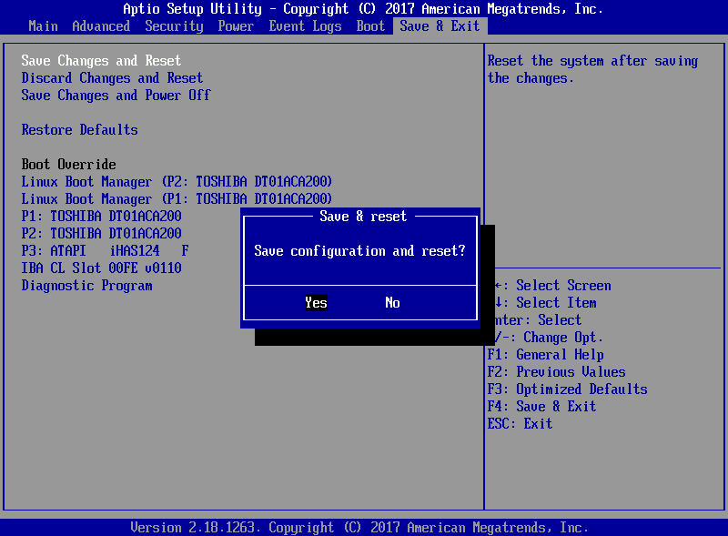
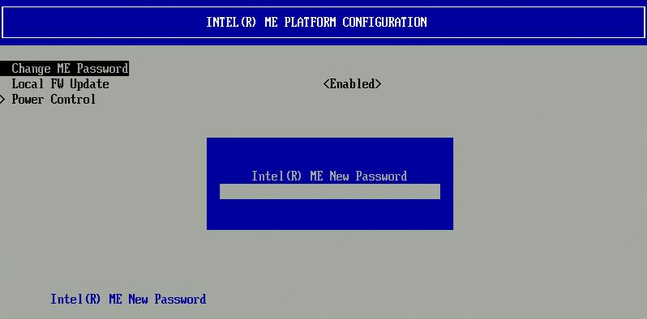
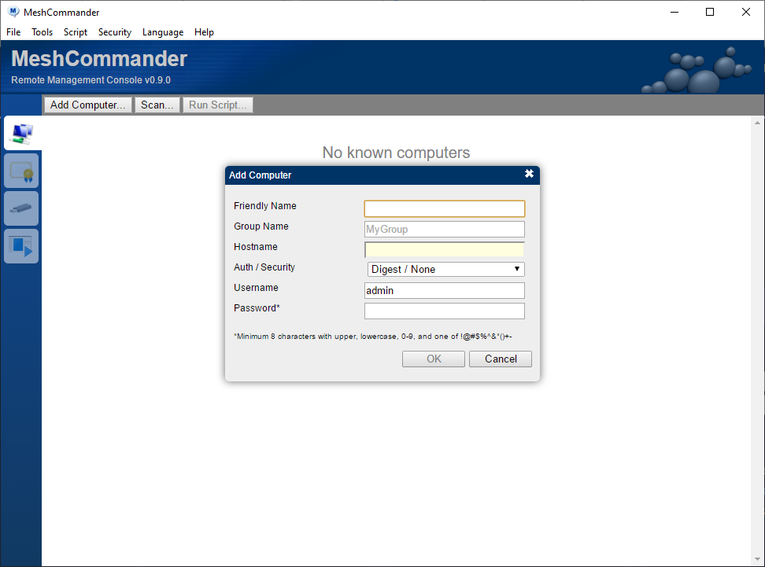
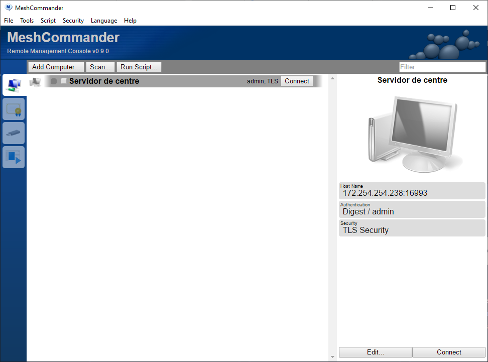
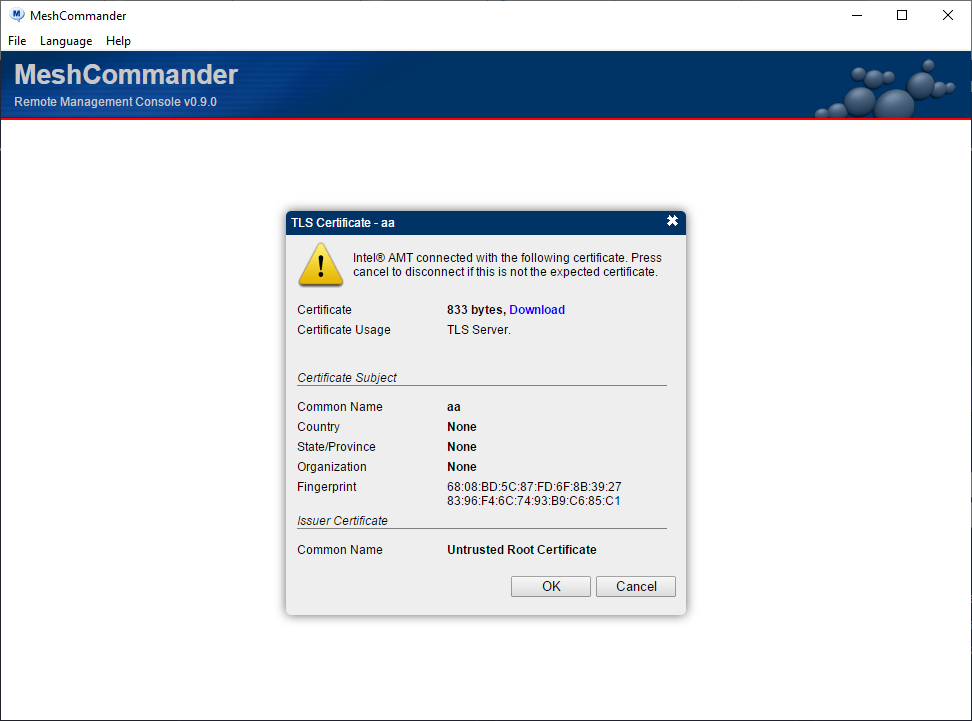
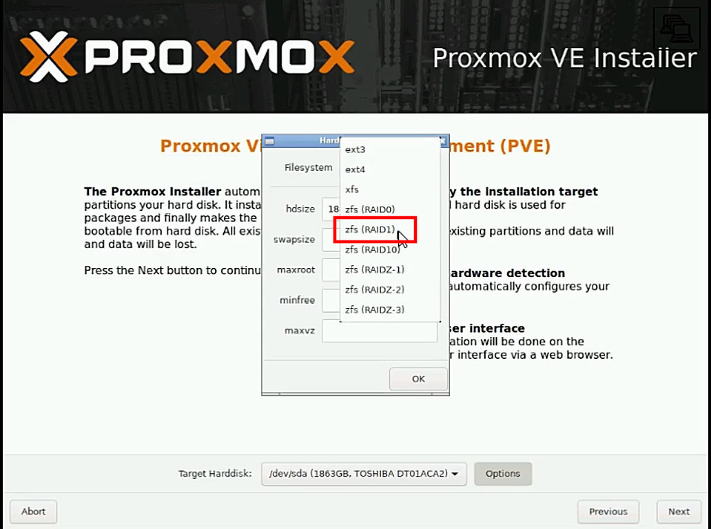
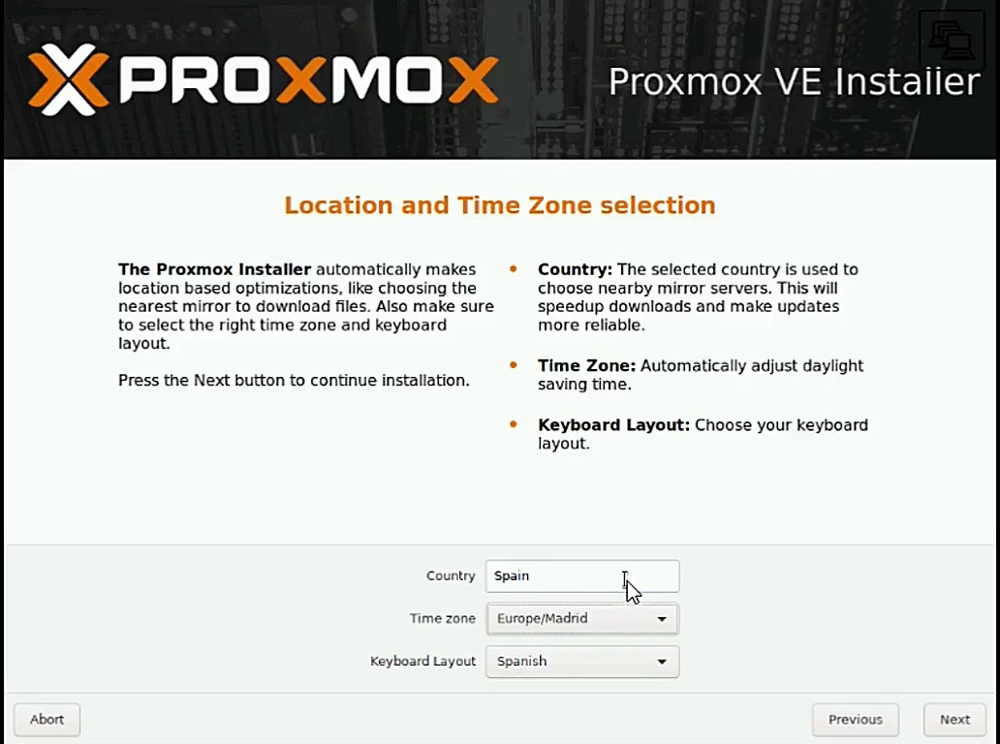

---
title: "INSTAL·LACIÓ DE PROXMOX"
author: [Alfredo Rafael Vicente Boix i Javier Estellés Dasi \newline Revisado por Sergio Balaguer]
date: "06-10-2021"
subject: "Proxmox"
keywords: [Proxmox, Instal·lació]
subtitle: "Primer pas per a instal·lar el model de aula LliureX"
lang: "ca"
page-background: "background10.pdf"
titlepage: true,
titlepage-rule-color: "360049"
titlepage-background: "background10.pdf"
colorlinks: true
toc-own-page: true
header-includes:
- |
  ```{=latex}
  \usepackage{awesomebox}
  ```
pandoc-latex-environment:
  noteblock: [note]
  tipblock: [tip]
  warningblock: [warning]
  cautionblock: [caution]
  importantblock: [important]
...

<!-- \awesomebox[violet]{2pt}{\faRocket}{violet}{Lorem ipsum…} -->

# Introducció

En aquesta unitat tractarem la instal·lació de Proxmox. Però al primer capítol veurem com ens pot resultar útil la ferramenta [meshcomander](https://www.meshcommander.com/meshcommander).


És important tenir clar els següents conceptes abans de començar la instal·lació.

* **AMT** funciona com un sistema independent, per tant tindrà la seua pròpia ip.
* Els suports físics cada vegada s'utilitzen menys. Recorda quan va ser l'última vegada que utilitzares un CD-ROM.
* Anem a fer una instal·lació de proxmox. No és necessari tenir accés a la consola de Proxmox en cap moment, per tant si ja tens l'hipervisor muntat al rack, no el desmuntes.
* Les IPs utilitzades no corresponen amb les indicades al que recomana el SAI. És la tasca que se vos manarà!



\newpage

# Posada a punt del servidor

Per a posar a punt el servidor, és recomanable, encara que no imprescindible habilitar el AMT, per a posteriorment utilitzar la ferramenta meshcomander per a fer una instal·lació remota.

## Habilitar AMT de Intel

Els servidors distribuïts als centres disposen de la ferramenta AMT de Intel per a poder connectar-se remotament, no sols ens permetrà arrancar l'hipervisor sinó que també ens permetrà configurar certes funcionalitats bàsiques. Però abans que res, caldrà entrar a la BIOS.
Per a accedir a la BIOS (Model SEH1) polsem F2 en el setup de l'ordinador.


\newpage

Una vegada dins anem a la pestanya *Advanced*.


\newpage

I seleccionem *AMT Configuration*.



\newpage

Canviem *MEBx Mode* i seleccionem l'opció Enter MEBx Setup


\newpage

Finalment salvem els paràmetres i reiniciem.



## Configuració del AMT

Una vegada hem habilitat el AMT, entrem en la configuració del mateix i configurem els següents paràmetres.

::: tip
**Info**: Per obvis motius de seguretat no es permet entrar a la configuració del AMT per VNC, pel que algunes de les següents imatges están fotografiades de la pantalla.
:::

Quan entren a la ferramenta de configuració del AMT, hem de logar-nos. La contrasenya d'administrador és **admin**. Posteriorment ens demanarà que canviem la contrasenya per una nova.

::: warning
**Contrasenya**: Hem de respectar la política de contrasenyes, amb majúscula, minúscula i caràcter especial.
:::




Hem d'accedir a les següents opcions per a fer una configuració bàsica.

| Opció | Funcionalitat |
| -- | -- |
| **User Consent** | Connectar-nos al servidor per VNC sense permís |
| **Network Setup** | Per a configurar les opcions de xarxa |
| **Activate Network Access** | Per a poder accedir a l'hipervisor |


Dins de la opció de **User Content** hem de canviar l'opció assenyalada a *NONE*.


Per a configurar la xarxa anem a l'opció de Network Setup. 


Després anem a **TCP/IP Settings**


I configurem la AMT segons els següents paràmetres

::: caution
**Vés amb compte**: L'adreça de l'AMT és diferent a l'adreça de l'hipervisor. A més has de tenir en compte que el AMT no té el ICMP activitat, pel que si fas un *ping* o *nmap* no et donarà resposta.
:::

Els paràmetres que mostrem són uns paràmetres d'exemple que anem a utilitzar dins del nostre banc de proves.

| Opció | IP |
| -- | -- |
| IP | 172.x.y.2 – 172.x.y.254 |
| Máscara | 255.255.255.0 |
| Puerta de Enlace | 172.x.y.1 |
| DNS | 172.27.111.5 y 172.27.111.6 |


::: important
**Accés**: Una vegada ja tingues funcionant el AMT, podràs accedir a través del navegador amb l'adreça http://172.x.y.238:16992 ó https://172.x.y.238:16993. Hauràs de canviar l'adreça segons la que hages escollit.
:::

# Meshcomander
El *AMT* junt l'aplicació *Meshcommander* ens permetrà tindre els servidors muntats dins del rack principal sense necessitat de tindre ni un monitor ni teclat connectat.


> Des de febrer de 2021 existeix una versió de *Meshcommander* per a GNU/Linux, us deixem un **vídeo** en recursos addicionals per a fer la instal·lació en GNU/Linux. En resum s'instal·la amb el comando: 

```tcsh 
npm install meshcommander 
``` 
>Una vegada instal·lat accedim a la carpeta que s'ha descarregat 

```tcsh 
cd node_modules/meshcommander 
``` 
i executem: 
```tcsh 
node meshcommander 
``` 
>Esto habilitarà meshcommander en l'adreça web http://127.0.0.1:3000 i el procediment serà igual que amb l'aplicació Windows.


En aquesta secció es detalla la instal·lació en Windows. Però és més que recomanable utilitizar la versió per a GNU/Linux.

::: note
**Info**: IDE Redirect (IDE-R) permet muntar una imatge ISO remotament des d'un client. Aquesta opció és molt interessant ja que evita que necessàriament estiguem físicament presents a d'instal·lar o reinstal·lar el Proxmox. Podeu trobar més informació [ací](https://software.intel.com/content/www/us/en/develop/blogs/meshcommander-javascript-ider.html).
:::

Hem de descarregar el programari de la seua [pàgina web](https://www.meshcommander.com/meshcommander) i fer la instal·lació.


::: caution
**Vés amb compte**: Recorda que has d'estar a la mateixa xarxa que l'hipervisor (la xarxa d'Aules en el nostre cas). No cal que l'hipervisor estiga encés per a poder accedir.
:::

Una vegada instal·lat i funcionant el mesh comander veurem una cosa com la següent.


Farem click sobre *Add computer...* I configurarem el servidor amb els paràmetres del AMT que hem configurat prèviament. Podem accedir de dues maneres:

* Amb TLS, pel que utilitzarem el port **16993**
* Sense seguretat, utilitzarem el port **16992**

:::warning
El port 16993 està donant problemes aquest any, si no teniu el firmware de l'AMT actualitzat és possible que no vos deixe utilitzar el port 16993.
:::




Una vegada configurat el servidor veurem la pantalla de la següent manera. Ja només en cal, donar a **connect** i podrem accedir a la configuració del nostre servidor de manera remota.



Si has escollit la connexió amb TLS, probablement t'apareixerà una advertència.



Una vegada connectat veurem la següent pantalla. No anem a parar a explicar totes les funcionalitats disponibles, sinó que ens centrarem en la instal·lació remota. Per a això cal anar a Serial-over-LAN.


En aquest punt hem de descarregar la ISO de Proxmox desde la seua [pàgina web](https://proxmox.com/en/downloads).


Aquí farem click sobre l'opció **IDER** i seleccionarem la imatge descarregada.


Una vegada seleccionada l'opció de Proxmox anirem  **Remote Desktop** i seleccionarem l'opció de **Power Actions**. Allí, hem d'escollir l'opció de *Power on to IDE-R CDROM*. Veurem que l'hipervisor es reinicia i començarà la instal·lació.


Finalment veurem com comença la instal·lació de Proxmox.


:::important
És altament recomanable tenir una connexió al menys de 1Gb, ja que sinó la instal·lació es pot fer molt pesada i poden aparèixer errades de *timeout*.
:::

# Instal·lació de Proxmox

Per a instal·lar Proxmox podem utilitzar l'opció explicada. És la més recomanable si ja tens el servidor muntat al rack. De tota manera, també es pot instal·lar amb una memòria usb.


## Creació de usb d'arrancada de proxmox

Per a fer la instal·lació de la iso de proxmox, la millor opció és utilitzar **dd**. Per a detectar on està muntat el usb podem executar abans i després lsblk i podem veure on s'ha muntat la partició.

```tcsh
lsblk
```

En el nostre exemple (ja que tenim un disc dur m2 no sata, s'ha muntat en sda). Per tant el nostre comandament seria:

```tcsh
dd if=./proxmox-ve_6.2-1.iso of=/dev/sda status=progress
```

\awesomebox[violet]{2pt}{\faUsb}{violet}{}

També disposem de ferramentes gràfiques per a gravar la iso de Proxmox en un USB. Podem utilitzar [Etcher](https://balena.io/etcher/) que és multiplataforma i molt senzilla d'utilitzar.


## Instal·lació de proxmox

Una vegada tenim creat el disc usb d'arrancada i iniciem amb l'usb, o a través de IDER. Veurem la següent imatge. Polsem *enter* i continuem. 


Tots sabem que és important llegir-se la llicència :smirk: .


Aquesta és una de les parts més delicades i depèn del que vullgueu tenir muntat al vostre centre, també depèn de la quantitat de discs durs que tingueu instal·lats i de si voleu invertir diners en una cabina de discs durs.


Si voleu deixar-ho en **ext4** i utilitzar un únic disc per a utilitzar Proxmox i les màquines virtuals no va a donar mals resultats. L'altre disc dur el podeu utilitzar per a fer còpies de seguretat.

:::info
Proxmox utilitza ZFS que és una combinació d'administrador de volums i sistema de fitxers.
:::


Les opcions que tenim són les següents:

| Sistema | Característiques  |
| -- | -- |
| RAID0 | Suma capacitats dels discos. Si falla una unitat el fa inservible. |
| RAID1 | Dada escrita idènticament. Cal mínim 2 discos de la mateixa mida. |
| RAID10 | Una combinació de RAID0 i RAID1. Cal com a mínim 4 discos. |
| RAIDZ-1 | Variació de RAID-5, paritat sola. Cal com a mínim 3 discos. |
| RAIDZ-2 | Variació de RAID-5, paritat doble. Cal com a mínim 4 discos. |
| RAIDZ-3 | Variació damunt RAID-5, paritat triple. Cal com a mínim 5 discos |

:::warning
Si heu optat per adquirir una targeta controladora per a muntar el RAID, aquesta opció no l'heu de fer servir. Sempre i quan la targeta siga reconeguda per Proxmox, es veurà com un únic disc. Les opcions que estem configurant és RAID per via software.
:::

L'opció més anivellada entre tots els paràmetres a tenir en compte seria l'opció de RAID1.



Configurem la zona geogràfica.



Configurem el password i la contrasenya.

:::caution
Si estàs fent la instal·lació per IDER utilitza la arroba del camp de text ja que és possible que no la pugues escriure amb Alt Gr+2.
:::


Configura la xarxa segons els paràmetres del teu centre. L'exemple donat no és el corresponent al que deuries utilitzar.


Comprovem que tots els paràmetres que hem configurat són els correctes i li donem a Install. De seguida començarà la instal·lació que sol ser bastant ràpida.


Una vegada finalitzada la instal·lació. Reiniciem el sistema i passarem a la següent unitat. Configuració del Proxmox.


# Bibliografia i referències

(@) https://pve.proxmox.com/wiki/ZFS_on_Linux
(@) https://www.meshcommander.com/meshcommander
(@) https://wiki.edu.gva.es/lliurex/tiki-index.php
(@) https://proxmox.com/en/


