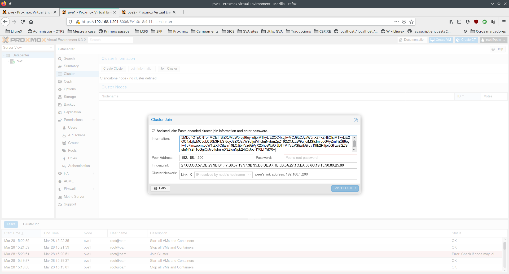

---
# Front matter
# Metainformació del document
title: "Cluster i HA"
author: [Alfredo Rafael Vicente Boix i Javier Estellés Dasi]
date: "05-05-2024"
subject: "Proxmox"
keywords: [Xarxa, Instal·lació]
subtitle: "Muntatge de cluster en varios hipervisors i alta disponibilitat"
lang: ca
page-background: img/bg.png
titlepage: true
# portada
titlepage-rule-height: 2
titlepage-rule-color: AA0000
titlepage-text-color: AA0000
titlepage-background: ../portades/U6.png

# configuració de l'índex
toc-own-page: true
toc-title: Continguts
toc-depth: 2

# capçalera i peu
header-left: \thetitle
header-right: Curs 2023-2024
footer-left: CEFIRE València
footer-right: \thepage/\pageref{LastPage}

# Les figures que apareguen on les definim i centrades
float-placement-figure: H
caption-justification: centering 

# No volem numerar les linies de codi
listings-disable-line-numbers: true

# Configuracions dels paquets de latex
header-includes:

  #  imatges i subfigures
  - \usepackage{graphicx}
  - \usepackage{subfigure}
  - \usepackage{lastpage}

  #  - \usepackage{adjustbox}
  # marca d'aigua
  #- \usepackage{draftwatermark}
 # - \SetWatermarkText{\includegraphics{./img/Markdown.png}}
  #- \SetWatermarkText{Per revisar}
  #- \SetWatermarkScale{.5}
  #- \SetWatermarkAngle{20}
   
  # caixes d'avisos 
  - \usepackage{awesomebox}

  # text en columnes
  - \usepackage{multicol}
  - \setlength{\columnseprule}{1pt}
  - \setlength{\columnsep}{1em}

  # pàgines apaïsades
  - \usepackage{pdflscape}
  
  # per a permetre pandoc dins de blocs Latex
  - \newcommand{\hideFromPandoc}[1]{#1}
  - \hideFromPandoc {
      \let\Begin\begin
      \let\End\end
    }
 
# definició de les caixes d'avis
pandoc-latex-environment:
  noteblock: [note]
  tipblock: [tip]
  warningblock: [warning]
  cautionblock: [caution]
  importantblock: [important]
...

\vspace*{\fill}

{ height=50px }

Este documento está sujeto a una licencia creative commons que permite su difusión y uso comercial reconociendo siempre la autoría de su creador. Este documento se encuentra para ser modificado en el siguiente repositorio de github:
<!-- CAMBIAR EL ENLACE -->
[https://github.com/arvicenteboix/lliurexproxmox](https://github.com/arvicenteboix/lliurexproxmox)
\newpage

<!-- \awesomebox[violet]{2pt}{\faRocket}{violet}{Lorem ipsum…} -->

# Introducció

En aquesta última unitat, explicarem com muntar un clúster en PROXMOX. És un procediment molt
senzill, però s’han de tenir en compte les següents consideracions:

* En muntar un clúster pot tenir diferents màquines entre els hipervisors del clúster.
* Si no muntem un sistema d’alta disponibilitat, no té massa sentit.
* Per a muntar un sistema d’alta disponibilitat cal muntar un CEPH (no s’explica en aquest curs) o
    tenir una cabina externa.

:::warning
Les cabines externes són sistemes molt fiables i difícilment fallen, ja que només serveixen dades. Tot el processament es faria al sistema PROXMOX.
:::

:::warning
Un sistema d’alta disponibilitat permetrà que quan una màquina deixe de funcionar immediatament altre hipervisor se n’adonarà que alguna cosa està passant i la posarà en marxa, sense necessitat que cap persona intervinga.
:::

# Muntar clúster en PROXMOX

Ja que no deposam de tres ordinadors, es pot muntar un sistema d’alta disponibilitat en Virtualbox per a veure el seu funcionament. La màquina utilitzada és un Ryzen 5 amb 8 GB de RAM i un NAS. S’ha muntat el següent sistema:

| Màquina | Característiques |
| --- | ------|
| Proxmox 1 | Proxmox al Virtualbox |
| Proxmox 2 | Proxmox al Virtualbox |
| Proxmox 3 | Proxmox al Virtualbox |
| TrueNAS | Muntat a una màquina externa |

:::warning
La quantitat mínima d'hipervisors per a poder fer funcionar un sistema d'alta disponibilitat és de 3. Es necessita per a fer votació i saber qui està viu, qui guanye amb dos vots (ell i altre) està viu, això significa tenir quòrum, qui tinga només un vot està mort (significaria que no té accés a la xarxa). Per a ser justos podem dir que, en realitat podem tindre 2 hipervisors i una màquina que solament vote per a fer quòrum, en eixe cas instal·laríem el corosync en aquesta màquina que podria ser perfectament una raspberry pi, per exemple, però no anem a tractar-ho en este curs.
:::

El primer que cal fer és tenir 3 servidors instal·lats amb PROXMOX. En aquest cas hem muntat els 3 hipervisors amb una única targeta de xarxa. Si es muntara el model de centre tots 3 hipervisors, haurien de tenir la mateixa configuració de xarxa a excepció de la seua IP, òbviament.

  

::tip
Recordeu que és necessari que cada PROXMOX tinga un hostname diferent. Si el nom
del node coincidix cal canviar-lo. Es deu modificar a l’arxiu /etc/hostname, i a /etc/hosts.
:::

Una vegada tenim els 3 hipervisors funcionant. Farem clic sobre el datacenter i anem **Cluster** i clickem a **Create cluster**.

  

Una vegada polsem a **Create cluster** ens apareixerà la següent finestra on li donarem el nom al clúster que vulguem:

  

Quan posem a **Create** ens apareixerà la següent finestra:

  

Com podem veure en aquests moments només tindrem un hipervisor al nostre clúster. Si volem afegir més hipervisors farem clic sobre **Join information**:

  

I li donarem a **Copy information**. Aquests són els paràmetres que utilitzarà PROXMOX per a afegir els altres hipervisors al clúster.

  

Canviem d’hipervisor i anem novament a Clúster en el nostre Datacenter:

  

Polsarem a **Join cluster** i pegarem la informació copiada del primer hipervisor:

  

Al clicar sobre **Join cluster** ens apareixerà la següent informació:

  

Aquest procés es repetirà per a altre hipervisor:

  

  

Ara podrem veure com tenim els tres hipervisors al mateix clúster:

  

En aquests moments ja tenim el nostre clúster muntat.

# Muntatge d’alta disponibilitat

Per a realitzar el nostre muntatge d’alta disponibilitat utilitzarem una cabina externa. Per a fer les proves s’ha utilitzat la distro [Tiny Core](http://tinycorelinux.net/), la versió de 16 Mb. Es tracta d’una distro que a penes consumeix recursos i es poden fer proves amb ella en virtualització anidada.

:::warning
Si es decidix fer el muntatge d’alta disponibilitat amb una cabina, cal disposar d’una
cabina amb 4 targetes de xarxa per a muntar un bond, o d’una targeta de 10Gb que
obligaria a tenir un switch que suportara 10 Gb.
:::

## NAS i màquina virtual

En primer lloc, afegim el nostre NAS al Proxmox. Quan l’afegim al datacenter serà visible per part de tots els hipervisors.

  

Pugem la nostra ISO (no tenim el perquè fer-ho al NAS)

  

I creem la nostra màquina virtual:

  

  

No cal donar molta memòria a aquesta màquina:

  

I arranquem la màquina:

  

La màquina arranca de seguida i funciona molt fluida:

# Alta disponibilitat

Una vegada tenim la màquina funcionant anirem a Datacenter i després HA i clicarem sobre **Add**.

  

Ens apareixerà la següent finestra on haurem d’escollir la màquina que volem tenir funcionant en tot moment:

  

  

En **Request state** cal tenir estat started.

I ja tenim el nostre sistema muntat:

  

Amb Virtualbox podem provar d’apagar una màquina per a veure què passa:

  

Al cap del temps podem veure com el nostre hipervisor ja no està en marxa i com la màquina ha canviat d'hipervisor i ara està funcionant a l'hipervisor 2:

  

Podem veure que la màquina està funcionant:

  

:::warning
No espereu que la màquina es pose en marxa de seguida, el procés pot trigar uns 5 minuts i si hi han clients semilleugers funcionant, probablement deixaran de funcionar correctament. En aquest procés pot haver-hi certa pèrdua d’informació ja que no es recupera l’estat de la màquina.
:::

# Consideracions finals

Es pot tractar de tenir un sistema on hi haja una mínima pèrdua d’informació amb dos hipervisors i si no disposes de NAS. Es podrien tenir dues màquines duplicades amb dos hipervisors i utilitzar la replicació.

Es podria tenir el /net a un disc virtual a banda i que aquest anara replicant-se cada 30 min entre els dos hipervisors, si un d’ells caiguera. Es podria posar en marxa l’altra màquina a l’altre hipervisor i, com a molt, s’haurien perdut 30 minuts d’informació.

Podrien configurar-ho dins de la màquina virtual a l’apartat de **Replication**.

  

Es podrien fer moltes més coses, ja que PROXMOX permet automatitzar moltes tasques i tenir un munt de serveis. Amb aquest curs hem tractat de donar-vos unes pinzellades sobre el que es pot fer i com es podria utilitzat als centres educatius.

