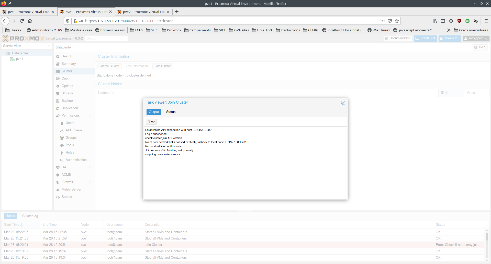
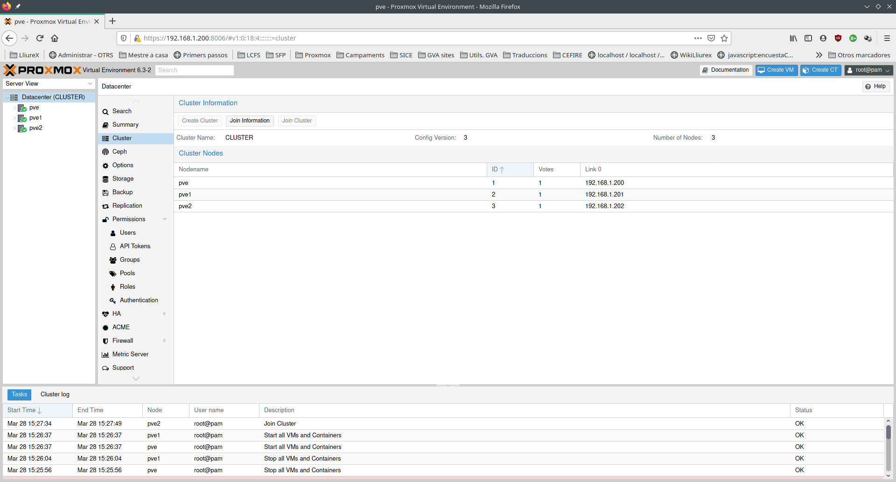
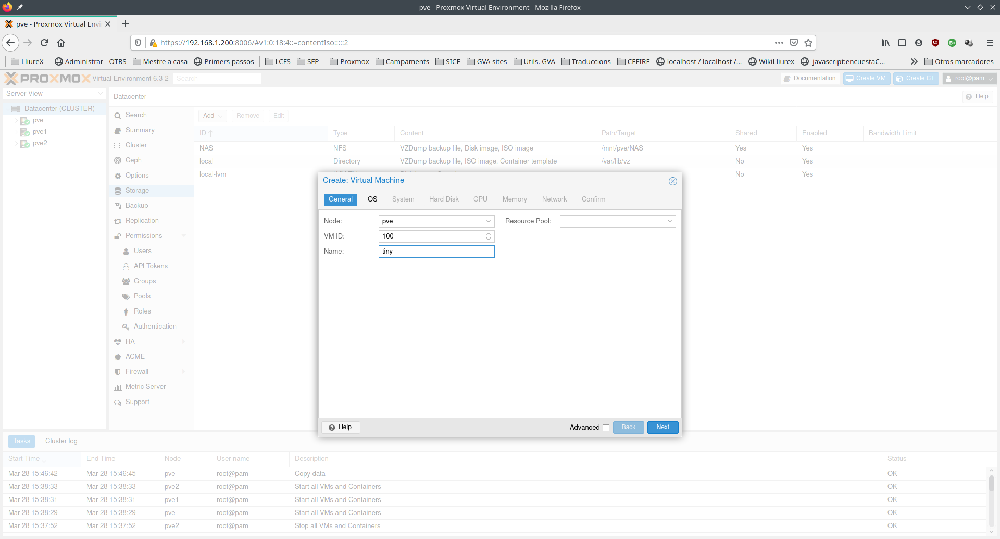
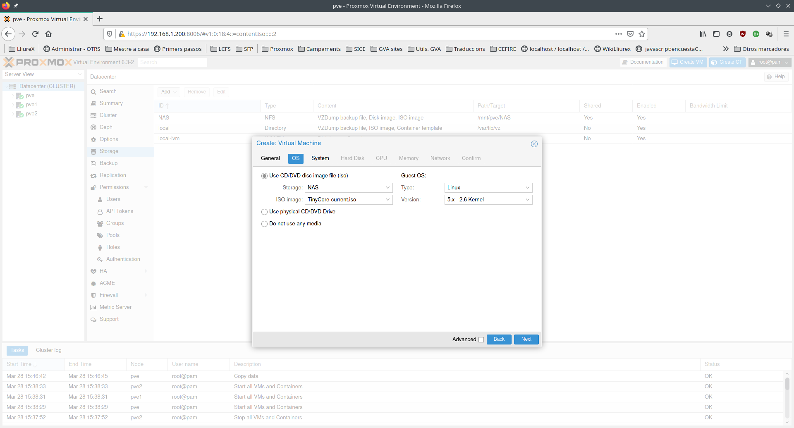
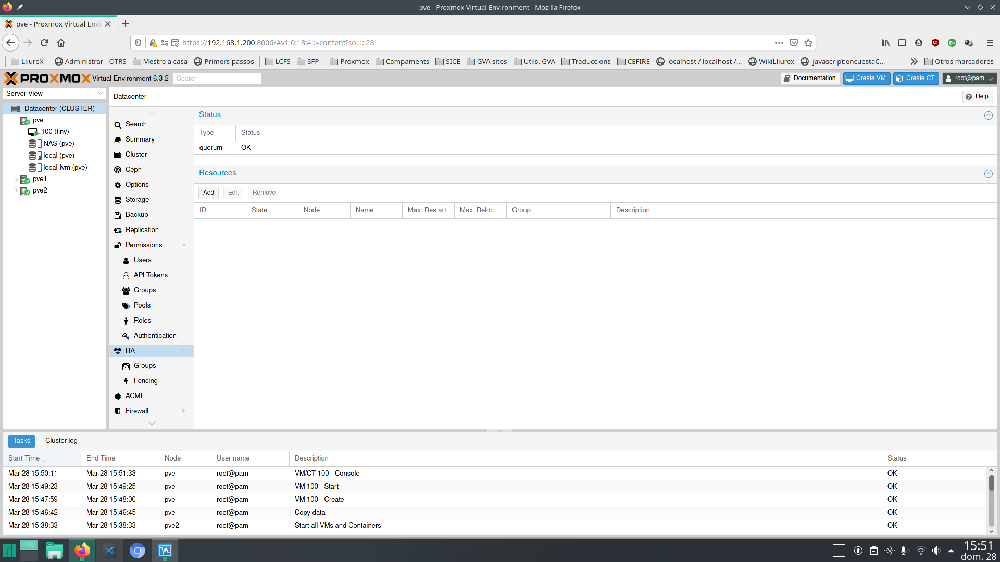
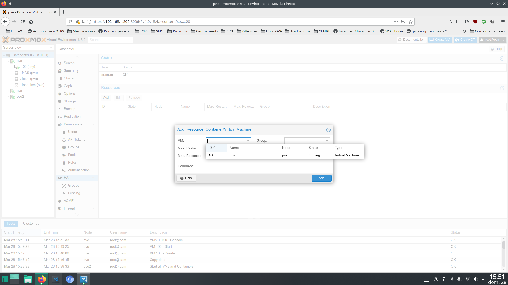
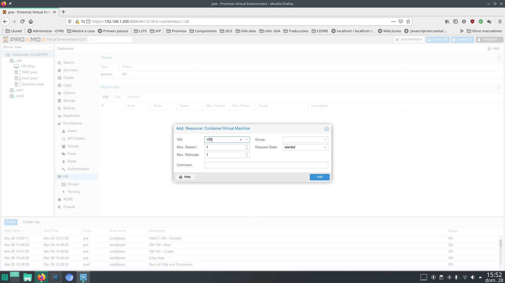

---
# Front matter
# Metainformació del document
title: "Montar cluster y alta disponibilidad en Proxmox"
author: [Alfredo Rafael Vicente Boix i Javier Estellés Dasi]
date: "05-05-2024"
subject: "Proxmox"
keywords: [Xarxa, Instal·lació]
subtitle: "Configuración de PROXMOX"

lang: es
page-background: img/bg.png
titlepage: true
# portada
titlepage-rule-height: 2
titlepage-rule-color: AA0000
titlepage-text-color: AA0000
titlepage-background: ../portades/U6.png

# configuració de l'índex
toc-own-page: true
toc-title: Contenidos
toc-depth: 2

# capçalera i peu
header-left: \thetitle
header-right: Curs 2023-2024
footer-left: CEFIRE València
footer-right: \thepage/\pageref{LastPage}

# Les figures que apareguen on les definim i centrades
float-placement-figure: H
caption-justification: centering 

# No volem numerar les linies de codi
listings-disable-line-numbers: true

# Configuracions dels paquets de latex
header-includes:

  #  imatges i subfigures
  - \usepackage{graphicx}
  - \usepackage{subfigure}
  - \usepackage{lastpage}

  #  - \usepackage{adjustbox}
  # marca d'aigua
  #- \usepackage{draftwatermark}
 # - \SetWatermarkText{\includegraphics{./img/Markdown.png}}
  #- \SetWatermarkText{Per revisar}
  #- \SetWatermarkScale{.5}
  #- \SetWatermarkAngle{20}
   
  # caixes d'avisos 
  - \usepackage{awesomebox}

  # text en columnes
  - \usepackage{multicol}
  - \setlength{\columnseprule}{1pt}
  - \setlength{\columnsep}{1em}

  # pàgines apaïsades
  - \usepackage{pdflscape}
  
  # per a permetre pandoc dins de blocs Latex
  - \newcommand{\hideFromPandoc}[1]{#1}
  - \hideFromPandoc {
      \let\Begin\begin
      \let\End\end
    }
 
# definició de les caixes d'avis
pandoc-latex-environment:
  noteblock: [note]
  tipblock: [tip]
  warningblock: [warning]
  cautionblock: [caution]
  importantblock: [important]
...

\vspace*{\fill}

{ height=50px }

Este documento está sujeto a una licencia creative commons que permite su difusión y uso comercial reconociendo siempre la autoría de su creador. Este documento se encuentra para ser modificado en el siguiente repositorio de github:
<!-- CAMBIAR EL ENLACE -->
[https://github.com/arvicenteboix/lliurexproxmox](https://github.com/arvicenteboix/lliurexproxmox)
\newpage

<!-- \awesomebox[violet]{2pt}{\faRocket}{violet}{Lorem ipsum…} -->

# Introducción

En esta última unidad, explicaremos como montar un clúster en PROXMOX. Es un procedimiento muy sencillo, pero hay que tener en cuenta las siguientes consideraciones:

* Al montar un clúster se puede tener diferentes máquinas entre los hipervisores del clúster.
* Si no montamos un sistema de alta disponibilidad, no tiene demasiado sentido.
* Para montar un sistema de alta disponibilidad hay que montar un CEPH (no se explica en este curso) o tener una cabina externa.

:::warning
Las cabinas externas son sistemas muy fiables y difícilmente fallan, puesto que solo sirven datos. Todo el procesamiento se haría en el sistema PROXMOX.
:::

:::tip
Un sistema de alta disponibilidad permitirá que cuando una máquina deja de funcionar, inmediatamente otro hipervisor se dará cuenta de que algo está pasando y la pondrá en marcha, sin necesidad que intervenga una persona.
:::

# Montar clúster en PROXMOX

Puesto que no disponemos de tres ordenadores, se puede montar un sistema de alta disponibilidad en Virtualbox para ver su funcionamiento. La máquina utilizada es un Ryzen 5 con 8 GB de RAM y un NAS. Se ha montado el siguiente sistema:

| Máquina | Características |
| --- | ------|
| Proxmox 1 | Proxmox al Virtualbox |
| Proxmox 2 | Proxmox al Virtualbox |
| Proxmox 3 | Proxmox al Virtualbox |
| TrueNAS | Montado a una máquina externa |

:::warning
La cantidad mínima de hipervisores para poder hacer funcionar un sistema de alta disponibilidad es de 3. Se necesita para hacer votación para saber quien está vivo, que es el que gana con dos votos (él y otro), esto significa tener **quorum** , quien tenga solo un voto está muerto (significaría que no tiene acceso en la red). Para ser justos podemos decir que, en realidad podemos tener 2 hipervisores i una máquina que solo vote para hacer quorom, para ellos instalaríamos el corosync en esa máquina que podría ser perfectamente una raspberry pi por ejemplo. Pero no lo vamos a tratar en este curso.
:::

Lo primero que hay que hacer es tener 3 servidores instalados con PROXMOX. En este caso hemos montado los 3 hipervisors con una única tarjeta de red. Si se montara el modelo de centro los 3 hipervisores, tendrían que tener la misma configuración de red a excepción de su ip, obviamente.

::tip
Es necesario recordar que cada PROXMOX tiene un hostname diferente. Si el nombre del nodo coincide hay que cambiarlo. Se debe de modificar en los archivos */etc/hostname*, y  */etc/hosts*.
:::

Una vez tenemos los 3 hipervisores funcionando. Hacemos click sobre el datacenter y vamos a **Cluster** y luego a **Create cluster**.

Una vez pulsamos en **Create cluster** nos aparecerá la siguiente ventana donde le daremos el nombre al clúster que queramos:

Cuando pulsamos en **Create** nos aparecerá la siguiente ventana:

Como podemos ver en estos momentos solo tendremos un hipervisor en nuestro cluster. Si queremos añadir más hipervisores haremos click sobre **Join information** :

Y le daremos a **Copy information**. Estos son los parámetros que utilizará PROXMOX para añadir los otros hipervisores al clúster.

 6 

Cambiamos de hipervisor y vamos nuevamente a Clúster en nuestro Datacenter:

Pulsaremos sobre **Join cluster** y pegaremos la información copiada del primer hipervisor:

Al clicar sobre **Join cluster** nos aparecerá la siguiente información:

 

Este proceso se repetirá para otro hipervisor:

 

 

Ahora podremos ver cómo tenemos los tres hipervisores en el mismo clúster:

 

En estos momentos ya tenemos nuestro clúster montado.

# Montaje de alta disponibilidad

Para realizar nuestro montaje de alta disponibilidad utilizaremos una cabina externa.En este caso se ha utilizado la distro [Tiny Core](http://tinycorelinux.net/), la versión de 16 Mb. Se trata de una distro que a penas consume recursos y se pueden hacer pruebas con ella en virtualización anidada sin consumir demasiados recursos.

:::warning
Si se decide hacer el montaje de alta disponibilidad con una cabina, hay que disponer de una cabina con 4 tarjetas de red para montar un bond, o de una tarjeta de 10Gb que obligaría a tener un switch que soportara 10 Gb.
:::

# NAS y máquina virtual

En primer lugar añadimos nuestro NAS al Proxmox. Cuando lo añadimos al datacenter será visible por parte de todos los hipervisores.

 

Subimos nuestra ISO (no tenemos el porqué de hacerlo en la NAS)

 

Y creamos nuestra máquina virtual:

 

 

No hay que dar mucha memoria a esta máquina:

 

Y arrancamos la máquina:

 

La máquina arranca enseguida y funciona muy fluida:

# Alta disponibilidad

Una vez tenemos la máquina funcionando iremos a Datacenter y después HA y haremos clic sobre **Add**.

 

Nos aparecerá la siguiente ventana donde tendremos que escoger la máquina que queremos tener funcionando en todo momento:

 

 

En **Request state** hay que tener *started*.

Y ya tenemos nuestro sistema montado:

 

Con Virtualbox podemos probar de apagar una máquina para ver qué pasa:

 

Al cabo de un tiempo podemos ver cómo nuestro hipervisor ya no está en marcha, cómo la máquina ha cambiado de hipervisor y ahora está funcionando en el hipervisor 2:

 

Podemos ver que la máquina está funcionando:

 

:::warning
No esperéis que la máquina se ponga en marcha enseguida, el proceso puede tardar unos 5 minutos y si hay clientes semiligeros funcionando, probablemente dejarán de funcionar correctamente. En este proceso puede haber cierta pérdida de información puesto que no se recupera el estado de la máquina.
:::

# Consideraciones finales

Se puede tratar de tener un sistema donde haya una mínima pérdida de información con dos hipervisores y si no dispones de NAS. Se podrían tener dos máquinas duplicadas con dos hipervisores y utilizar la replicación.

Se podría tener el /net en otro disco virtual de la máquina y que este fuera replicándose cada 30 min entre los dos hipervisores, si uno de ellos cayera. Se podría poner en marcha la otra máquina en el otro hipervisor y, como mucho, se habrían perdido 30 minutos de información.

Se podría configurar dentro de la máquina virtual en el apartado de **Replication**.

 

Se podrían hacer muchas más cosas, puesto que PROXMOX permite automatizar muchas tareas y tener un montón de servicios. En este curso hemos tratado de daros unas pinceladas sobre lo que se puede hacer y cómo se podría utilizar en un centro educativo.